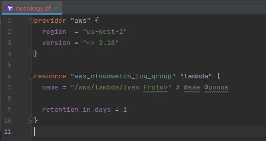
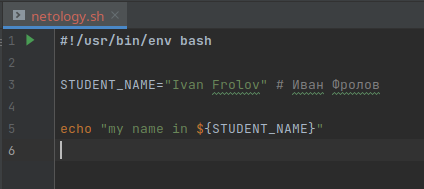
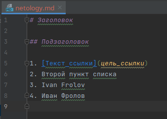
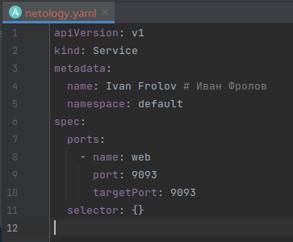
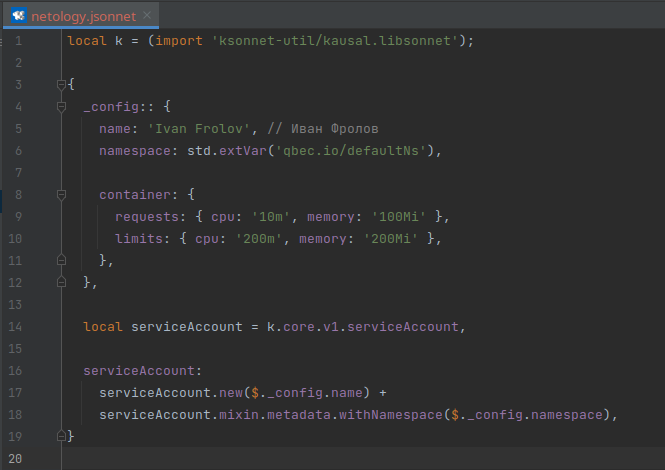

# Решения домашних заданий к занятию «1.1. Введение в DevOps»

## Решение задания №1

1. Установил Pycharm Community Edition, который скачал [отсюда](https://www.jetbrains.com/ru-ru/pycharm/download/)
2. Установил плагины:
   - Terraform;
   - MarkDown;
   - Yaml/Ansible Support;
   - Jsonnet.
3. Склонировал репозиторий [netology-code/sysadm-homeworks](https://github.com/netology-code/sysadm-homeworks.git)
4. Утащил из папки "01-intro-01" файлы:
   - [netology.tf](netology.tf) – terraform;
   - [netology.sh](netology.sh) – bash;
   - [netology.md](netology.md) – markdown; 
   - [netology.yaml](netology.yaml) – yaml;
   - [netology.jsonnet](netology.jsonnet) – jsonnet.
5. Убедился, что подсветка синтаксиса работает
6. Добавил свое имя в каждый файл, сделал снимок экрана и выложил в этот репозиторий.
7. Ссылки на картинки:
   - Terraform: 
   - Bash: 
   - Markdown: 
   - Yaml: 
   - Jsonnet: 
