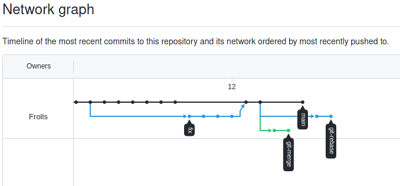
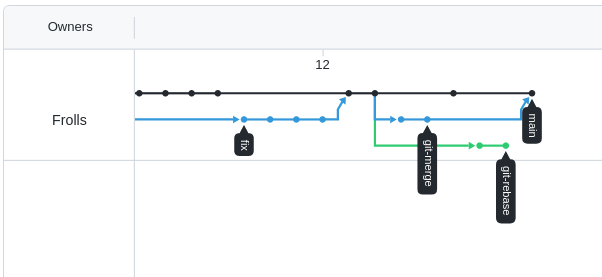
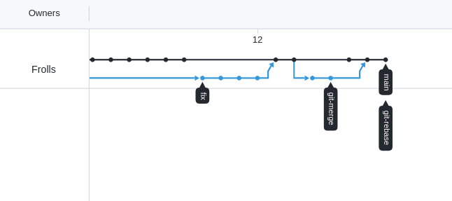

##  Задание №1 – Ветвление, merge и rebase.

1. Создал папку `branching` и в ней два файла `merge.sh` и `rebase.sh` с содержимым:
```bash
#!/bin/bash
# display command line options

count=1
for param in "$*"; do
    echo "\$* Parameter #$count = $param"
    count=$(( $count + 1 ))
done
```
2. Создал коммит с описанием `prepare for merge and rebase` и отправил его в ветку main. 

### Подготовка файла merge.sh

1. Создал ветку `git-merge`
2. Заменил в ней содержимое файла `merge.sh` на
```bash
#!/bin/bash
# display command line options

count=1
for param in "$@"; do
    echo "\$@ Parameter #$count = $param"
    count=$(( $count + 1 ))
done
```

### .. В итоге последовательно получалось вот так:

 
 
 