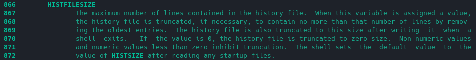

### Решение домашнего задания к занятию "3.1. Работа в терминале, лекция 1"

1. Установил VirtualBox.
2. Установил Vagrand.
3. Подготовил терминал. Установил zsh.
4. С помощью базового файла конфигурации запустил Ubuntu 20.04 в VirtualBox посредством vagrant
5. Ознакомился с графическим интерфейсом virtualbox. Посмотрел, как выглядит виртуальная машина, которую создал vagrant.

Вот оно: 

Аппаратные ресурсы, выделенные по-умолчанию

**Система**
   - Оперативная память: 1024 МБ
   - Процессоры: 2
   - Ускорение: VT-x/AMD-V, Nested Paging, PAE/NX, Паравиртуализация KVM

**Дисплей**
   - Видеопамять: 4 МБ
   - Графический контроллер: VBoxVGA

**Носители**
   - Контроллер: IDE Controller
   - Контроллер: SATA Controller
   - Sata порт 0: ubuntu-20.04-amd64-disk001.vdmk (Обычный, 64,00 ГБ)

**Аудио**
   - Выключено

**Сеть**
   - Адаптер 1: Intel PRO/1000 MT Desktop (NAT)

**USB**
   - Выключено

**Общие папки**
   - Общие папки: 1

6. Ознакомился с возможностями конфигурации VirtualBox через Vagrantfile. Добавил оперативной памяти и 
ресурсов процессора виртуальной машине:
```
Vagrant.configure("2") do |config|
	config.vm.box = "bento/ubuntu-20.04"

    config.vm.provider "virtualbox" do |v|
        v.name = "ubuntu 20.04"
        v.memory = 4096
        v.cpus = 16
    end
end
```

Результат: 

7. Выполнил `vagrant ssh`:
```
Welcome to Ubuntu 20.04.2 LTS (GNU/Linux 5.4.0-80-generic x86_64)

 * Documentation:  https://help.ubuntu.com
 * Management:     https://landscape.canonical.com
 * Support:        https://ubuntu.com/advantage

  System information as of Wed 15 Dec 2021 05:14:13 PM UTC

  System load:  0.0               Processes:             221
  Usage of /:   2.5% of 61.31GB   Users logged in:       0
  Memory usage: 5%                IPv4 address for eth0: 10.0.2.15
  Swap usage:   0%


This system is built by the Bento project by Chef Software
More information can be found at https://github.com/chef/bento
vagrant@vagrant:~$ 
```

8. Ознакомился с разделами `man bash`. Ну как сказать.. Пролистал )
   - какой переменной можно задать длину журнала history, и на какой строчке manual это описывается? Если правильно
понял, то это переменная `HISTFILESIZE`. Номер строки зависит от версии мануала. `-N + Enter` показал номера строк. 
В моей версии мануала, это 866 строка. 
   - что делает директива ignoreboth в bash? Хм.. Поиск в мане (`/ignoreboth`) подсказал, что это объединение 
`ignorespace` и `ignoredups`, т.е в историю не попадет ничего, что начинается с пробелов или повторяет предыдущую
строку

9. В каких сценариях использования применимы скобки {} и на какой строчке man bash это описано?

Эта штука распространяется на текущее окружение и, по ходу, является сокращением для команд, типа циклов/перечислений. 
Строка в `man bash`: 262.

10. С учётом ответа на предыдущий вопрос, как создать однократным вызовом touch 100000 файлов?

Все просто: `touch {1..100000}`

Получится ли аналогичным образом создать 300000? Если нет, то почему? 
Не получится. Ругается на слишком длинный список аргументов. Получилось создать 146000 файлов, точнее 
не экспериментировал. 

11. В man bash поищите по /\[\[. Что делает конструкция [[ -d /tmp ]]

Поискал `/\[\[`. Двойные квадратные скобки обозначают условные выражения. 

Конструкция `[[ -d /tmp ]]` по ходу проверяет наличие каталога `/tmp`

12. Основываясь на знаниях о просмотре текущих (например, PATH) и установке новых переменных; командах, которые мы 
рассматривали, добейтесь в выводе type -a bash в виртуальной машине наличия первым пунктом в списке:
```
bash is /tmp/new_path_directory/bash
bash is /usr/local/bin/bash
bash is /bin/bash
```

хм.. попробую..

   - bash is /tmp/new_path_directory/bash:
```
vagrant@vagrant:~$ mkdir /tmp/new_patch_directory
vagrant@vagrant:~$ cp /bin/bash /tmp/new_patch_directory/
vagrant@vagrant:~$ PATH=/tmp/new_patch_directory/:$PATH
vagrant@vagrant:~$ type -a bash
bash is /tmp/new_patch_directory/bash
bash is /usr/bin/bash
bash is /bin/bash
```

13. Чем отличается планирование команд с помощью batch и at?

   - `at` запускает команду в заданное время
   - `batch` запускает команду при определенной загрузке системы, например ниже средних 1,5 попугаев по дефолту 

14. Завершите работу виртуальной машины чтобы не расходовать ресурсы компьютера и/или батарею ноутбука.

Не вопрос, тормознул по `vagrant suspend`