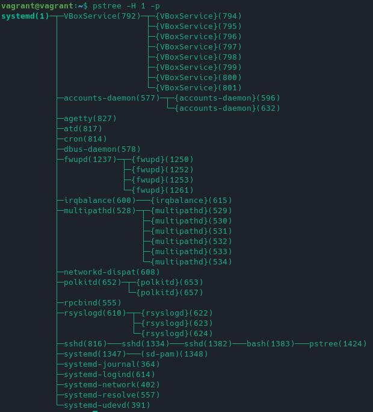
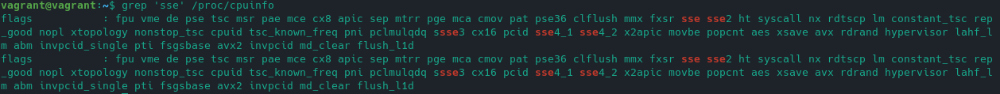

### Решение домашнего задания к занятию "3.2. Работа в терминале, лекция 2"

1. Какого типа команда `cd`? Попробуйте объяснить, почему она именно такого типа; опишите ход своих мыслей, 
если считаете что она могла бы быть другого типа.

Это команда, встроенная в оболочку. Вывод `type cd`:
```
vagrant@vagrant:~$ type cd
cd is a shell builtin
```

Если она встроена в оболочку, то должна быть описана в `man bash`. Поищем:

Вот что нашлось в 2801 строке: 

Почему она встроена в оболочку? Хм.. Может быть потому что встроенной функцией проще менять указатель 
на текущую директорию внутри сессии терминала? Нет необходимости создавать новый процесс, осуществлять взаимодействие 
с вызвавшим шеллом и тд)

Да, еще небольшой момент.. Похоже под капотом команды `cd` вызов функции `chdir()`. А в `man chdir`
написано:
``` 
The chdir() function only affects the working directory of the current process.
```

Т.е. выполняется в текущем процессе.

2. Какая альтернатива без pipe команде `grep <some_string> <some_file> | wc -l`? `man grep` поможет в ответе 
на этот вопрос. Ознакомьтесь с [документом](http://www.smallo.ruhr.de/award.html) о других подобных 
некорректных вариантах использования pipe.

Создал файл `test` для суровых испытаний:
```
1 2 3 4 5
2
1
3
2
```

Натравил команду `grep 1 test | wc -l`, получил выхлоп: `2`.

В итоге, вся эта конструкция выводит количество строк, которые содержат строку (шаблон), переданный в `grep`.

Обратимся к `man grep`: 

О!, смотрим далее и происходит чудо! Есть такая буква (с): 

Проверим, что нам покажет `grep -c 1 test`: `2`

Результаты совпадают примерно на 100%.

3. Какой процесс с PID 1 является родителем для всех процессов в вашей виртуальной машине Ubuntu 20.04?

Посмотрим список процессов командой `ps`:
```
vagrant@vagrant:~$ ps -fp 1
UID          PID    PPID  C STIME TTY          TIME CMD
root           1       0  0 14:52 ?        00:00:01 /sbin/init
```

Процесс с PID == 1 по версии команды `ps -fp 1` это `/sbin/init`.

Интересно, что если посмотреть то же самое просто с флагом `-p 1` или даже просто `1`, то вывод будет отличаться:
```
vagrant@vagrant:~$ ps -p 1
    PID TTY          TIME CMD
      1 ?        00:00:01 systemd
```

Теперь процесс c PID == 1 это `systemd` :-)

Продолжим.. Попытка сделать аналогичные телодвижения командой `pstree -H 1 -p`, которая подсветит в выхлопе 
процесс с PID 1, то получим:



Это процесс `systemd`.

Вывод: это процесс `systemd`, ноги которого растут из `/sbin/init`

11. Узнайте, какую наиболее старшую версию набора инструкций SSE поддерживает ваш процессор с помощью /proc/cpuinfo

`cat /proc/cpuinfo`, `less /proc/cpuinfo` или любая аналогичная команда покажет в строке `flags`:
```
flags           : fpu vme de pse tsc msr pae mce cx8 apic sep mtrr pge mca cmov pat pse36 clflush mmx fxsr sse sse2 
ht syscall nx rdtscp lm constant_tsc rep_good nopl xtopology nonstop_tsc cpuid tsc_known_freq pni pclmulqdq ssse3 
cx16 pcid sse4_1 sse4_2 x2apic movbe popcnt aes xsave avx rdrand hypervisor lahf_lm abm invpcid_single pti fsgsbase 
avx2 invpcid md_clear flush_l1d
```

А еще лучше грепнуть) Типа такого `grep -i 'sse' /proc/cpuinfo`:



Нашлось две строки, потомучто я выделил два ядра виртуальной машине.

В итоге, старшая версия набора инструкций SSE == SSE4.2