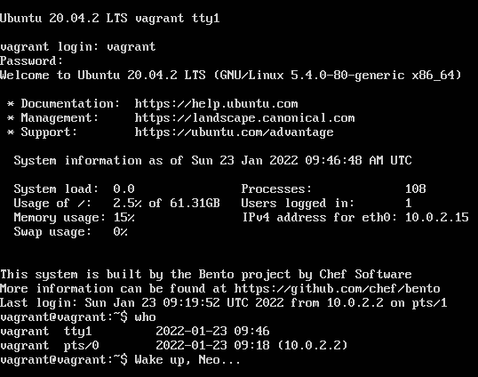
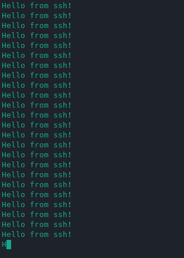

### Решение домашнего задания к занятию "3.2. Работа в терминале, лекция 2"

1. Какого типа команда `cd`? Попробуйте объяснить, почему она именно такого типа; опишите ход своих мыслей, 
если считаете что она могла бы быть другого типа.

Это команда, встроенная в оболочку. Вывод `type cd`:
```
vagrant@vagrant:~$ type cd
cd is a shell builtin
```

Если она встроена в оболочку, то должна быть описана в `man bash`. Поищем:

Вот что нашлось в 2801 строке: 

Почему она встроена в оболочку? Хм.. Может быть потому что встроенной функцией проще менять указатель 
на текущую директорию внутри сессии терминала? Нет необходимости создавать новый процесс, осуществлять взаимодействие 
с вызвавшим шеллом и тд)

Да, еще небольшой момент.. Похоже под капотом команды `cd` вызов функции `chdir()`. А в `man chdir`
написано:
``` 
The chdir() function only affects the working directory of the current process.
```

Т.е. выполняется в текущем процессе.

2. Какая альтернатива без pipe команде `grep <some_string> <some_file> | wc -l`? `man grep` поможет в ответе 
на этот вопрос. Ознакомьтесь с [документом](http://www.smallo.ruhr.de/award.html) о других подобных 
некорректных вариантах использования pipe.

Создал файл `test` для суровых испытаний:
```
1 2 3 4 5
2
1
3
2
```

Натравил команду `grep 1 test | wc -l`, получил выхлоп: `2`.

В итоге, вся эта конструкция выводит количество строк, которые содержат строку (шаблон), переданный в `grep`.

Обратимся к `man grep`: 

О!, смотрим далее и происходит чудо! Есть такая буква (с): 

Проверим, что нам покажет `grep -c 1 test`: `2`

Результаты совпадают примерно на 100%.

3. Какой процесс с PID 1 является родителем для всех процессов в вашей виртуальной машине Ubuntu 20.04?

Посмотрим список процессов командой `ps`. Для начала сделаем это "в лоб" с флагом `-p 1` и получим:
```
vagrant@vagrant:~$ ps -p 1
    PID TTY          TIME CMD
      1 ?        00:00:01 systemd
```
Процесс c PID == 1 это `systemd`.

Интересно, если посмотреть то же самое с дополнительным флагом `-f` или просто выполнить `ps 1`, то вывод будет 
отличаться:
```
vagrant@vagrant:~$ ps -fp 1
UID          PID    PPID  C STIME TTY          TIME CMD
root           1       0  0 14:52 ?        00:00:01 /sbin/init
vagrant@vagrant:~$ ps 1
    PID TTY      STAT   TIME COMMAND
      1 ?        Ss     0:01 /sbin/init
```

Теперь процесс с PID == 1 это `/sbin/init` :-)

Что будет, если вывести только имя процесса? Попробуем:
```
vagrant@vagrant:~$ ps -p 1 -o comm=
systemd
```

Это `systemd`..

А теперь с флагом `-f`:
```
vagrant@vagrant:~$ ps -fp 1 -o comm=
systemd
```

И снова `systemd` ))

Продолжим.. Попытка сделать аналогичные телодвижения командой `pstree -H 1 -p`, которая подсветит в выхлопе 
процесс с PID == 1, привела к результату ниже:


С PID == 1 процесс `systemd`.

**Вывод:** PID == 1 у процесса `systemd`, ноги которого растут из `/sbin/init`

4. Как будет выглядеть команда, которая перенаправит вывод stderr `ls` на другую сессию терминала?

Попробуем вывести список файлов для несуществующей директории: 
```
vagrant@vagrant:~$ ls /my_little_dir
ls: cannot access '/my_little_dir': No such file or directory
```

Отлично! А теперь перенаправим ругательное сообщение в другую сессию терминала. Для этого выполним еще раз `vagrant ssh`.
Смотрим:
```
vagrant@vagrant:~$ who
vagrant  pts/0        2022-01-23 09:18 (10.0.2.2)
vagrant  pts/1        2022-01-23 09:19 (10.0.2.2)
```

Выведем сообщение об ошибках в `/dev/pts1`:
```
vagrant@vagrant:~$ ls /my_little_dir 2> /dev/pts/1
```

В соседней консоли радостно наблюдаем сообщение:
```
vagrant@vagrant:~$ ls: cannot access '/my_little_dir': No such file or directory
```

5. Получится ли одновременно передать команде файл на stdin и вывести ее stdout в другой файл? 
Приведите работающий пример.

Да, конечно получится. Для натурных испытаний создадим файл `input`, который скормим команде `cat` с выводом
в файл `output`.

Вот как это выглядит в итоге:
```
vagrant@vagrant:~$ ls -l
total 4
-rw-rw-r-- 1 vagrant vagrant 16 Jan 23 09:35 input
vagrant@vagrant:~$ cat input 
some text
1
2
3
vagrant@vagrant:~$ cat < input > output
vagrant@vagrant:~$ ls -l
total 8
-rw-rw-r-- 1 vagrant vagrant 16 Jan 23 09:35 input
-rw-rw-r-- 1 vagrant vagrant 16 Jan 23 09:37 output
vagrant@vagrant:~$ cat output 
some text
1
2
3
```

6. Получится ли вывести находясь в графическом режиме данные из PTY в какой-либо из эмуляторов TTY? 
Сможете ли вы наблюдать выводимые данные?

Да, не вижу особых преград)

Выполнил `vagrant ssh`, а потом подключился к виртуальной машине непосредственно в virtualBox. Вот что имею на выходе
команды `who`:
```
vagrant@vagrant:~$ who
vagrant  tty1         2022-01-23 09:46
vagrant  pts/0        2022-01-23 09:18 (10.0.2.2)
```

Попробуем пульнуть что-нибудь в tty1:
```
vagrant@vagrant:~$ echo 'Wake up, Neo...' > /dev/tty1
```

Наблюдаем:



7. Выполните команду `bash 5>&1`. К чему она приведет? Что будет, если вы выполните echo netology > /proc/$$/fd/5? 
Почему так происходит?

Выполнил команду `bash 5>&1` ни к чему хорошему или плохому это не привело). Создали новый процесс `bash` с 
другим PID, дополнительно создался дескриптор с номером 5 и перенаправился в stdout:
```
vagrant@vagrant:~$ lsof -p $$
COMMAND PID    USER   FD   TYPE DEVICE SIZE/OFF   NODE NAME
...
bash    895 vagrant  txt    REG  253,0  1183448 524308 /usr/bin/bash
...

vagrant@vagrant:~$ ls -lah /proc/895/fd/
total 0
dr-x------ 2 vagrant vagrant  0 Jan 23 10:02 .
dr-xr-xr-x 9 vagrant vagrant  0 Jan 23 10:02 ..
lrwx------ 1 vagrant vagrant 64 Jan 23 10:02 0 -> /dev/pts/0
lrwx------ 1 vagrant vagrant 64 Jan 23 10:02 1 -> /dev/pts/0
lrwx------ 1 vagrant vagrant 64 Jan 23 10:02 2 -> /dev/pts/0
lrwx------ 1 vagrant vagrant 64 Jan 23 10:03 255 -> /dev/pts/0

vagrant@vagrant:~$ bash 5>&1
vagrant@vagrant:~$ lsof -p $$
COMMAND PID    USER   FD   TYPE DEVICE SIZE/OFF   NODE NAME
...
bash    916 vagrant  txt    REG  253,0  1183448 524308 /usr/bin/bash
...

vagrant@vagrant:~$ ls -lah /proc/916/fd/
total 0
dr-x------ 2 vagrant vagrant  0 Jan 23 10:03 .
dr-xr-xr-x 9 vagrant vagrant  0 Jan 23 10:03 ..
lrwx------ 1 vagrant vagrant 64 Jan 23 10:03 0 -> /dev/pts/0
lrwx------ 1 vagrant vagrant 64 Jan 23 10:03 1 -> /dev/pts/0
lrwx------ 1 vagrant vagrant 64 Jan 23 10:03 2 -> /dev/pts/0
lrwx------ 1 vagrant vagrant 64 Jan 23 10:03 255 -> /dev/pts/0
lrwx------ 1 vagrant vagrant 64 Jan 23 10:03 5 -> /dev/pts/0
```

Выполним `echo netology > /proc/$$/fd/5` и посмотрим, что будет:
```
vagrant@vagrant:~$ echo netology > /proc/$$/fd/5
netology
```

Почему так происходит? Так мы же сами создали дескриптор и связали его с stdout в рамках новой сессии bash :-) 

Если создать новую сессию и выполнить `echo netology > /proc/$$/fd/5`, то такой фокус не прокатит по причине отсутствия
дескриптора с номером 5 и перенаправления в stdout.

8. Получится ли в качестве входного потока для pipe использовать только stderr команды, не потеряв при этом отображение
stdout на pty? Напоминаем: по умолчанию через pipe передается только stdout команды слева от | на stdin команды справа. 
Это можно сделать, поменяв стандартные потоки местами через промежуточный новый дескриптор, который вы научились 
создавать в предыдущем вопросе.

Хм.. Попробую..

Немного модифицируем решение из задания 4:
- создадим промежуточный дескриптор с номером 11;
- перенаправим дескриптор 11 в stderr;
- сам strerr перенаправим в stdout;
- stdout перенаправим в дескриптор 11.

Само решение с примером:
```
vagrant@vagrant:~$ ls /my_little_dir 11>&2 2>&1 1>&11 | grep 'cannot' -c
1
```

9. Что выведет команда cat /proc/$$/environ? Как еще можно получить аналогичный по содержанию вывод?

Вот что она выведет (немного отформатировал):
```
vagrant@vagrant:~$ cat /proc/$$/environ
USER=vagrant
LOGNAME=vagrant
HOME=/home/vagrant
PATH=/usr/local/sbin:/usr/local/bin:/usr/sbin:/usr/bin:/sbin:/bin:/usr/games:/usr/local/games:/snap/bin
SHELL=/bin/bash
TERM=xterm-256color
XDG_SESSION_ID=1
XDG_RUNTIME_DIR=/run/user/1000
DBUS_SESSION_BUS_ADDRESS=unix:path=/run/user/1000/bus
XDG_SESSION_TYPE=tty
XDG_SESSION_CLASS=user
MOTD_SHOWN=pam
LANG=en_US.UTF-8
LANGUAGE=en_US:
SSH_CLIENT=10.0.2.2 45518 22
SSH_CONNECTION=10.0.2.2 45518 10.0.2.15 22
SSH_TTY=/dev/pts/0 
```

Очень напоминает переменные окружения.

Похожий результат дает команда `env`:
```
vagrant:~$ env
SHELL=/bin/bash
LANGUAGE=en_US:
PWD=/home/vagrant
LOGNAME=vagrant
XDG_SESSION_TYPE=tty
MOTD_SHOWN=pam
HOME=/home/vagrant
LANG=en_US.UTF-8
LS_COLORS=rs=0:di=01;34:ln=01;36:mh=00:pi=40;33:so=01;35:do=01;35:bd=40;33;01:cd=40;33;01:or=40;31;01:mi=00:su=37;
41:sg=30;43:ca=30;41:tw=30;42:ow=34;42:st=37;44:ex=01;32:*.tar=01;31:*.tgz=01;31:*.arc=01;31:*.arj=01;31:*.taz=01;
31:*.lha=01;31:*.lz4=01;31:*.lzh=01;31:*.lzma=01;31:*.tlz=01;31:*.txz=01;31:*.tzo=01;31:*.t7z=01;31:*.zip=01;
31:*.z=01;31:*.dz=01;31:*.gz=01;31:*.lrz=01;31:*.lz=01;31:*.lzo=01;31:*.xz=01;31:*.zst=01;31:*.tzst=01;31:*.bz2=01;
31:*.bz=01;31:*.tbz=01;31:*.tbz2=01;31:*.tz=01;31:*.deb=01;31:*.rpm=01;31:*.jar=01;31:*.war=01;31:*.ear=01;31:*.sar=01;
31:*.rar=01;31:*.alz=01;31:*.ace=01;31:*.zoo=01;31:*.cpio=01;31:*.7z=01;31:*.rz=01;31:*.cab=01;31:*.wim=01;31:*.swm=01;
31:*.dwm=01;31:*.esd=01;31:*.jpg=01;35:*.jpeg=01;35:*.mjpg=01;35:*.mjpeg=01;35:*.gif=01;35:*.bmp=01;35:*.pbm=01;
35:*.pgm=01;35:*.ppm=01;35:*.tga=01;35:*.xbm=01;35:*.xpm=01;35:*.tif=01;35:*.tiff=01;35:*.png=01;35:*.svg=01;
35:*.svgz=01;35:*.mng=01;35:*.pcx=01;35:*.mov=01;35:*.mpg=01;35:*.mpeg=01;35:*.m2v=01;35:*.mkv=01;35:*.webm=01;
35:*.ogm=01;35:*.mp4=01;35:*.m4v=01;35:*.mp4v=01;35:*.vob=01;35:*.qt=01;35:*.nuv=01;35:*.wmv=01;35:*.asf=01;
35:*.rm=01;35:*.rmvb=01;35:*.flc=01;35:*.avi=01;35:*.fli=01;35:*.flv=01;35:*.gl=01;35:*.dl=01;35:*.xcf=01;
35:*.xwd=01;35:*.yuv=01;35:*.cgm=01;35:*.emf=01;35:*.ogv=01;35:*.ogx=01;35:*.aac=00;36:*.au=00;36:*.flac=00;
36:*.m4a=00;36:*.mid=00;36:*.midi=00;36:*.mka=00;36:*.mp3=00;36:*.mpc=00;36:*.ogg=00;36:*.ra=00;36:*.wav=00;
36:*.oga=00;36:*.opus=00;36:*.spx=00;36:*.xspf=00;36:
SSH_CONNECTION=10.0.2.2 45518 10.0.2.15 22
LESSCLOSE=/usr/bin/lesspipe %s %s
XDG_SESSION_CLASS=user
TERM=xterm-256color
LESSOPEN=| /usr/bin/lesspipe %s
USER=vagrant
SHLVL=1
XDG_SESSION_ID=1
XDG_RUNTIME_DIR=/run/user/1000
SSH_CLIENT=10.0.2.2 45518 22
XDG_DATA_DIRS=/usr/local/share:/usr/share:/var/lib/snapd/desktop
PATH=/usr/local/sbin:/usr/local/bin:/usr/sbin:/usr/bin:/sbin:/bin:/usr/games:/usr/local/games:/snap/bin
DBUS_SESSION_BUS_ADDRESS=unix:path=/run/user/1000/bus
SSH_TTY=/dev/pts/0
_=/usr/bin/env
```

10. Используя man, опишите что доступно по адресам `/proc/<PID>/cmdline`, `/proc/<PID>/exe`

Посмотрим, что покажет `man 5 proc`.. 

- `/proc/<PID>/cmdline` (строка 231): это файл, доступный только для чтения. Содержит полную командную строку для процесса, 
если только процесс не является zombie-процессом (вернет 0 при чтении). Аргументы разделены '\0'.
- `/proc/<PID>/exe` (строка 285): В Linux 2.2 и более поздних версиях этот файл является символической ссылкой, содержащей 
фактическое имя пути выполняемой команды. Эта символическая ссылка может быть разыменована обычным образом; 
попытка открыть ее приведет к открытию исполняемого файла.  Можно даже набрать `/proc/<PID>]/exe`, 
чтобы запустить другую копию того же исполняемого файла, который который выполняется процессом `<PID>`. 
Если имя пути было удалено, символическая ссылка будет содержать строку '(deleted)', добавленная к исходному имени пути.  
В многопоточном процессе содержимое этой символической ссылки недоступно, если основной поток уже завершен.

11. Узнайте, какую наиболее старшую версию набора инструкций SSE поддерживает ваш процессор с помощью `/proc/cpuinfo`

`cat /proc/cpuinfo`, `less /proc/cpuinfo` или любая аналогичная команда покажет в строке `flags`:
```
flags           : fpu vme de pse tsc msr pae mce cx8 apic sep mtrr pge mca cmov pat pse36 clflush mmx fxsr sse sse2 
ht syscall nx rdtscp lm constant_tsc rep_good nopl xtopology nonstop_tsc cpuid tsc_known_freq pni pclmulqdq ssse3 
cx16 pcid sse4_1 sse4_2 x2apic movbe popcnt aes xsave avx rdrand hypervisor lahf_lm abm invpcid_single pti fsgsbase 
avx2 invpcid md_clear flush_l1d
```

А еще лучше грепнуть) Типа такого `grep -i 'sse' /proc/cpuinfo`:


Нашлось две строки, потомучто я выделил два ядра виртуальной машине.

В итоге, старшая версия набора инструкций SSE == SSE4.2

12. При открытии нового окна терминала и vagrant ssh создается новая сессия и выделяется pty. Это можно подтвердить 
командой tty, которая упоминалась в лекции 3.2. Однако:
```
vagrant@netology1:~$ ssh localhost 'tty'
not a tty
```

Почитайте, почему так происходит, и как изменить поведение.

Полистал мануал `man ssh`.

По умолчанию для удаленного сеанса не выделяется tty. Флаг `-t` решает эту проблему, т.е. принудительно выделяет 
псевдотерминал, что позволит выполнять экранные программы.

Выполним:
```
vagrant@vagrant:~$ ssh -t localhost 'tty'
vagrant@localhost's password: 
/dev/pts/1
Connection to localhost closed.
```

13. Бывает, что есть необходимость переместить запущенный процесс из одной сессии в другую. Попробуйте сделать это, 
воспользовавшись reptyr. Например, так можно перенести в screen процесс, который вы запустили по ошибке в обычной 
SSH-сессии.

Выполнил `vagrand ssh`, залогинился. Далее выполнил `yes 'Hello from ssh!'`. Пусть себе выполняется). Посмотрел PID 
процесса: PID == 1623.

В отдельном терминале выполнил `vagrant ssh`. После этого запустил `screen`. Установил `reptyr` командой 
`apt install reptyr`.

Для примера создадим в screen новое окно и перенесем туда процесс. Создание нового окна в screen: `Ctrl+a c`. 
Для переключения в новое окно укажем его номер: `Ctrl+a 1`.

Перенесем процесс в это окно командой `reptyr 1623`:
```
vagrant@vagrant:~$ reptyr 1623
Unable to attach to pid 1623: Operation not permitted
The kernel denied permission while attaching. If your uid matches
the target's, check the value of /proc/sys/kernel/yama/ptrace_scope.
For more information, see /etc/sysctl.d/10-ptrace.conf
```

Упс.. Что-то пошло не так..

Установил `kernel.yama.ptrace_scope = 0` в файле `/etc/sysctl.d/10-ptrace.conf`:
```
vagrant@vagrant:~$ sudo sysctl -w kernel.yama.ptrace_scope=0
kernel.yama.ptrace_scope = 0
```

Попробуем еще раз выполнить `reptyr 1623`:` и вот оно!:



14. `sudo echo string > /root/new_file` не даст выполнить перенаправление под обычным пользователем, так как 
перенаправлением занимается процесс shell'а, который запущен без sudo под вашим пользователем. Для решения данной 
проблемы можно использовать конструкцию `echo string | sudo tee /root/new_file`. Узнайте что делает команда tee и 
почему в отличие от sudo echo команда с sudo tee будет работать.

`man tee` намекает на то, что команда читает со стандартного ввода и записывает в стандартный вывод и в файлы.

Т.к. команда `sudo tee /root/new_file` запущена от sudo, то имеет права на запись в файл всего того, что придет в stdin. 
В примере это сделано через pipe от stdout команды `echo`.