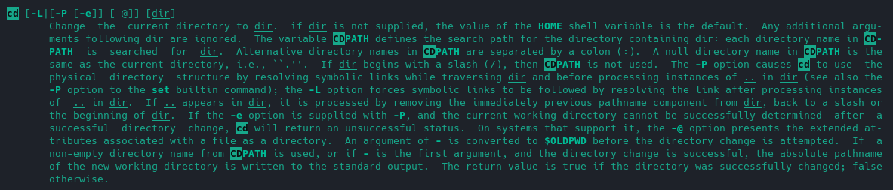
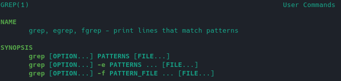
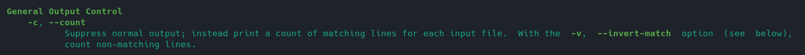

### Решение домашнего задания к занятию "3.2. Работа в терминале, лекция 2"

1. Какого типа команда `cd`? Попробуйте объяснить, почему она именно такого типа; опишите ход своих мыслей, 
если считаете что она могла бы быть другого типа.

Это команда, встроенная в оболочку. Вывод `type cd`:
```
vagrant@vagrant:~$ type cd
cd is a shell builtin
```

Если она встроена в оболочку, то должна быть описана в `man bash`. Поищем:

Вот что нашлось в 2801 строке: 

Почему она встроена в оболочку? Хм.. Может быть потому что встроенной функцией проще менять указатель 
на текущую директорию внутри сессии терминала? Нет необходимости создавать новый процесс, осуществлять взаимодействие 
с вызвавшим шеллом и тд)

Да, еще небольшой момент.. Похоже под капотом команды `cd` вызов функции `chdir()`. А в `man chdir`
написано:
``` 
The chdir() function only affects the working directory of the current process.
```

Т.е. выполняется в текущем процессе.

1. Какая альтернатива без pipe команде `grep <some_string> <some_file> | wc -l`? `man grep` поможет в ответе 
на этот вопрос. Ознакомьтесь с [документом](http://www.smallo.ruhr.de/award.html) о других подобных 
некорректных вариантах использования pipe.

Создал файл `test` для суровых испытаний:
```
1 2 3 4 5
2
1
3
2
```

Натравил команду `grep 1 test | wc -l`, получил выхлоп: `2`.

В итоге, вся эта конструкция выводит количество строк, которые содержат строку (шаблон), переданный в `grep`.

Обратимся к `man grep`: 

О!, смотрим далее и происходит чудо! Есть такая буква (с): 

Проверим, что нам покажет `grep -c 1 test`: `2`

Результаты совпадают примерно на 100%.