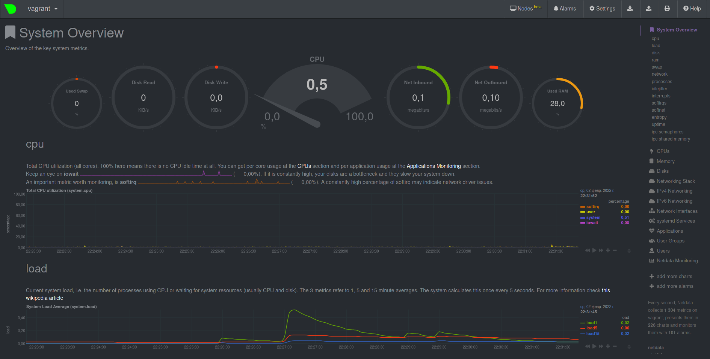

### Решение домашнего задания к занятию "3.4. Операционные системы, лекция 2"

1. На лекции мы познакомились с [node_exporter](https://github.com/prometheus/node_exporter/releases). 
В демонстрации его исполняемый файл запускался в background. Этого достаточно для демо, но не для настоящей 
production-системы, где процессы должны находиться под внешним управлением. Используя знания из лекции по systemd, 
создайте самостоятельно простой [unit-файл](https://www.freedesktop.org/software/systemd/man/systemd.service.html) 
для node_exporter:

    * поместите его в автозагрузку,
    * предусмотрите возможность добавления опций к запускаемому процессу через внешний файл (посмотрите, например, 
на `systemctl cat cron`),
    * удостоверьтесь, что с помощью systemctl процесс корректно стартует, завершается, а после перезагрузки 
автоматически поднимается.

Не буду описывать процесс установки, суть задания не в нём. Отмечу, что исполняемый файл поместил в `/opt` (не хочу в
бинарники):
```bash
vagrant@vagrant:~$ sudo mv node_exporter-1.3.1.linux-amd64 /opt/node_exporter
vagrant@vagrant:~$ ls /opt/node_exporter/
LICENSE  node_exporter  NOTICE
```

Запилим systemd unit-файл, подглядывая в маны, выбрав тип unit-файла -- **.service**, который будет описывать, как 
управлять службой или приложением на сервере. Формат файла чем-то напоминает ini-файлы в Windows ) Для создания 
простейшего unit-файла нужно описать три секции: `[Unit], [Service], [Install]`.

Создадим файл `node_exporter.service` и поместим его в `/etc/systemd/system/`. Впишем в него следующие строки:

```bash
[Unit]
Description=my little unit for node_exporter
Documentation=https://github.com/prometheus/node_exporter/blob/master/README.md

[Service]
EnvironmentFile=-/etc/default/node_exporter
ExecStart=/opt/node_exporter/node_exporter
KillMode=process
Restart=on-failure
RestartSec=42s

[Install]
WantedBy=multi-user.target
```

---

### upd по замечанию "Предлагаю уточнить как именно в службу будут передаваться дополнительные опции."

Предложение рассмотрено и принято)

В файл `/etc/default/node_exporter` заботливо положил опцию для примера, параметры подглядел в `node_exporter --help`: 

```bash
                          
# Default settings for my node_exporter

# Example options
MY_LITTLE_OPTION=--log.level="debug" --log.format=json --web.listen-address=":9100"
```

Сам файл `node_exporter.service` поправил:

```bash

[Unit]
Description=my little unit for node_exporter
Documentation=https://github.com/prometheus/node_exporter/blob/master/README.md

[Service]
EnvironmentFile=-/etc/default/node_exporter
ExecStart=/opt/node_exporter/node_exporter $MY_LITTLE_OPTION
KillMode=process
Restart=on-failure
RestartSec=42s

[Install]
WantedBy=multi-user.target
```

Проверим, что заработало:
```bash

vagrant@vagrant:~$ sudo systemctl status node_exporter
● node_exporter.service - my little unit for node_exporter
     Loaded: loaded (/etc/systemd/system/node_exporter.service; disabled; vendor preset: enabled)
     Active: active (running) since Mon 2022-02-07 11:26:29 UTC; 3s ago
       Docs: https://github.com/prometheus/node_exporter/blob/master/README.md
   Main PID: 13614 (node_exporter)
      Tasks: 4 (limit: 1071)
     Memory: 2.3M
     CGroup: /system.slice/node_exporter.service
             └─13614 /opt/node_exporter/node_exporter --log.level=debug --log.format=json --web.listen-address=:9100

Feb 07 11:26:29 vagrant node_exporter[13614]: {"caller":"node_exporter.go:115","collector":"thermal_zone","level":">
Feb 07 11:26:29 vagrant node_exporter[13614]: {"caller":"node_exporter.go:115","collector":"time","level":"info","t>
Feb 07 11:26:29 vagrant node_exporter[13614]: {"caller":"node_exporter.go:115","collector":"timex","level":"info",">
Feb 07 11:26:29 vagrant node_exporter[13614]: {"caller":"node_exporter.go:115","collector":"udp_queues","level":"in>
Feb 07 11:26:29 vagrant node_exporter[13614]: {"caller":"node_exporter.go:115","collector":"uname","level":"info",">
Feb 07 11:26:29 vagrant node_exporter[13614]: {"caller":"node_exporter.go:115","collector":"vmstat","level":"info",>
Feb 07 11:26:29 vagrant node_exporter[13614]: {"caller":"node_exporter.go:115","collector":"xfs","level":"info","ts>
Feb 07 11:26:29 vagrant node_exporter[13614]: {"caller":"node_exporter.go:115","collector":"zfs","level":"info","ts>
Feb 07 11:26:29 vagrant node_exporter[13614]: {"address":":9100","caller":"node_exporter.go:199","level":"info","ms>
Feb 07 11:26:29 vagrant node_exporter[13614]: {"caller":"tls_config.go:195","http2":false,"level":"info","msg":"TLS>
lines 1-20/20 (END)

````

---

Выполним `vagrant@vagrant:~$ sudo systemctl daemon-reload`. Смотрим статус:
```bash

vagrant@vagrant:~$ sudo systemctl status node_exporter
● node_exporter.service - my little unit for node_exporter
     Loaded: loaded (/etc/systemd/system/node_exporter.service; disabled; vendor preset: enabled)
     Active: inactive (dead)
       Docs: https://github.com/prometheus/node_exporter/blob/master/README.md
```

Уже неплохо.. Попробуем стартануть:
```bash

vagrant@vagrant:~$ sudo systemctl start node_exporter
vagrant@vagrant:~$ sudo systemctl status node_exporter
● node_exporter.service - my little unit for node_exporter
     Loaded: loaded (/etc/systemd/system/node_exporter.service; disabled; vendor preset: enabled)
     Active: active (running) since Mon 2022-01-31 16:31:10 UTC; 2s ago
       Docs: https://github.com/prometheus/node_exporter/blob/master/README.md
   Main PID: 948 (node_exporter)
      Tasks: 4 (limit: 1107)
     Memory: 13.3M
     CGroup: /system.slice/node_exporter.service
             └─948 /opt/node_exporter/node_exporter

Jan 31 16:31:11 vagrant node_exporter[948]: ts=2022-01-31T16:31:11.046Z caller=node_exporter.go:115 level=info coll>
Jan 31 16:31:11 vagrant node_exporter[948]: ts=2022-01-31T16:31:11.046Z caller=node_exporter.go:115 level=info coll>
Jan 31 16:31:11 vagrant node_exporter[948]: ts=2022-01-31T16:31:11.046Z caller=node_exporter.go:115 level=info coll>
Jan 31 16:31:11 vagrant node_exporter[948]: ts=2022-01-31T16:31:11.046Z caller=node_exporter.go:115 level=info coll>
Jan 31 16:31:11 vagrant node_exporter[948]: ts=2022-01-31T16:31:11.046Z caller=node_exporter.go:115 level=info coll>
Jan 31 16:31:11 vagrant node_exporter[948]: ts=2022-01-31T16:31:11.046Z caller=node_exporter.go:115 level=info coll>
Jan 31 16:31:11 vagrant node_exporter[948]: ts=2022-01-31T16:31:11.046Z caller=node_exporter.go:115 level=info coll>
Jan 31 16:31:11 vagrant node_exporter[948]: ts=2022-01-31T16:31:11.046Z caller=node_exporter.go:115 level=info coll>
Jan 31 16:31:11 vagrant node_exporter[948]: ts=2022-01-31T16:31:11.047Z caller=node_exporter.go:199 level=info msg=>
Jan 31 16:31:11 vagrant node_exporter[948]: ts=2022-01-31T16:31:11.047Z caller=tls_config.go:195 level=info msg="TL>
lines 1-20/20 (END)
```

Что-то даже взлетело и не ругается сразу. Что ж, бывает..

Поместим в автозагрузку:
```bash
vagrant@vagrant:~$ sudo systemctl enable node_exporter
Created symlink /etc/systemd/system/multi-user.target.wants/node_exporter.service → /etc/systemd/system/node_exporter.service.
vagrant@vagrant:~$ sudo systemctl status node_exporter
● node_exporter.service - my little unit for node_exporter
     Loaded: loaded (/etc/systemd/system/node_exporter.service; enabled; vendor preset: enabled)
     Active: active (running) since Mon 2022-01-31 16:31:10 UTC; 3min 1s ago
       Docs: https://github.com/prometheus/node_exporter/blob/master/README.md
   Main PID: 948 (node_exporter)
      Tasks: 4 (limit: 1107)
     Memory: 13.3M
     CGroup: /system.slice/node_exporter.service
             └─948 /opt/node_exporter/node_exporter
```

Нежно завершим процесс и посмотрим, что произойдет через 42 секунды: 
```bash
vagrant@vagrant:~$ sudo kill -9 948
vagrant@vagrant:~$ sudo systemctl status node_exporter
● node_exporter.service - my little unit for node_exporter
     Loaded: loaded (/etc/systemd/system/node_exporter.service; enabled; vendor preset: enabled)
     Active: activating (auto-restart) (Result: signal) since Mon 2022-01-31 16:36:03 UTC; 16s ago
       Docs: https://github.com/prometheus/node_exporter/blob/master/README.md
    Process: 948 ExecStart=/opt/node_exporter/node_exporter (code=killed, signal=KILL)
   Main PID: 948 (code=killed, signal=KILL)

Jan 31 16:36:03 vagrant systemd[1]: node_exporter.service: Main process exited, code=killed, status=9/KILL
Jan 31 16:36:03 vagrant systemd[1]: node_exporter.service: Failed with result 'signal'.
vagrant@vagrant:~$ sudo systemctl status node_exporter
● node_exporter.service - my little unit for node_exporter
     Loaded: loaded (/etc/systemd/system/node_exporter.service; enabled; vendor preset: enabled)
     Active: active (running) since Mon 2022-01-31 16:36:45 UTC; 1min 28s ago
       Docs: https://github.com/prometheus/node_exporter/blob/master/README.md
   Main PID: 1007 (node_exporter)
      Tasks: 4 (limit: 1107)
     Memory: 2.8M
     CGroup: /system.slice/node_exporter.service
             └─1007 /opt/node_exporter/node_exporter
```

Процесс восстал из пепла)

Проверю после перезагрузки. Работает, врать не буду. 100500 однотипный кусок текста копипастить тоже не стану. 
Процесс запустился, отличается только PID == 610.
```bash
vagrant@vagrant:~$ ps -f 610
UID          PID    PPID  C STIME TTY      STAT   TIME CMD
root         610       1  0 16:39 ?        Ssl    0:00 /opt/node_exporter/node_exporter
```

И даже `curl http://localhost:9100/metrics` что-то выплевывает.

1. Ознакомьтесь с опциями node_exporter и выводом `/metrics` по-умолчанию. Приведите несколько опций, которые вы бы 
выбрали для базового мониторинга хоста по CPU, памяти, диску и сети.

Ознакомился с опциями (cплошные регеспы и флаги включения/отключения разных коллекторов (сборщиков)).

Вывод `/metrics` по-умолчанию содержит более 1000 строк.. Точнее, 1058, включая комментарии )
Гы:
```bash
vagrant@vagrant:~$ grep -c node_ metrics 
935
```

Какие опции бы выбрал, зависит от задачи, поэтому в качестве ответа буду стрелять из пушки по воробьям ))

Грепнем по словам `cpu, memory, disk, network` и получим (все не покажу):
```bash
node_cpu_guest_seconds_total{cpu="0",mode="nice"} 0
node_cpu_guest_seconds_total{cpu="0",mode="user"} 0
node_cpu_guest_seconds_total{cpu="1",mode="nice"} 0
node_cpu_guest_seconds_total{cpu="1",mode="user"} 0
...
node_memory_MemAvailable_bytes 6.39152128e+08
node_memory_MemFree_bytes 4.5961216e+08
...
node_disk_io_time_seconds_total{device="dm-0"} 9.964
node_disk_io_time_seconds_total{device="dm-1"} 0.06
node_disk_io_time_seconds_total{device="sda"} 10.108
node_disk_io_time_weighted_seconds_total{device="dm-0"} 250.244
node_disk_io_time_weighted_seconds_total{device="dm-1"} 0.044
node_disk_io_time_weighted_seconds_total{device="sda"} 4.5920000000000005
node_disk_written_bytes_total{device="dm-0"} 1.45522688e+08
node_disk_written_bytes_total{device="dm-1"} 0
node_disk_written_bytes_total{device="sda"} 1.44569344e+08
...
node_network_receive_bytes_total{device="eth0"} 3.208692e+06
node_network_receive_bytes_total{device="lo"} 392386
node_network_receive_errs_total{device="eth0"} 0
node_network_receive_errs_total{device="lo"} 0
node_network_transmit_bytes_total{device="eth0"} 6.98591e+06
node_network_transmit_bytes_total{device="lo"} 392386
node_network_transmit_errs_total{device="eth0"} 0
node_network_transmit_errs_total{device="lo"} 0
```

1. Установите в свою виртуальную машину [Netdata](https://github.com/netdata/netdata). 
Воспользуйтесь [готовыми пакетами](https://packagecloud.io/netdata/netdata/install) для установки 
(`sudo apt install -y netdata`). После успешной установки:
    * в конфигурационном файле `/etc/netdata/netdata.conf` в секции [web] замените значение с localhost на `bind to = 0.0.0.0`,
    * добавьте в Vagrantfile проброс порта Netdata на свой локальный компьютер и сделайте `vagrant reload`:

    ```bash
    config.vm.network "forwarded_port", guest: 19999, host: 19999
    ```

После успешной перезагрузки в браузере *на своем ПК* (не в виртуальной машине) вы должны суметь зайти 
на `localhost:19999`. Ознакомьтесь с метриками, которые по умолчанию собираются Netdata и с комментариями, 
которые даны к этим метрикам.

Выполнил все по инструкции и в браузере появилось нечто красивое (вах-вах):




1. Можно ли по выводу `dmesg` понять, осознает ли ОС, что загружена не на настоящем оборудовании, а на 
системе виртуализации?

Пока не знаю, но сейчас проверим..
```bash
vagrant@vagrant:~$ dmesg | grep virtual
[    0.003010] CPU MTRRs all blank - virtualized system.
[    0.079209] Booting paravirtualized kernel on KVM
[    3.101371] systemd[1]: Detected virtualization oracle.

vagrant@vagrant:~$ dmesg | grep vbox
[    0.990760] fbcon: vboxvideodrmfb (fb0) is primary device
[    0.997543] vboxvideo 0000:00:02.0: fb0: vboxvideodrmfb frame buffer device
[    1.026131] [drm] Initialized vboxvideo 1.0.0 20130823 for 0000:00:02.0 on minor 0
[    4.028761] vboxguest: loading out-of-tree module taints kernel.
[    4.040888] vboxguest: Successfully loaded version 6.1.26_Ubuntu r145957
[    4.040912] vboxguest: misc device minor 58, IRQ 20, I/O port d020, MMIO at 00000000f0400000 (size 0x400000)
[    4.040913] vboxguest: Successfully loaded version 6.1.26_Ubuntu r145957 (interface 0x00010004)
[    7.210152] vboxsf: g_fHostFeatures=0x8000000f g_fSfFeatures=0x1 g_uSfLastFunction=29
[    7.210418] *** VALIDATE vboxsf ***
[    7.210424] vboxsf: Successfully loaded version 6.1.26_Ubuntu r145957
[    7.210477] vboxsf: Successfully loaded version 6.1.26_Ubuntu r145957 on 5.4.0-96-generic SMP mod_unload modversions  (LINUX_VERSION_CODE=0x5049d)
[    7.211618] vboxsf: SHFL_FN_MAP_FOLDER failed for '/vagrant': share not found
```

Да, ОС вполне должна осознавать, что загружена на системе виртуализации

1. Как настроен sysctl `fs.nr_open` на системе по-умолчанию? Узнайте, что означает этот параметр. Какой другой 
существующий лимит не позволит достичь такого числа (`ulimit --help`)?

Дефолтное состояние:
```bash
vagrant@vagrant:~$ sysctl -n fs.nr_open
1048576
```

Вызов `strace sysctl -n fs.nr_open` показал, что собака порылась в `proc/sys/fs/nr_open`, который возвращает то же 
значение `1048576`:
```bash
vagrant@vagrant:~$ cat /proc/sys/fs/nr_open 
1048576
```

Этот параметр означает максимальное количество открытых дескрипторов для ядра (по ходу захардкожено, но в исходниках
пока не нашел).

`ulimit --help` показал, что для юзера есть `soft` и `hard` лимиты:
```bash
vagrant@vagrant:~$ ulimit -Sn
1024
vagrant@vagrant:~$ ulimit -Hn
1048576
```

Собственно, делать можно что угодно, главное не превышать `fs.nr_open`.

1. Запустите любой долгоживущий процесс (не `ls`, который отработает мгновенно, а, например, `sleep 1h`) в отдельном 
неймспейсе процессов; покажите, что ваш процесс работает под PID 1 через `nsenter`. Для простоты работайте в данном 
задании под root (`sudo -i`). Под обычным пользователем требуются дополнительные опции (`--map-root-user`) и т.д.


Утащил из презентации )
```bash
root@vagrant:~# unshare -f -p --mount-proc sleep 1h
root@vagrant:~# ps aux
..
root        1723  0.0  0.0   8076   592 pts/0    S    16:23   0:00 sleep 1h
..
```
Потом
```bash
root@vagrant:~# nsenter -t 1723 -p -m
root@vagrant:/# ps
    PID TTY          TIME CMD
      1 pts/0    00:00:00 sleep
      2 pts/0    00:00:00 bash
     11 pts/0    00:00:00 ps
```

Как-то так, не сразу получилось, пришлось немного покурить манов..

1. Найдите информацию о том, что такое `:(){ :|:& };:`. Запустите эту команду в своей виртуальной машине Vagrant с 
Ubuntu 20.04 (**это важно, поведение в других ОС не проверялось**). Некоторое время все будет "плохо", после чего 
(минуты) – ОС должна стабилизироваться. Вызов `dmesg` расскажет, какой механизм помог автоматической стабилизации. 
Как настроен этот механизм по-умолчанию, и как изменить число процессов, которое можно создать в сессии?

Дык это ж fork bomb, в основе которой рекурсивная функция. Подождем (надоело ждать), пока она займет ресурсы системы и 
вызовем `dmesg`:
```bash
..
[ 4132.287398] cgroup: fork rejected by pids controller in /user.slice/user-1000.slice/session-3.scope
..
```

Сработал механизм ограничения ресурсов внутри конкретной группы процессов.

Лимиты можно глянуть все той же командой `ulimit -a`:
```bash
vagrant@vagrant:~$ ulimit -a
core file size          (blocks, -c) 0
data seg size           (kbytes, -d) unlimited
scheduling priority             (-e) 0
file size               (blocks, -f) unlimited
pending signals                 (-i) 3691
max locked memory       (kbytes, -l) 65536
max memory size         (kbytes, -m) unlimited
open files                      (-n) 1024
pipe size            (512 bytes, -p) 8
POSIX message queues     (bytes, -q) 819200
real-time priority              (-r) 0
stack size              (kbytes, -s) 8192
cpu time               (seconds, -t) unlimited
max user processes              (-u) 3691
virtual memory          (kbytes, -v) unlimited
file locks                      (-x) unlimited
```

Лимит на количество процессов можно установить командой `ulimit -u XXX`, где `XXX` -- число процессов.

DuckDuckGo подсказал, что можно порыться в конфиг-файлах типа `/etc/security/limits.conf` ) 