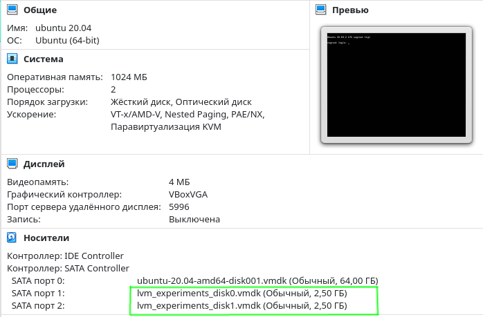

### Решение домашнего задания к занятию "3.5. Файловые системы"

1. Узнайте о [sparse](https://ru.wikipedia.org/wiki/%D0%A0%D0%B0%D0%B7%D1%80%D0%B5%D0%B6%D1%91%D0%BD%D0%BD%D1%8B%D0%B9_%D1%84%D0%B0%D0%B9%D0%BB) 
(разряженных) файлах.

Почитал, знал. Полезная штука.

1. Могут ли файлы, являющиеся жесткой ссылкой на один объект, иметь разные права доступа и владельца? Почему?

Нет, жесткие ссылки, в отличие от симлинков, имеют ту же информацию inode и набор разрешений, что и у исходного
файла. 

Приведу пример:
```bash
vagrant@vagrant:~$ mkdir links
vagrant@vagrant:~$ cd links/
vagrant@vagrant:~/links$ touch file
vagrant@vagrant:~/links$ ls
file
vagrant@vagrant:~/links$ ln -P file hard_link
vagrant@vagrant:~/links$ ls -li
total 0
131106 -rw-rw-r-- 2 vagrant vagrant 0 Feb  6 13:18 file
131106 -rw-rw-r-- 2 vagrant vagrant 0 Feb  6 13:18 hard_link
vagrant@vagrant:~/links$ 
```

Inode и права доступа идентичны.

Чмокнем жесткую ссылку:
```bash
vagrant@vagrant:~/links$ chmod 777 hard_link 
vagrant@vagrant:~/links$ ls -li
total 0
131106 -rwxrwxrwx 2 vagrant vagrant 0 Feb  6 13:18 file
131106 -rwxrwxrwx 2 vagrant vagrant 0 Feb  6 13:18 hard_link
```

Здорово, правда? Есть подозрение, что жесткая ссылка это обычный файл ) 

1. Сделайте `vagrant destroy` на имеющийся инстанс Ubuntu. Замените содержимое Vagrantfile следующим:

    ```bash
    Vagrant.configure("2") do |config|
      config.vm.box = "bento/ubuntu-20.04"
      config.vm.provider :virtualbox do |vb|
        lvm_experiments_disk0_path = "/tmp/lvm_experiments_disk0.vmdk"
        lvm_experiments_disk1_path = "/tmp/lvm_experiments_disk1.vmdk"
        vb.customize ['createmedium', '--filename', lvm_experiments_disk0_path, '--size', 2560]
        vb.customize ['createmedium', '--filename', lvm_experiments_disk1_path, '--size', 2560]
        vb.customize ['storageattach', :id, '--storagectl', 'SATA Controller', '--port', 1, '--device', 0, '--type', 'hdd', '--medium', lvm_experiments_disk0_path]
        vb.customize ['storageattach', :id, '--storagectl', 'SATA Controller', '--port', 2, '--device', 0, '--type', 'hdd', '--medium', lvm_experiments_disk1_path]
      end
    end
    ```

    Данная конфигурация создаст новую виртуальную машину с двумя дополнительными неразмеченными дисками по 2.5 Гб.

Выполнил, поднял новую машину. Залогинимся и посмотрим:
```bash
vagrant@vagrant:~$ lsblk
NAME                 MAJ:MIN RM  SIZE RO TYPE MOUNTPOINT
sda                    8:0    0   64G  0 disk 
├─sda1                 8:1    0  512M  0 part /boot/efi
├─sda2                 8:2    0    1K  0 part 
└─sda5                 8:5    0 63.5G  0 part 
  ├─vgvagrant-root   253:0    0 62.6G  0 lvm  /
  └─vgvagrant-swap_1 253:1    0  980M  0 lvm  [SWAP]
sdb                    8:16   0  2.5G  0 disk 
sdc                    8:32   0  2.5G  0 disk

vagrant@vagrant:~$ sudo fdisk -l
Disk /dev/sda: 64 GiB, 68719476736 bytes, 134217728 sectors
Disk model: VBOX HARDDISK   
Units: sectors of 1 * 512 = 512 bytes
Sector size (logical/physical): 512 bytes / 512 bytes
I/O size (minimum/optimal): 512 bytes / 512 bytes
Disklabel type: dos
Disk identifier: 0x3f94c461

Device     Boot   Start       End   Sectors  Size Id Type
/dev/sda1  *       2048   1050623   1048576  512M  b W95 FAT32
/dev/sda2       1052670 134215679 133163010 63.5G  5 Extended
/dev/sda5       1052672 134215679 133163008 63.5G 8e Linux LVM


Disk /dev/sdb: 2.51 GiB, 2684354560 bytes, 5242880 sectors
Disk model: VBOX HARDDISK   
Units: sectors of 1 * 512 = 512 bytes
Sector size (logical/physical): 512 bytes / 512 bytes
I/O size (minimum/optimal): 512 bytes / 512 bytes


Disk /dev/sdc: 2.51 GiB, 2684354560 bytes, 5242880 sectors
Disk model: VBOX HARDDISK   
Units: sectors of 1 * 512 = 512 bytes
Sector size (logical/physical): 512 bytes / 512 bytes
I/O size (minimum/optimal): 512 bytes / 512 bytes


Disk /dev/mapper/vgvagrant-root: 62.55 GiB, 67150807040 bytes, 131153920 sectors
Units: sectors of 1 * 512 = 512 bytes
Sector size (logical/physical): 512 bytes / 512 bytes
I/O size (minimum/optimal): 512 bytes / 512 bytes


Disk /dev/mapper/vgvagrant-swap_1: 980 MiB, 1027604480 bytes, 2007040 sectors
Units: sectors of 1 * 512 = 512 bytes
Sector size (logical/physical): 512 bytes / 512 bytes
I/O size (minimum/optimal): 512 bytes / 512 bytes

```

VBox также показывает, что появилось что-то новое:



1. Используя `fdisk`, разбейте первый диск на 2 раздела: 2 Гб, оставшееся пространство.

Потекла скупая ностальгическая гентушная слеза..

```bash
vagrant@vagrant:~$ sudo fdisk /dev/sdb

Welcome to fdisk (util-linux 2.34).
Changes will remain in memory only, until you decide to write them.
Be careful before using the write command.

Device does not contain a recognized partition table.
Created a new DOS disklabel with disk identifier 0xb2d16bd1.

Command (m for help): n
Partition type
   p   primary (0 primary, 0 extended, 4 free)
   e   extended (container for logical partitions)
Select (default p): p
Partition number (1-4, default 1): 
First sector (2048-5242879, default 2048): 
Last sector, +/-sectors or +/-size{K,M,G,T,P} (2048-5242879, default 5242879): +2G

Created a new partition 1 of type 'Linux' and of size 2 GiB.

Command (m for help): n
Partition type
   p   primary (1 primary, 0 extended, 3 free)
   e   extended (container for logical partitions)
Select (default p): p
Partition number (2-4, default 2): 
First sector (4196352-5242879, default 4196352): 
Last sector, +/-sectors or +/-size{K,M,G,T,P} (4196352-5242879, default 5242879): 

Created a new partition 2 of type 'Linux' and of size 511 MiB.

Command (m for help): p
Disk /dev/sdb: 2.51 GiB, 2684354560 bytes, 5242880 sectors
Disk model: VBOX HARDDISK   
Units: sectors of 1 * 512 = 512 bytes
Sector size (logical/physical): 512 bytes / 512 bytes
I/O size (minimum/optimal): 512 bytes / 512 bytes
Disklabel type: dos
Disk identifier: 0xb2d16bd1

Device     Boot   Start     End Sectors  Size Id Type
/dev/sdb1          2048 4196351 4194304    2G 83 Linux
/dev/sdb2       4196352 5242879 1046528  511M 83 Linux
```

Запишем изменения на диск и посмотрим, что получилось:
```bash
Command (m for help): w
The partition table has been altered.
Calling ioctl() to re-read partition table.
Syncing disks.
```

```bash
vagrant@vagrant:~$ lsblk
NAME                 MAJ:MIN RM  SIZE RO TYPE MOUNTPOINT
sda                    8:0    0   64G  0 disk 
├─sda1                 8:1    0  512M  0 part /boot/efi
├─sda2                 8:2    0    1K  0 part 
└─sda5                 8:5    0 63.5G  0 part 
  ├─vgvagrant-root   253:0    0 62.6G  0 lvm  /
  └─vgvagrant-swap_1 253:1    0  980M  0 lvm  [SWAP]
sdb                    8:16   0  2.5G  0 disk 
├─sdb1                 8:17   0    2G  0 part 
└─sdb2                 8:18   0  511M  0 part 
sdc                    8:32   0  2.5G  0 disk 

vagrant@vagrant:~$ sudo fdisk -l
Disk /dev/sda: 64 GiB, 68719476736 bytes, 134217728 sectors
Disk model: VBOX HARDDISK   
Units: sectors of 1 * 512 = 512 bytes
Sector size (logical/physical): 512 bytes / 512 bytes
I/O size (minimum/optimal): 512 bytes / 512 bytes
Disklabel type: dos
Disk identifier: 0x3f94c461

Device     Boot   Start       End   Sectors  Size Id Type
/dev/sda1  *       2048   1050623   1048576  512M  b W95 FAT32
/dev/sda2       1052670 134215679 133163010 63.5G  5 Extended
/dev/sda5       1052672 134215679 133163008 63.5G 8e Linux LVM


Disk /dev/sdb: 2.51 GiB, 2684354560 bytes, 5242880 sectors
Disk model: VBOX HARDDISK   
Units: sectors of 1 * 512 = 512 bytes
Sector size (logical/physical): 512 bytes / 512 bytes
I/O size (minimum/optimal): 512 bytes / 512 bytes
Disklabel type: dos
Disk identifier: 0xb2d16bd1

Device     Boot   Start     End Sectors  Size Id Type
/dev/sdb1          2048 4196351 4194304    2G 83 Linux
/dev/sdb2       4196352 5242879 1046528  511M 83 Linux


Disk /dev/sdc: 2.51 GiB, 2684354560 bytes, 5242880 sectors
Disk model: VBOX HARDDISK   
Units: sectors of 1 * 512 = 512 bytes
Sector size (logical/physical): 512 bytes / 512 bytes
I/O size (minimum/optimal): 512 bytes / 512 bytes


Disk /dev/mapper/vgvagrant-root: 62.55 GiB, 67150807040 bytes, 131153920 sectors
Units: sectors of 1 * 512 = 512 bytes
Sector size (logical/physical): 512 bytes / 512 bytes
I/O size (minimum/optimal): 512 bytes / 512 bytes


Disk /dev/mapper/vgvagrant-swap_1: 980 MiB, 1027604480 bytes, 2007040 sectors
Units: sectors of 1 * 512 = 512 bytes
Sector size (logical/physical): 512 bytes / 512 bytes
I/O size (minimum/optimal): 512 bytes / 512 bytes
```

1. Используя `sfdisk`, перенесите данную таблицу разделов на второй диск.

Опций для прямой команды переноса таблицы разделов не нашел, может, плохо искал. 

Придется делать через сохранение и восстановление:
```bash

vagrant@vagrant:~$ sudo sfdisk -d /dev/sdb > dump
```

А потом наоборот:
```bash

vagrant@vagrant:~$ sudo sfdisk /dev/sdc < dump
Checking that no-one is using this disk right now ... OK

Disk /dev/sdc: 2.51 GiB, 2684354560 bytes, 5242880 sectors
Disk model: VBOX HARDDISK   
Units: sectors of 1 * 512 = 512 bytes
Sector size (logical/physical): 512 bytes / 512 bytes
I/O size (minimum/optimal): 512 bytes / 512 bytes

>>> Script header accepted.
>>> Script header accepted.
>>> Script header accepted.
>>> Script header accepted.
>>> Created a new DOS disklabel with disk identifier 0xf205c9aa.
/dev/sdc1: Created a new partition 1 of type 'Linux' and of size 2 GiB.
/dev/sdc2: Created a new partition 2 of type 'Linux' and of size 511 MiB.
/dev/sdc3: Done.

New situation:
Disklabel type: dos
Disk identifier: 0xf205c9aa

Device     Boot   Start     End Sectors  Size Id Type
/dev/sdc1          2048 4196351 4194304    2G 83 Linux
/dev/sdc2       4196352 5242879 1046528  511M 83 Linux

The partition table has been altered.
Calling ioctl() to re-read partition table.
Syncing disks.
```

Проверим:

```bash

vagrant@vagrant:~$ lsblk
NAME                 MAJ:MIN RM  SIZE RO TYPE MOUNTPOINT
sda                    8:0    0   64G  0 disk 
├─sda1                 8:1    0  512M  0 part /boot/efi
├─sda2                 8:2    0    1K  0 part 
└─sda5                 8:5    0 63.5G  0 part 
  ├─vgvagrant-root   253:0    0 62.6G  0 lvm  /
  └─vgvagrant-swap_1 253:1    0  980M  0 lvm  [SWAP]
sdb                    8:16   0  2.5G  0 disk 
├─sdb1                 8:17   0    2G  0 part 
└─sdb2                 8:18   0  511M  0 part 
sdc                    8:32   0  2.5G  0 disk 
├─sdc1                 8:33   0    2G  0 part 
└─sdc2                 8:34   0  511M  0 part 
```

Теоретически, можно попробовать объединить, рискнем:
```bash

vagrant@vagrant:~$ sudo sfdisk -d /dev/sdb | sudo sfdisk /dev/sdc
Checking that no-one is using this disk right now ... OK

Disk /dev/sdc: 2.51 GiB, 2684354560 bytes, 5242880 sectors
Disk model: VBOX HARDDISK   
Units: sectors of 1 * 512 = 512 bytes
Sector size (logical/physical): 512 bytes / 512 bytes
I/O size (minimum/optimal): 512 bytes / 512 bytes
Disklabel type: dos
Disk identifier: 0xf205c9aa

Old situation:

Device     Boot   Start     End Sectors  Size Id Type
/dev/sdc1          2048 4196351 4194304    2G 83 Linux
/dev/sdc2       4196352 5242879 1046528  511M 83 Linux

>>> Script header accepted.
>>> Script header accepted.
>>> Script header accepted.
>>> Script header accepted.
>>> Created a new DOS disklabel with disk identifier 0xf205c9aa.
/dev/sdc1: Created a new partition 1 of type 'Linux' and of size 2 GiB.
/dev/sdc2: Created a new partition 2 of type 'Linux' and of size 511 MiB.
/dev/sdc3: Done.

New situation:
Disklabel type: dos
Disk identifier: 0xf205c9aa

Device     Boot   Start     End Sectors  Size Id Type
/dev/sdc1          2048 4196351 4194304    2G 83 Linux
/dev/sdc2       4196352 5242879 1046528  511M 83 Linux

The partition table has been altered.
Calling ioctl() to re-read partition table.
Syncing disks.

vagrant@vagrant:~$ lsblk
NAME                 MAJ:MIN RM  SIZE RO TYPE MOUNTPOINT
sda                    8:0    0   64G  0 disk 
├─sda1                 8:1    0  512M  0 part /boot/efi
├─sda2                 8:2    0    1K  0 part 
└─sda5                 8:5    0 63.5G  0 part 
  ├─vgvagrant-root   253:0    0 62.6G  0 lvm  /
  └─vgvagrant-swap_1 253:1    0  980M  0 lvm  [SWAP]
sdb                    8:16   0  2.5G  0 disk 
├─sdb1                 8:17   0    2G  0 part 
└─sdb2                 8:18   0  511M  0 part 
sdc                    8:32   0  2.5G  0 disk 
├─sdc1                 8:33   0    2G  0 part 
└─sdc2                 8:34   0  511M  0 part 
```

Хуже не стало

1. Соберите `mdadm` RAID1 на паре разделов 2 Гб.

Применяем следующую команду:

`mdadm --create --verbose /dev/md0 -l 1 -n 2 /dev/sd{b1,c1}`

где:
  - /dev/md0 — устройство RAID, которое появится после сборки; 
  - -l 1 — уровень RAID; 
  - -n 2 — количество дисков, из которых собирается массив; 
  - /dev/sd{b1,c1} — сборка выполняется из разделов sdb1 и sdc1.

Мы должны увидеть что-то на подобие:
```bash

mdadm: Note: this array has metadata at the start and
    may not be suitable as a boot device.  If you plan to
    store '/boot' on this device please ensure that
    your boot-loader understands md/v1.x metadata, or use
    --metadata=0.90
mdadm: size set to 2094080K
Continue creating array? y
mdadm: Defaulting to version 1.2 metadata
mdadm: array /dev/md0 started.
```

Проверяем:
```bash

vagrant@vagrant:~$ sudo mdadm -D /dev/md0
/dev/md0:
           Version : 1.2
     Creation Time : Mon Feb  7 12:32:33 2022
        Raid Level : raid1
        Array Size : 2094080 (2045.00 MiB 2144.34 MB)
     Used Dev Size : 2094080 (2045.00 MiB 2144.34 MB)
      Raid Devices : 2
     Total Devices : 2
       Persistence : Superblock is persistent

       Update Time : Mon Feb  7 12:32:44 2022
             State : clean 
    Active Devices : 2
   Working Devices : 2
    Failed Devices : 0
     Spare Devices : 0

Consistency Policy : resync

              Name : vagrant:0  (local to host vagrant)
              UUID : b4eef557:4a6e22e2:4d92ec45:59ceea00
            Events : 17

    Number   Major   Minor   RaidDevice State
       0       8       17        0      active sync   /dev/sdb1
       1       8       33        1      active sync   /dev/sdc1
       
vagrant@vagrant:~$ lsblk
NAME                 MAJ:MIN RM  SIZE RO TYPE  MOUNTPOINT
sda                    8:0    0   64G  0 disk  
├─sda1                 8:1    0  512M  0 part  /boot/efi
├─sda2                 8:2    0    1K  0 part  
└─sda5                 8:5    0 63.5G  0 part  
  ├─vgvagrant-root   253:0    0 62.6G  0 lvm   /
  └─vgvagrant-swap_1 253:1    0  980M  0 lvm   [SWAP]
sdb                    8:16   0  2.5G  0 disk  
├─sdb1                 8:17   0    2G  0 part  
│ └─md0                9:0    0    2G  0 raid1 
└─sdb2                 8:18   0  511M  0 part  
sdc                    8:32   0  2.5G  0 disk  
├─sdc1                 8:33   0    2G  0 part  
│ └─md0                9:0    0    2G  0 raid1 
└─sdc2                 8:34   0  511M  0 part  
```

Ого! У наших дисков sdb1 и sdc1 появился раздел md0 )

1. Соберите `mdadm` RAID0 на второй паре маленьких разделов

Делается аналогично предыдущему заданию, только команда слегка отличается:
```bash


vagrant@vagrant:~$ sudo mdadm --create --verbose /dev/md1 -l 0 -n 2 /dev/sd{b2,c2}
mdadm: chunk size defaults to 512K
mdadm: Defaulting to version 1.2 metadata
mdadm: array /dev/md1 started.

vagrant@vagrant:~$ sudo mdadm -D /dev/md1
/dev/md1:
           Version : 1.2
     Creation Time : Mon Feb  7 12:38:07 2022
        Raid Level : raid0
        Array Size : 1042432 (1018.00 MiB 1067.45 MB)
      Raid Devices : 2
     Total Devices : 2
       Persistence : Superblock is persistent

       Update Time : Mon Feb  7 12:38:07 2022
             State : clean 
    Active Devices : 2
   Working Devices : 2
    Failed Devices : 0
     Spare Devices : 0

            Layout : -unknown-
        Chunk Size : 512K

Consistency Policy : none

              Name : vagrant:1  (local to host vagrant)
              UUID : ce7dd748:51ff1728:158dc4ae:862bf0d0
            Events : 0

    Number   Major   Minor   RaidDevice State
       0       8       18        0      active sync   /dev/sdb2
       1       8       34        1      active sync   /dev/sdc2

vagrant@vagrant:~$ lsblk
NAME                 MAJ:MIN RM  SIZE RO TYPE  MOUNTPOINT
sda                    8:0    0   64G  0 disk  
├─sda1                 8:1    0  512M  0 part  /boot/efi
├─sda2                 8:2    0    1K  0 part  
└─sda5                 8:5    0 63.5G  0 part  
  ├─vgvagrant-root   253:0    0 62.6G  0 lvm   /
  └─vgvagrant-swap_1 253:1    0  980M  0 lvm   [SWAP]
sdb                    8:16   0  2.5G  0 disk  
├─sdb1                 8:17   0    2G  0 part  
│ └─md0                9:0    0    2G  0 raid1 
└─sdb2                 8:18   0  511M  0 part  
  └─md1                9:1    0 1018M  0 raid0 
sdc                    8:32   0  2.5G  0 disk  
├─sdc1                 8:33   0    2G  0 part  
│ └─md0                9:0    0    2G  0 raid1 
└─sdc2                 8:34   0  511M  0 part  
  └─md1                9:1    0 1018M  0 raid0 
```

1. Создайте 2 независимых PV на получившихся md-устройствах

```bash

vagrant@vagrant:~$ sudo pvcreate /dev/md0 /dev/md1
  Physical volume "/dev/md0" successfully created.
  Physical volume "/dev/md1" successfully created.
```

Проверим, куда без этого:
```bash

vagrant@vagrant:~$ sudo pvscan
  PV /dev/sda5   VG vgvagrant       lvm2 [<63.50 GiB / 0    free]
  PV /dev/md0                       lvm2 [<2.00 GiB]
  PV /dev/md1                       lvm2 [1018.00 MiB]
  Total: 3 [<66.49 GiB] / in use: 1 [<63.50 GiB] / in no VG: 2 [2.99 GiB]
```

Или так:
```bash

vagrant@vagrant:~$ sudo pvdisplay
  --- Physical volume ---
  PV Name               /dev/sda5
  VG Name               vgvagrant
  PV Size               <63.50 GiB / not usable 0   
  Allocatable           yes (but full)
  PE Size               4.00 MiB
  Total PE              16255
  Free PE               0
  Allocated PE          16255
  PV UUID               Mx3LcA-uMnN-h9yB-gC2w-qm7w-skx0-OsTz9z
   
  "/dev/md0" is a new physical volume of "<2.00 GiB"
  --- NEW Physical volume ---
  PV Name               /dev/md0
  VG Name               
  PV Size               <2.00 GiB
  Allocatable           NO
  PE Size               0   
  Total PE              0
  Free PE               0
  Allocated PE          0
  PV UUID               e6W3lf-OvA1-yJ13-h7mH-ChEq-t7iB-rqX6Gu
   
  "/dev/md1" is a new physical volume of "1018.00 MiB"
  --- NEW Physical volume ---
  PV Name               /dev/md1
  VG Name               
  PV Size               1018.00 MiB
  Allocatable           NO
  PE Size               0   
  Total PE              0
  Free PE               0
  Allocated PE          0
  PV UUID               rBTvec-E2PF-j9su-75VO-dOXX-3tY1-ktYWMx
```

1. Создайте общую volume-group на этих двух PV.

```bash

vagrant@vagrant:~$ sudo vgcreate vol_grp1 /dev/md0 /dev/md1
  Volume group "vol_grp1" successfully created
```

Вот что из этого вышло:
```bash

vagrant@vagrant:~$ sudo vgdisplay
  --- Volume group ---
  VG Name               vgvagrant
  System ID             
  Format                lvm2
  Metadata Areas        1
  Metadata Sequence No  3
  VG Access             read/write
  VG Status             resizable
  MAX LV                0
  Cur LV                2
  Open LV               2
  Max PV                0
  Cur PV                1
  Act PV                1
  VG Size               <63.50 GiB
  PE Size               4.00 MiB
  Total PE              16255
  Alloc PE / Size       16255 / <63.50 GiB
  Free  PE / Size       0 / 0   
  VG UUID               PaBfZ0-3I0c-iIdl-uXKt-JL4K-f4tT-kzfcyE
   
  --- Volume group ---
  VG Name               vol_grp1
  System ID             
  Format                lvm2
  Metadata Areas        2
  Metadata Sequence No  1
  VG Access             read/write
  VG Status             resizable
  MAX LV                0
  Cur LV                0
  Open LV               0
  Max PV                0
  Cur PV                2
  Act PV                2
  VG Size               <2.99 GiB
  PE Size               4.00 MiB
  Total PE              765
  Alloc PE / Size       0 / 0   
  Free  PE / Size       765 / <2.99 GiB
  VG UUID               DRaBRn-l8RA-vHMg-1q0q-1whR-noq2-blr6VI
```

1. Создайте LVM размером 100 Мб, указав его расположение на PV с RAID0.

У нас как раз все готово, чтобы создать логический LVM раздел)

```bash

vagrant@vagrant:~$ sudo lvcreate -L 100M -n vol_log1 vol_grp1 /dev/md1
  Logical volume "vol_log1" created.
```

Вот:
```bash

vagrant@vagrant:~$ lsblk
NAME                    MAJ:MIN RM  SIZE RO TYPE  MOUNTPOINT
sda                       8:0    0   64G  0 disk  
├─sda1                    8:1    0  512M  0 part  /boot/efi
├─sda2                    8:2    0    1K  0 part  
└─sda5                    8:5    0 63.5G  0 part  
  ├─vgvagrant-root      253:0    0 62.6G  0 lvm   /
  └─vgvagrant-swap_1    253:1    0  980M  0 lvm   [SWAP]
sdb                       8:16   0  2.5G  0 disk  
├─sdb1                    8:17   0    2G  0 part  
│ └─md0                   9:0    0    2G  0 raid1 
└─sdb2                    8:18   0  511M  0 part  
  └─md1                   9:1    0 1018M  0 raid0 
    └─vol_grp1-vol_log1 253:2    0  100M  0 lvm   
sdc                       8:32   0  2.5G  0 disk  
├─sdc1                    8:33   0    2G  0 part  
│ └─md0                   9:0    0    2G  0 raid1 
└─sdc2                    8:34   0  511M  0 part  
  └─md1                   9:1    0 1018M  0 raid0 
    └─vol_grp1-vol_log1 253:2    0  100M  0 lvm   


vagrant@vagrant:~$ sudo lvdisplay
..
  --- Logical volume ---
  LV Path                /dev/vol_grp1/vol_log1
  LV Name                vol_log1
  VG Name                vol_grp1
  LV UUID                wmVBFP-E1BT-P8nW-bEgX-BwTx-YiU3-KWVoHp
  LV Write Access        read/write
  LV Creation host, time vagrant, 2022-02-07 13:02:02 +0000
  LV Status              available
  # open                 0
  LV Size                100.00 MiB
  Current LE             25
  Segments               1
  Allocation             inherit
  Read ahead sectors     auto
  - currently set to     4096
  Block device           253:2
```

1. Создайте `mkfs.ext4` ФС на получившемся LV.

Легко:
```bash

vagrant@vagrant:~$ sudo mkfs.ext4 /dev/vol_grp1/vol_log1 
mke2fs 1.45.5 (07-Jan-2020)
Creating filesystem with 25600 4k blocks and 25600 inodes

Allocating group tables: done                            
Writing inode tables: done                            
Creating journal (1024 blocks): done
Writing superblocks and filesystem accounting information: done

vagrant@vagrant:~$ lsblk -o NAME,FSTYPE
NAME                    FSTYPE
sda                     
├─sda1                  vfat
├─sda2                  
└─sda5                  LVM2_member
  ├─vgvagrant-root      ext4
  └─vgvagrant-swap_1    swap
sdb                     
├─sdb1                  linux_raid_member
│ └─md0                 LVM2_member
└─sdb2                  linux_raid_member
  └─md1                 LVM2_member
    └─vol_grp1-vol_log1 ext4
sdc                     
├─sdc1                  linux_raid_member
│ └─md0                 LVM2_member
└─sdc2                  linux_raid_member
  └─md1                 LVM2_member
    └─vol_grp1-vol_log1 ext4

```


1. Смонтируйте этот раздел в любую директорию, например, `/tmp/new`.

```bash

vagrant@vagrant:~$ mkdir /tmp/new
vagrant@vagrant:~$ sudo mount /dev/vol_grp1/vol_log1 /tmp/new/
```

Как-то так..

1. Поместите туда тестовый файл, например `wget https://mirror.yandex.ru/ubuntu/ls-lR.gz -O /tmp/new/test.gz`.

```bash

vagrant@vagrant:~$ sudo wget https://mirror.yandex.ru/ubuntu/ls-lR.gz -O /tmp/new/test.gz
--2022-02-07 13:11:16--  https://mirror.yandex.ru/ubuntu/ls-lR.gz
Resolving mirror.yandex.ru (mirror.yandex.ru)... 213.180.204.183, 2a02:6b8::183
Connecting to mirror.yandex.ru (mirror.yandex.ru)|213.180.204.183|:443... connected.
HTTP request sent, awaiting response... 200 OK
Length: 22197022 (21M) [application/octet-stream]
Saving to: ‘/tmp/new/test.gz’

/tmp/new/test.gz             100%[==============================================>]  21.17M  1.02MB/s    in 21s     

2022-02-07 13:11:37 (1.01 MB/s) - ‘/tmp/new/test.gz’ saved [22197022/22197022]

vagrant@vagrant:~$ ls -lah /tmp/new/
total 22M
drwxr-xr-x  3 root root 4.0K Feb  7 13:11 .
drwxrwxrwt 12 root root 4.0K Feb  7 13:08 ..
drwx------  2 root root  16K Feb  7 13:06 lost+found
-rw-r--r--  1 root root  22M Feb  7 08:06 test.gz
```

1. Прикрепите вывод `lsblk`.

```bash

vagrant@vagrant:~$ lsblk
NAME                    MAJ:MIN RM  SIZE RO TYPE  MOUNTPOINT
sda                       8:0    0   64G  0 disk  
├─sda1                    8:1    0  512M  0 part  /boot/efi
├─sda2                    8:2    0    1K  0 part  
└─sda5                    8:5    0 63.5G  0 part  
  ├─vgvagrant-root      253:0    0 62.6G  0 lvm   /
  └─vgvagrant-swap_1    253:1    0  980M  0 lvm   [SWAP]
sdb                       8:16   0  2.5G  0 disk  
├─sdb1                    8:17   0    2G  0 part  
│ └─md0                   9:0    0    2G  0 raid1 
└─sdb2                    8:18   0  511M  0 part  
  └─md1                   9:1    0 1018M  0 raid0 
    └─vol_grp1-vol_log1 253:2    0  100M  0 lvm   /tmp/new
sdc                       8:32   0  2.5G  0 disk  
├─sdc1                    8:33   0    2G  0 part  
│ └─md0                   9:0    0    2G  0 raid1 
└─sdc2                    8:34   0  511M  0 part  
  └─md1                   9:1    0 1018M  0 raid0 
    └─vol_grp1-vol_log1 253:2    0  100M  0 lvm   /tmp/new
```

Протестируйте целостность файла:

```bash
    root@vagrant:~# gzip -t /tmp/new/test.gz
    root@vagrant:~# echo $?
    0
```

Готово:
```bash

vagrant@vagrant:/tmp/new$ sudo gzip -t /tmp/new/test.gz
vagrant@vagrant:/tmp/new$ sudo echo $?
0
```


1. Используя `pvmove`, переместите содержимое PV с RAID0 на RAID1.

```bash

vagrant@vagrant:/tmp/new$ sudo pvmove /dev/md1 /dev/md0
  /dev/md1: Moved: 64.00%
  /dev/md1: Moved: 100.00%
```

Проверим:
```bash

vagrant@vagrant:/tmp/new$ lsblk
NAME                    MAJ:MIN RM  SIZE RO TYPE  MOUNTPOINT
sda                       8:0    0   64G  0 disk  
├─sda1                    8:1    0  512M  0 part  /boot/efi
├─sda2                    8:2    0    1K  0 part  
└─sda5                    8:5    0 63.5G  0 part  
  ├─vgvagrant-root      253:0    0 62.6G  0 lvm   /
  └─vgvagrant-swap_1    253:1    0  980M  0 lvm   [SWAP]
sdb                       8:16   0  2.5G  0 disk  
├─sdb1                    8:17   0    2G  0 part  
│ └─md0                   9:0    0    2G  0 raid1 
│   └─vol_grp1-vol_log1 253:2    0  100M  0 lvm   /tmp/new
└─sdb2                    8:18   0  511M  0 part  
  └─md1                   9:1    0 1018M  0 raid0 
sdc                       8:32   0  2.5G  0 disk  
├─sdc1                    8:33   0    2G  0 part  
│ └─md0                   9:0    0    2G  0 raid1 
│   └─vol_grp1-vol_log1 253:2    0  100M  0 lvm   /tmp/new
└─sdc2                    8:34   0  511M  0 part  
  └─md1                   9:1    0 1018M  0 raid0 
```

Похоже, все получилось)

1. Сделайте `--fail` на устройство в вашем RAID1 md.

```bash

vagrant@vagrant:/tmp/new$ sudo mdadm /dev/md0 --fail /dev/sdb1
mdadm: set /dev/sdb1 faulty in /dev/md0
```

Смотрим состояние:
```bash

vagrant@vagrant:/tmp/new$ sudo mdadm -D /dev/md0
/dev/md0:
           Version : 1.2
     Creation Time : Mon Feb  7 12:32:33 2022
        Raid Level : raid1
        Array Size : 2094080 (2045.00 MiB 2144.34 MB)
     Used Dev Size : 2094080 (2045.00 MiB 2144.34 MB)
      Raid Devices : 2
     Total Devices : 2
       Persistence : Superblock is persistent

       Update Time : Mon Feb  7 13:36:38 2022
             State : clean, degraded 
    Active Devices : 1
   Working Devices : 1
    Failed Devices : 1
     Spare Devices : 0

Consistency Policy : resync

              Name : vagrant:0  (local to host vagrant)
              UUID : b4eef557:4a6e22e2:4d92ec45:59ceea00
            Events : 19

    Number   Major   Minor   RaidDevice State
       -       0        0        0      removed
       1       8       33        1      active sync   /dev/sdc1

       0       8       17        -      faulty   /dev/sdb1
```

1. Подтвердите выводом `dmesg`, что RAID1 работает в деградированном состоянии.

```bash

vagrant@vagrant:/tmp/new$ dmesg | grep raid1
..
[21941.512530] md/raid1:md0: Disk failure on sdb1, disabling device.
               md/raid1:md0: Operation continuing on 1 devices.
```


1. Протестируйте целостность файла, несмотря на "сбойный" диск он должен продолжать быть доступен:

```bash
root@vagrant:~# gzip -t /tmp/new/test.gz
root@vagrant:~# echo $?
0
```

Протестировал, все доступно.

1. Погасите тестовый хост, `vagrant destroy`.

```bash

..
    default: Are you sure you want to destroy the 'default' VM? [y/N] y
==> default: Forcing shutdown of VM...
==> default: Destroying VM and associated drives...
```

Погасил)