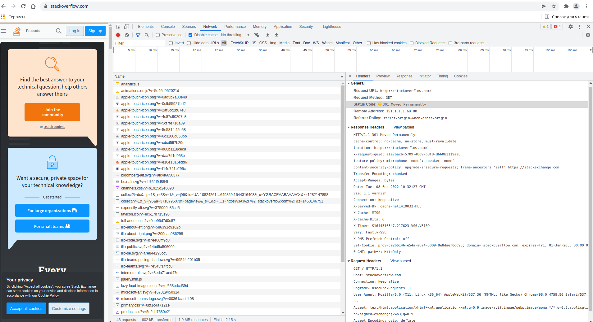
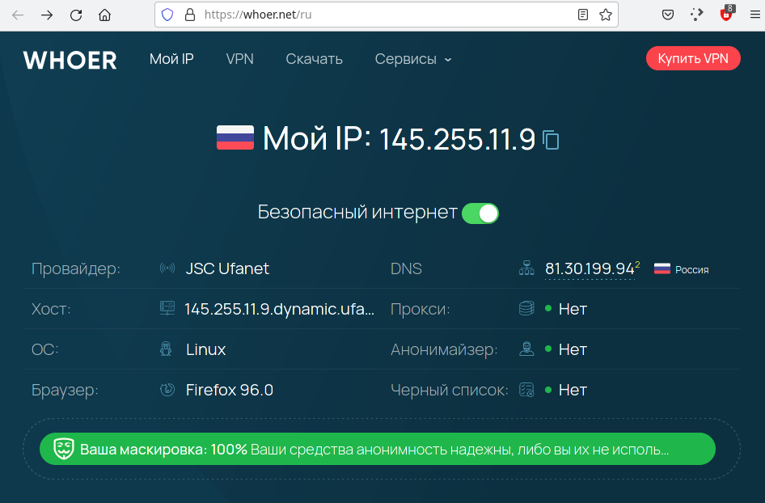
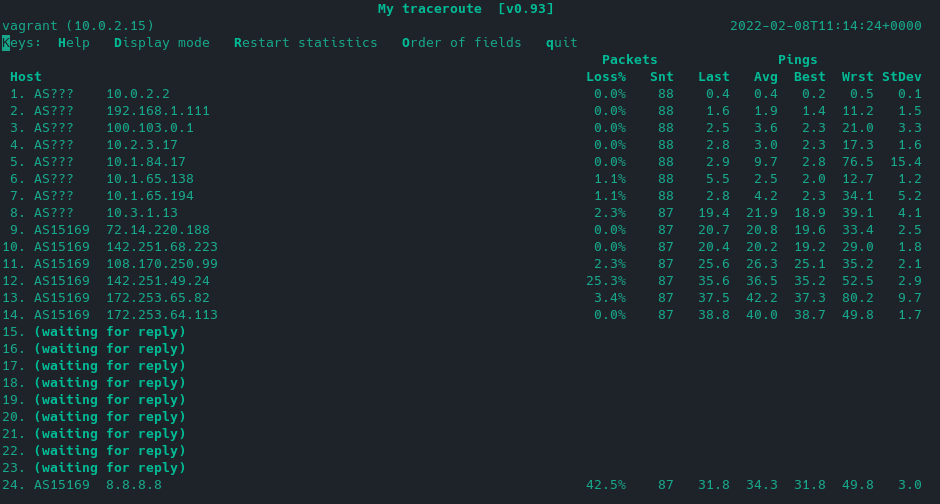

### Решение домашнего задания к занятию "3.6. Компьютерные сети, лекция 1"


1. Работа c HTTP через телнет
   - Подключитесь утилитой телнет к сайту `stackoverflow.com telnet stackoverflow.com 80`
   - отправьте HTTP запрос
```
GET /questions HTTP/1.0
HOST: stackoverflow.com
[press enter]
[press enter]
```

В ответе укажите полученный HTTP код, что он означает?

```bash
vagrant@vagrant:~$ telnet stackoverflow.com 80
Trying 151.101.129.69...
Connected to stackoverflow.com.
Escape character is '^]'.
GET /questions HTTP/1.0
HOST: stackoverflow.com

HTTP/1.1 301 Moved Permanently
cache-control: no-cache, no-store, must-revalidate
location: https://stackoverflow.com/questions
x-request-guid: 46f02ed5-d7d3-450c-86f2-e15b775a41a1
feature-policy: microphone 'none'; speaker 'none'
content-security-policy: upgrade-insecure-requests; frame-ancestors 'self' https://stackexchange.com
Accept-Ranges: bytes
Date: Tue, 08 Feb 2022 10:11:47 GMT
Via: 1.1 varnish
Connection: close
X-Served-By: cache-hel1410020-HEL
X-Cache: MISS
X-Cache-Hits: 0
X-Timer: S1644315107.402222,VS0,VE110
Vary: Fastly-SSL
X-DNS-Prefetch-Control: off
Set-Cookie: prov=8630b27b-15bf-5873-4ad7-d76356948ab4; domain=.stackoverflow.com; expires=Fri, 01-Jan-2055 00:00:00 GMT; path=/; HttpOnly

Connection closed by foreign host.

```

Запрошенный ресурс был на постоянной основе перемещён в новое месторасположение. Текущие ссылки, использующие данный 
URL, должны быть обновлены. 

Адрес нового месторасположения ресурса указывается в поле `Location` получаемого в ответ заголовка пакета протокола 
HTTP.


1. Повторите задание 1 в браузере, используя консоль разработчика F12.
  - откройте вкладку Network
  - отправьте запрос http://stackoverflow.com
  - найдите первый ответ HTTP сервера, откройте вкладку Headers
  - укажите в ответе полученный HTTP код.
  - проверьте время загрузки страницы, какой запрос обрабатывался дольше всего?
  - приложите скриншот консоли браузера в ответ.
  
Поведение в разных браузерах отличается. В Firefox нет редиректа. Пришлось поставить Chromium, чтобы повторить 
результат. Полученный HTTP-код в первом ответе:

```bash
Accept-Ranges: bytes
cache-control: no-cache, no-store, must-revalidate
Connection: keep-alive
content-security-policy: upgrade-insecure-requests; frame-ancestors 'self' https://stackexchange.com
Date: Tue, 08 Feb 2022 10:32:27 GMT
feature-policy: microphone 'none'; speaker 'none'
location: https://stackoverflow.com/
Set-Cookie: prov=ca2b6146-e54a-a8a4-5009-8e8daef0dd95; domain=.stackoverflow.com; expires=Fri, 01-Jan-2055 00:00:00 GMT; path=/; HttpOnly
Transfer-Encoding: chunked
Vary: Fastly-SSL
Via: 1.1 varnish
X-Cache: MISS
X-Cache-Hits: 0
X-DNS-Prefetch-Control: off
x-request-guid: a1a7bacb-5709-4809-b8f8-d660b1119aa8
X-Served-By: cache-hel1410032-HEL
X-Timer: S1644316347.217623,VS0,VE109
```

Время загрузки страницы 2,15 с..
Дольше всего обрабатывался запрос скрипта библиотеки jquery: 502 мс.

Скриншот:



1. Какой IP адрес у вас в интернете?

Мой IP: `145.255.11.9`



1. Какому провайдеру принадлежит ваш IP адрес? Какой автономной системе AS? Воспользуйтесь утилитой whois

```bash

vagrant@vagrant:~$ whois -h whois.radb.net 145.255.11.9 
route:          145.255.11.0/24
descr:          JSC "Ufanet", Ufa, Russia
origin:         AS24955
mnt-by:         UBN-MNT
created:        2018-08-15T03:28:45Z
last-modified:  2018-08-15T03:28:45Z
source:         RIPE
remarks:        ****************************
remarks:        * THIS OBJECT IS MODIFIED
remarks:        * Please note that all data that is generally regarded as personal
remarks:        * data has been removed from this object.
remarks:        * To view the original object, please query the RIPE Database at:
remarks:        * http://www.ripe.net/whois
remarks:        ****************************
```

Провайдер: Уфанет

Автономная система AS: AS24955


1. Через какие сети проходит пакет, отправленный с вашего компьютера на адрес 8.8.8.8? Через какие AS? 
Воспользуйтесь утилитой traceroute


Вот тут все наглядно видно:
```bash

vagrant@vagrant:~$ traceroute -An 8.8.8.8 
traceroute to 8.8.8.8 (8.8.8.8), 30 hops max, 60 byte packets
 1  10.0.2.2 [*]  0.237 ms  0.167 ms  0.125 ms
 2  192.168.1.111 [*]  1.492 ms  2.003 ms  1.895 ms
 3  100.103.0.1 [*]  26.662 ms  26.624 ms  26.505 ms
 4  10.2.3.17 [*]  2.886 ms  2.903 ms  3.127 ms
 5  10.1.84.17 [*]  5.892 ms  5.852 ms  5.774 ms
 6  10.1.65.138 [*]  2.887 ms  2.358 ms  2.921 ms
 7  10.1.65.194 [*]  2.867 ms  2.677 ms  2.659 ms
 8  10.3.1.13 [*]  19.298 ms  26.853 ms  26.832 ms
 9  72.14.220.188 [AS15169]  24.407 ms  19.283 ms  24.924 ms
10  * * *
11  108.170.250.33 [AS15169]  25.123 ms 108.170.250.129 [AS15169]  51.596 ms  33.287 ms
12  * * 108.170.250.146 [AS15169]  24.798 ms
13  * 209.85.255.136 [AS15169]  37.914 ms *
14  72.14.238.168 [AS15169]  33.390 ms 216.239.43.20 [AS15169]  47.111 ms 172.253.65.82 [AS15169]  68.101 ms
15  * 172.253.51.245 [AS15169]  38.387 ms 142.250.209.161 [AS15169]  35.235 ms
16  * * *
17  * * *
18  * * *
19  * * *
20  * * *
21  * * *
22  * * *
23  * * *
24  * * 8.8.8.8 [AS15169]  36.107 ms
```

1. Повторите задание 5 в утилите `mtr`. На каком участке наибольшая задержка - delay?



Если смотреть по средним показателям, то это 13-й хост (172.253.65.82), хотя пакетов теряется больше на 12-м хосте.

1. Какие DNS сервера отвечают за доменное имя dns.google? Какие A записи? воспользуйтесь утилитой `dig`

DNS-сервера:
```bash

vagrant@vagrant:~$ dig NS dns.google +noall +answer
dns.google.             7126    IN      NS      ns3.zdns.google.
dns.google.             7126    IN      NS      ns2.zdns.google.
dns.google.             7126    IN      NS      ns4.zdns.google.
dns.google.             7126    IN      NS      ns1.zdns.google.
```
А-записи:
```bash

vagrant@vagrant:~$ dig dns.google +noall +answer
dns.google.             163     IN      A       8.8.8.8
dns.google.             163     IN      A       8.8.4.4
```

Можно использовать опцию `+short`, будет еще лаконичнее.

1. Проверьте PTR записи для IP адресов из задания 7. Какое доменное имя привязано к IP? воспользуйтесь утилитой `dig`

Для просмотра информации об обратной зоне домена используется ключ `-x`.

```bash

vagrant@vagrant:~$ dig -x 8.8.4.4 +short
dns.google.
vagrant@vagrant:~$ dig -x 8.8.8.8 +short
dns.google.
```

Это `dns.google`