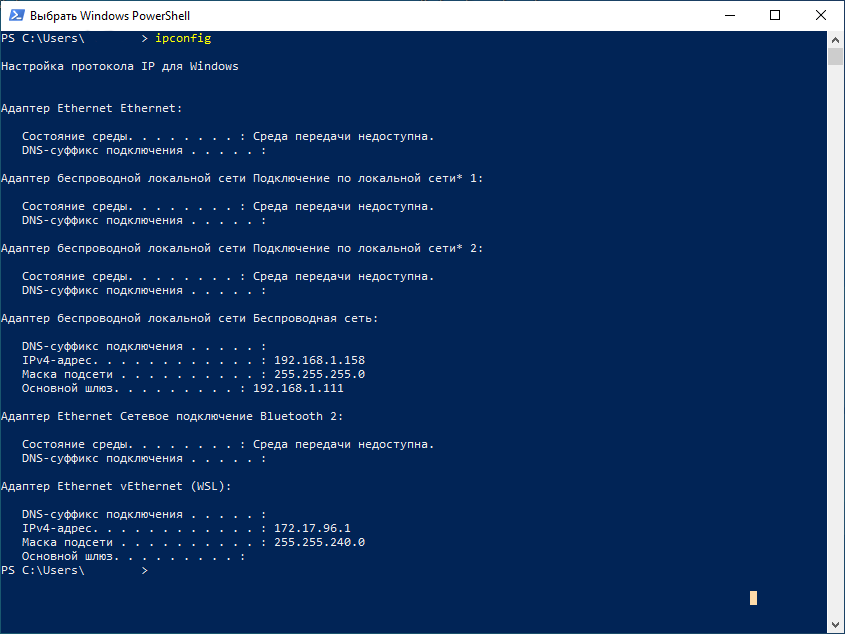
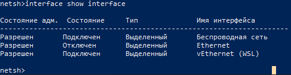
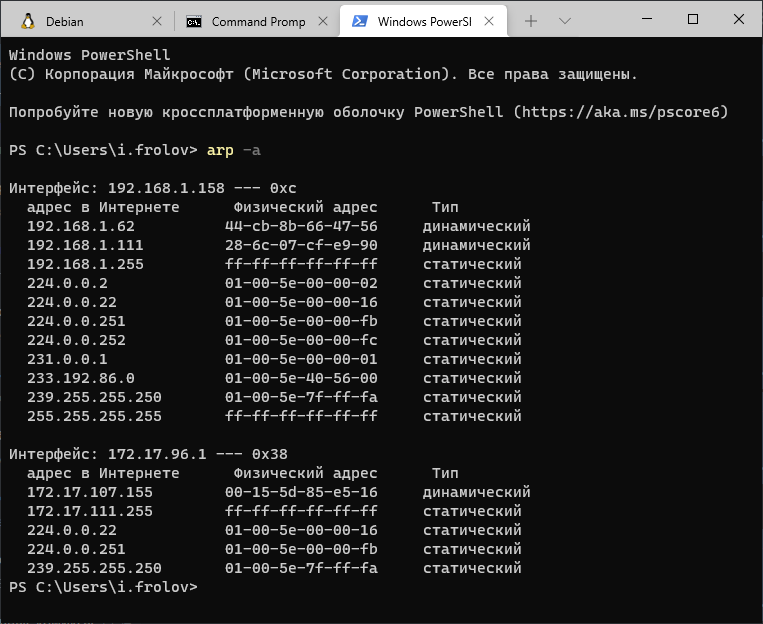
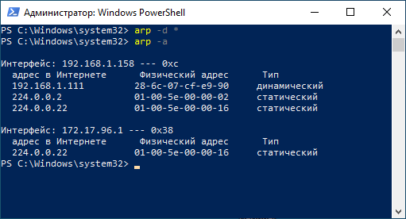
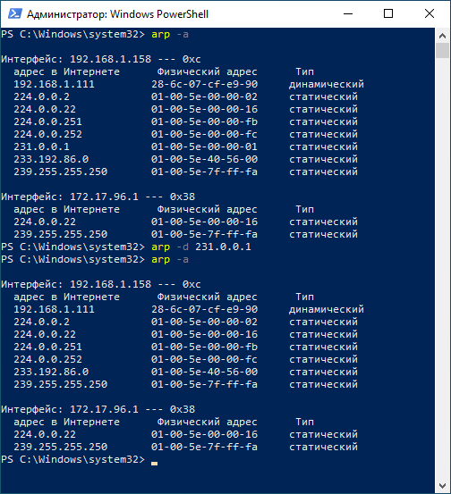

### Решение домашнего задания к занятию "3.7. Компьютерные сети, лекция 2"

1. Проверьте список доступных сетевых интерфейсов на вашем компьютере. Какие команды есть для этого в Linux и в Windows?

**Linux**

Раньше была утилита `ifconfig`, которую сейчас выпиливают, но её все же еще можно встретить: 
```bash

vagrant@vagrant:~$ ifconfig 
eth0: flags=4163<UP,BROADCAST,RUNNING,MULTICAST>  mtu 1500
        inet 10.0.2.15  netmask 255.255.255.0  broadcast 10.0.2.255
        inet6 fe80::a00:27ff:fe73:60cf  prefixlen 64  scopeid 0x20<link>
        ether 08:00:27:73:60:cf  txqueuelen 1000  (Ethernet)
        RX packets 1541  bytes 1229057 (1.2 MB)
        RX errors 0  dropped 0  overruns 0  frame 0
        TX packets 1161  bytes 119455 (119.4 KB)
        TX errors 0  dropped 0 overruns 0  carrier 0  collisions 0

lo: flags=73<UP,LOOPBACK,RUNNING>  mtu 65536
        inet 127.0.0.1  netmask 255.0.0.0
        inet6 ::1  prefixlen 128  scopeid 0x10<host>
        loop  txqueuelen 1000  (Local Loopback)
        RX packets 14  bytes 1336 (1.3 KB)
        RX errors 0  dropped 0  overruns 0  frame 0
        TX packets 14  bytes 1336 (1.3 KB)
        TX errors 0  dropped 0 overruns 0  carrier 0  collisions 0
```

Сейчас, в основном, пользуемся командой `ip` (выхлоп покажет одно и тоже для интерфейсов):
```bash

vagrant@vagrant:~$ ip l
1: lo: <LOOPBACK,UP,LOWER_UP> mtu 65536 qdisc noqueue state UNKNOWN mode DEFAULT group default qlen 1000
    link/loopback 00:00:00:00:00:00 brd 00:00:00:00:00:00
2: eth0: <BROADCAST,MULTICAST,UP,LOWER_UP> mtu 1500 qdisc fq_codel state UP mode DEFAULT group default qlen 1000
    link/ether 08:00:27:73:60:cf brd ff:ff:ff:ff:ff:ff

vagrant@vagrant:~$ ip link
1: lo: <LOOPBACK,UP,LOWER_UP> mtu 65536 qdisc noqueue state UNKNOWN mode DEFAULT group default qlen 1000
    link/loopback 00:00:00:00:00:00 brd 00:00:00:00:00:00
2: eth0: <BROADCAST,MULTICAST,UP,LOWER_UP> mtu 1500 qdisc fq_codel state UP mode DEFAULT group default qlen 1000
    link/ether 08:00:27:73:60:cf brd ff:ff:ff:ff:ff:ff

vagrant@vagrant:~$ ip link show
1: lo: <LOOPBACK,UP,LOWER_UP> mtu 65536 qdisc noqueue state UNKNOWN mode DEFAULT group default qlen 1000
    link/loopback 00:00:00:00:00:00 brd 00:00:00:00:00:00
2: eth0: <BROADCAST,MULTICAST,UP,LOWER_UP> mtu 1500 qdisc fq_codel state UP mode DEFAULT group default qlen 1000
    link/ether 08:00:27:73:60:cf brd ff:ff:ff:ff:ff:ff
```

Можно "в лоб":

```bash

vagrant@vagrant:~$ ls /sys/class/net/
eth0  lo
````

**Windows**

В-основном это `ipconfig`. Выхлоп без параметра `/all`, опустим подробности:



Есть еще `netsh`, но там вывод совсем скудный:



1. Какой протокол используется для распознавания соседа по сетевому интерфейсу? Какой пакет и команды есть в 
Linux для этого?

Как один из вариаентов, для распознавания соседа по сетевому интерфейсу используется протокол канального уровня 
LLDP (Link Layer Discovery Protocol). Описание протокола приводится в стандарте IEEE 802.1AB.

В linux для этого есть пакет `lldpd` и одноименный демон. 

Установим и посмотрим, что из этого получится..

```bash

vagrant@vagrant:~$ sudo systemctl start lldpd
vagrant@vagrant:~$ sudo systemctl status lldpd
● lldpd.service - LLDP daemon
     Loaded: loaded (/lib/systemd/system/lldpd.service; enabled; vendor preset: enabled)
     Active: active (running) since Sun 2022-02-13 14:57:52 UTC; 3min 22s ago
       Docs: man:lldpd(8)
   Main PID: 2072 (lldpd)
      Tasks: 2 (limit: 1071)
     Memory: 2.7M
     CGroup: /system.slice/lldpd.service
             ├─2072 lldpd: monitor.
             └─2074 lldpd: no neighbor.

Feb 13 14:57:52 vagrant systemd[1]: Started LLDP daemon.
Feb 13 14:57:52 vagrant lldpd[2074]: /etc/localtime copied to chroot
Feb 13 14:57:52 vagrant lldpd[2074]: protocol LLDP enabled
Feb 13 14:57:52 vagrant lldpd[2074]: protocol CDPv1 disabled
Feb 13 14:57:52 vagrant lldpd[2074]: protocol CDPv2 disabled
Feb 13 14:57:52 vagrant lldpd[2074]: protocol SONMP disabled
Feb 13 14:57:52 vagrant lldpd[2074]: protocol EDP disabled
Feb 13 14:57:52 vagrant lldpd[2074]: protocol FDP disabled
Feb 13 14:57:52 vagrant lldpd[2074]: libevent 2.1.11-stable initialized with epoll method
Feb 13 14:57:52 vagrant lldpcli[2073]: lldpd should resume operations

```

Для просмотра используется команда `lldpctl`, но в ней не будет толку, т.к. соседи не найдены ((

```bash

vagrant@vagrant:~$  
-------------------------------------------------------------------------------
LLDP neighbors:
-------------------------------------------------------------------------------
```

И даже так:
```bash

vagrant@vagrant:~$ lldpcli show neighbors
-------------------------------------------------------------------------------
LLDP neighbors:
-------------------------------------------------------------------------------
```

### Upd. Разобрался. Пришлось настроить сетевой мост в виртуалке.

Вот в итоге:
```bash

vagrant@vagrant:~$ sudo systemctl status lldpd
● lldpd.service - LLDP daemon
     Loaded: loaded (/lib/systemd/system/lldpd.service; enabled; vendor preset: enabled)
     Active: active (running) since Sun 2022-02-13 16:10:42 UTC; 3min 46s ago
       Docs: man:lldpd(8)
   Main PID: 637 (lldpd)
      Tasks: 2 (limit: 1071)
     Memory: 5.2M
     CGroup: /system.slice/lldpd.service
             ├─637 lldpd: monitor.
             └─652 lldpd: connected to mainframe.

Feb 13 16:10:42 vagrant systemd[1]: Started LLDP daemon.
Feb 13 16:10:42 vagrant lldpd[652]: /etc/localtime copied to chroot
Feb 13 16:10:42 vagrant lldpd[652]: protocol LLDP enabled
Feb 13 16:10:42 vagrant lldpd[652]: protocol CDPv1 disabled
Feb 13 16:10:42 vagrant lldpd[652]: protocol CDPv2 disabled
Feb 13 16:10:42 vagrant lldpd[652]: protocol SONMP disabled
Feb 13 16:10:42 vagrant lldpd[652]: protocol EDP disabled
Feb 13 16:10:42 vagrant lldpd[652]: protocol FDP disabled
Feb 13 16:10:42 vagrant lldpd[652]: libevent 2.1.11-stable initialized with epoll method
Feb 13 16:10:42 vagrant lldpcli[651]: lldpd should resume operations

vagrant@vagrant:~$ lldpctl 
-------------------------------------------------------------------------------
LLDP neighbors:
-------------------------------------------------------------------------------
Interface:    eth0, via: LLDP, RID: 1, Time: 0 day, 00:03:45
...
-------------------------------------------------------------------------------
```

Со стороны хоста:
```bash

-------------------------------------------------------------------------------
LLDP neighbors:
-------------------------------------------------------------------------------
Interface:    wlp0s20u14, via: LLDP, RID: 1, Time: 0 day, 00:05:24
...
-------------------------------------------------------------------------------
```

1. Какая технология используется для разделения L2 коммутатора на несколько виртуальных сетей? 
Какой пакет и команды есть в Linux для этого? Приведите пример конфига.

Судя по вопросу, речь о VLAN (виртуальная локальная сеть). Отмечу, что для L2 коммутаторов это скорее дополнительная
фишка, которая поддерживается на уровне, необходимом для участия в общей схеме сети или для передачи параметров. 
В коммутаторе L2 можно прописать несколько VLAN, но нельзя настроить полноценную маршрутизацию между ними, для этого 
будет нужен коммутатор L3.

#### Какой пакет и команды есть в Linux для этого?

Хм.. Это смотря как настраивать )

Опишу по порядку. Создадим разными способами `vlan50` на интерфейсе `eth0`.

##### Общая часть 0, в которой проверяем, загружен ли модуль ядра 8021q

```bash

agrant@vagrant:~$ lsmod | grep 8021
vagrant@vagrant:~$ 
```

Спойлер: модуль не загружен. Штош, загрузим и проверим:

```bash

vagrant@vagrant:~$ sudo modprobe 8021q
vagrant@vagrant:~$ lsmod | grep 8021
8021q                  32768  0
garp                   16384  1 8021q
mrp                    20480  1 8021q
```

##### Часть 1, в которой настраиваем VLAN с помощью `netplan`

В ubuntu этот пакет давно идет из коробки. Попробуем что-нибудь сделать. Всё только для примера.

Редактируем `/etc/netplan/01-netcfg.yaml` до состояния:
```bash

network:
  version: 2
  ethernets:
    eth0:
      dhcp4: yes
      nameservers:
        addresses: [8.8.8.8]
  vlans:
    vlan50:
      id: 50
      link: eth0
      dhcp4: no
      addresses: [10.0.0.5/24]
```

Применяем настройки командой `netplan apply`.

Наблюдаем:
```bash

vagrant@vagrant:~$ ip addr
1: lo: <LOOPBACK,UP,LOWER_UP> mtu 65536 qdisc noqueue state UNKNOWN group default qlen 1000
    link/loopback 00:00:00:00:00:00 brd 00:00:00:00:00:00
    inet 127.0.0.1/8 scope host lo
       valid_lft forever preferred_lft forever
    inet6 ::1/128 scope host 
       valid_lft forever preferred_lft forever
2: eth0: <BROADCAST,MULTICAST,UP,LOWER_UP> mtu 1500 qdisc fq_codel state UP group default qlen 1000
    link/ether 08:00:27:73:60:cf brd ff:ff:ff:ff:ff:ff
    inet 192.168.1.168/24 brd 192.168.1.255 scope global dynamic eth0
       valid_lft 86359sec preferred_lft 86359sec
    inet6 fe80::a00:27ff:fe73:60cf/64 scope link 
       valid_lft forever preferred_lft forever
3: vlan50@eth0: <BROADCAST,MULTICAST,UP,LOWER_UP> mtu 1500 qdisc noqueue state UP group default qlen 1000
    link/ether 08:00:27:73:60:cf brd ff:ff:ff:ff:ff:ff
    inet 10.0.0.5/24 brd 10.0.0.255 scope global vlan50
       valid_lft forever preferred_lft forever
    inet6 fe80::a00:27ff:fe73:60cf/64 scope link 
       valid_lft forever preferred_lft forever

```

Красота!

##### Часть 2, в которой настраиваем VLAN с помощью `vconfig`

Вернул всё в практически исходное состояние:
```bash

vagrant@vagrant:~$ ip addr
1: lo: <LOOPBACK,UP,LOWER_UP> mtu 65536 qdisc noqueue state UNKNOWN group default qlen 1000
    link/loopback 00:00:00:00:00:00 brd 00:00:00:00:00:00
    inet 127.0.0.1/8 scope host lo
       valid_lft forever preferred_lft forever
    inet6 ::1/128 scope host 
       valid_lft forever preferred_lft forever
2: eth0: <BROADCAST,MULTICAST,UP,LOWER_UP> mtu 1500 qdisc fq_codel state UP group default qlen 1000
    link/ether 08:00:27:73:60:cf brd ff:ff:ff:ff:ff:ff
    inet 192.168.1.168/24 brd 192.168.1.255 scope global dynamic eth0
       valid_lft 86267sec preferred_lft 86267sec
    inet6 fe80::a00:27ff:fe73:60cf/64 scope link 
       valid_lft forever preferred_lft forever
vagrant@vagrant:~$ 

```

Поставим пакет `vlan`, создадим `vlan50` на интерфейсе `eth0`

```bash

vagrant@vagrant:~$ sudo vconfig add eth0 50

Warning: vconfig is deprecated and might be removed in the future, please migrate to ip(route2) as soon as possible!
```

Это прекрасно!! )) Пользуемся, пока не удалили..

```bash

vagrant@vagrant:~$ ip addr
1: lo: <LOOPBACK,UP,LOWER_UP> mtu 65536 qdisc noqueue state UNKNOWN group default qlen 1000
    link/loopback 00:00:00:00:00:00 brd 00:00:00:00:00:00
    inet 127.0.0.1/8 scope host lo
       valid_lft forever preferred_lft forever
    inet6 ::1/128 scope host 
       valid_lft forever preferred_lft forever
2: eth0: <BROADCAST,MULTICAST,UP,LOWER_UP> mtu 1500 qdisc fq_codel state UP group default qlen 1000
    link/ether 08:00:27:73:60:cf brd ff:ff:ff:ff:ff:ff
    inet 192.168.1.168/24 brd 192.168.1.255 scope global dynamic eth0
       valid_lft 85295sec preferred_lft 85295sec
    inet6 fe80::a00:27ff:fe73:60cf/64 scope link 
       valid_lft forever preferred_lft forever
3: eth0.50@eth0: <BROADCAST,MULTICAST> mtu 1500 qdisc noop state DOWN group default qlen 1000
    link/ether 08:00:27:73:60:cf brd ff:ff:ff:ff:ff:ff
```

Далее настроим по старинке и посмотрим, что у нас получилось на этот раз:
```bash

vagrant@vagrant:~$ sudo ifconfig eth0.50 10.0.0.5 netmask 255.255.255.0 broadcast 10.0.0.255 up
vagrant@vagrant:~$ ip addr
1: lo: <LOOPBACK,UP,LOWER_UP> mtu 65536 qdisc noqueue state UNKNOWN group default qlen 1000
    link/loopback 00:00:00:00:00:00 brd 00:00:00:00:00:00
    inet 127.0.0.1/8 scope host lo
       valid_lft forever preferred_lft forever
    inet6 ::1/128 scope host 
       valid_lft forever preferred_lft forever
2: eth0: <BROADCAST,MULTICAST,UP,LOWER_UP> mtu 1500 qdisc fq_codel state UP group default qlen 1000
    link/ether 08:00:27:73:60:cf brd ff:ff:ff:ff:ff:ff
    inet 192.168.1.168/24 brd 192.168.1.255 scope global dynamic eth0
       valid_lft 85029sec preferred_lft 85029sec
    inet6 fe80::a00:27ff:fe73:60cf/64 scope link 
       valid_lft forever preferred_lft forever
3: eth0.50@eth0: <BROADCAST,MULTICAST,UP,LOWER_UP> mtu 1500 qdisc noqueue state UP group default qlen 1000
    link/ether 08:00:27:73:60:cf brd ff:ff:ff:ff:ff:ff
    inet 10.0.0.5/24 brd 10.0.0.255 scope global eth0.50
       valid_lft forever preferred_lft forever
    inet6 fe80::a00:27ff:fe73:60cf/64 scope link 
       valid_lft forever preferred_lft forever

vagrant@vagrant:~$ sudo cat /proc/net/vlan/eth0.50 
eth0.50  VID: 50         REORDER_HDR: 1  dev->priv_flags: 1021
         total frames received            0
          total bytes received            0
      Broadcast/Multicast Rcvd            0

      total frames transmitted           11
       total bytes transmitted          866
Device: eth0
INGRESS priority mappings: 0:0  1:0  2:0  3:0  4:0  5:0  6:0 7:0
 EGRESS priority mappings: 

```

А ниче так получилось! ) Сносим все к чертям, или перезагрузим, т.к. этот конфиг не сохранится.

```bash

vagrant@vagrant:~$ sudo ifconfig eth0.50 down
vagrant@vagrant:~$ sudo vconfig rem eth0.50

Warning: vconfig is deprecated and might be removed in the future, please migrate to ip(route2) as soon as possible!

1: lo: <LOOPBACK,UP,LOWER_UP> mtu 65536 qdisc noqueue state UNKNOWN group default qlen 1000
    link/loopback 00:00:00:00:00:00 brd 00:00:00:00:00:00
    inet 127.0.0.1/8 scope host lo
       valid_lft forever preferred_lft forever
    inet6 ::1/128 scope host 
       valid_lft forever preferred_lft forever
2: eth0: <BROADCAST,MULTICAST,UP,LOWER_UP> mtu 1500 qdisc fq_codel state UP group default qlen 1000
    link/ether 08:00:27:73:60:cf brd ff:ff:ff:ff:ff:ff
    inet 192.168.1.168/24 brd 192.168.1.255 scope global dynamic eth0
       valid_lft 84673sec preferred_lft 84673sec
    inet6 fe80::a00:27ff:fe73:60cf/64 scope link 
       valid_lft forever preferred_lft forever
```

В итоге снёс пакет `vlan`.

##### Часть 3, в которой настраиваем VLAN с помощью богоугодного `ip`

Для интерфейса `eth0` и `vlan50` выполним:

```bash

vagrant@vagrant:~$ sudo ip link add link eth0 name eth0.50 type vlan id 50

vagrant@vagrant:~$ ip addr
1: lo: <LOOPBACK,UP,LOWER_UP> mtu 65536 qdisc noqueue state UNKNOWN group default qlen 1000
    link/loopback 00:00:00:00:00:00 brd 00:00:00:00:00:00
    inet 127.0.0.1/8 scope host lo
       valid_lft forever preferred_lft forever
    inet6 ::1/128 scope host 
       valid_lft forever preferred_lft forever
2: eth0: <BROADCAST,MULTICAST,UP,LOWER_UP> mtu 1500 qdisc fq_codel state UP group default qlen 1000
    link/ether 08:00:27:73:60:cf brd ff:ff:ff:ff:ff:ff
    inet 192.168.1.168/24 brd 192.168.1.255 scope global dynamic eth0
       valid_lft 84451sec preferred_lft 84451sec
    inet6 fe80::a00:27ff:fe73:60cf/64 scope link 
       valid_lft forever preferred_lft forever
4: eth0.50@eth0: <BROADCAST,MULTICAST> mtu 1500 qdisc noop state DOWN group default qlen 1000
    link/ether 08:00:27:73:60:cf brd ff:ff:ff:ff:ff:ff
```

Поднастроим и поднимем:
```bash

vagrant@vagrant:~$ sudo ip addr add 10.0.0.5/24 brd 10.0.0.255 dev eth0.50
vagrant@vagrant:~$ sudo ip link set dev eth0.50 up

vagrant@vagrant:~$ ip addr
1: lo: <LOOPBACK,UP,LOWER_UP> mtu 65536 qdisc noqueue state UNKNOWN group default qlen 1000
    link/loopback 00:00:00:00:00:00 brd 00:00:00:00:00:00
    inet 127.0.0.1/8 scope host lo
       valid_lft forever preferred_lft forever
    inet6 ::1/128 scope host 
       valid_lft forever preferred_lft forever
2: eth0: <BROADCAST,MULTICAST,UP,LOWER_UP> mtu 1500 qdisc fq_codel state UP group default qlen 1000
    link/ether 08:00:27:73:60:cf brd ff:ff:ff:ff:ff:ff
    inet 192.168.1.168/24 brd 192.168.1.255 scope global dynamic eth0
       valid_lft 76944sec preferred_lft 76944sec
    inet6 fe80::a00:27ff:fe73:60cf/64 scope link 
       valid_lft forever preferred_lft forever
4: eth0.50@eth0: <BROADCAST,MULTICAST,UP,LOWER_UP> mtu 1500 qdisc noqueue state UP group default qlen 1000
    link/ether 08:00:27:73:60:cf brd ff:ff:ff:ff:ff:ff
    inet 10.0.0.5/24 brd 10.0.0.255 scope global eth0.50
       valid_lft forever preferred_lft forever
    inet6 fe80::a00:27ff:fe73:60cf/64 scope link 
       valid_lft forever preferred_lft forever
```

А потом сразу удалим) 

```bash

vagrant@vagrant:~$ sudo ip link set dev eth0.50 down
vagrant@vagrant:~$ sudo ip link delete eth0.50
vagrant@vagrant:~$ ip addr
1: lo: <LOOPBACK,UP,LOWER_UP> mtu 65536 qdisc noqueue state UNKNOWN group default qlen 1000
    link/loopback 00:00:00:00:00:00 brd 00:00:00:00:00:00
    inet 127.0.0.1/8 scope host lo
       valid_lft forever preferred_lft forever
    inet6 ::1/128 scope host 
       valid_lft forever preferred_lft forever
2: eth0: <BROADCAST,MULTICAST,UP,LOWER_UP> mtu 1500 qdisc fq_codel state UP group default qlen 1000
    link/ether 08:00:27:73:60:cf brd ff:ff:ff:ff:ff:ff
    inet 192.168.1.168/24 brd 192.168.1.255 scope global dynamic eth0
       valid_lft 76846sec preferred_lft 76846sec
    inet6 fe80::a00:27ff:fe73:60cf/64 scope link 
       valid_lft forever preferred_lft forever
```

##### Часть 4, в которой настраиваем VLAN с помощью редактирования `interfaces`

Слегка поправим файл `/etc/network/interfaces`, добавив в него строки:
```bash

auto eth0.50
iface eth0.50 inet static
address 10.0.0.5
netmask 255.255.255.0
vlan-raw-device eth0
```

Потом перезапустим службу `networking.service` и проверим результат:
```bash

vagrant@vagrant:~$ sudo systemctl restart networking.service 

vagrant@vagrant:~$ ip addr
1: lo: <LOOPBACK,UP,LOWER_UP> mtu 65536 qdisc noqueue state UNKNOWN group default qlen 1000
    link/loopback 00:00:00:00:00:00 brd 00:00:00:00:00:00
    inet 127.0.0.1/8 scope host lo
       valid_lft forever preferred_lft forever
    inet6 ::1/128 scope host 
       valid_lft forever preferred_lft forever
2: eth0: <BROADCAST,MULTICAST,UP,LOWER_UP> mtu 1500 qdisc fq_codel state UP group default qlen 1000
    link/ether 08:00:27:73:60:cf brd ff:ff:ff:ff:ff:ff
    inet 192.168.1.168/24 brd 192.168.1.255 scope global dynamic eth0
       valid_lft 86350sec preferred_lft 86350sec
    inet6 fe80::a00:27ff:fe73:60cf/64 scope link 
       valid_lft forever preferred_lft forever
5: eth0.50@eth0: <BROADCAST,MULTICAST,UP,LOWER_UP> mtu 1500 qdisc noqueue state UP group default qlen 1000
    link/ether 08:00:27:73:60:cf brd ff:ff:ff:ff:ff:ff
    inet 10.0.0.5/24 brd 10.0.0.255 scope global eth0.50
       valid_lft forever preferred_lft forever
    inet6 fe80::a00:27ff:fe73:60cf/64 scope link tentative 
       valid_lft forever preferred_lft forever
```

Работает. Но удалять пришлось руками через команду `ip`..

Считаю, что этого вполне достаточно )

4. Какие типы агрегации интерфейсов есть в Linux? Какие опции есть для балансировки нагрузки? Приведите пример конфига.

Аггрегация (объединение, bonding, бондинг) -- объединение двух или более физических сетевых интерфейсов в один 
виртуальный. Поведение связанных интерфейсов зависит от режима. В общем случае, объединенные интерфейсы могут работать 
в режиме горячего резерва (отказоустойчивости) или в режиме балансировки нагрузки.

Обычно объединение осуществляется с помощью драйвера `bonding`. Если ядро без поддержки бондинга, то придется включить,
пересобрать и установить ядро..

Типы аггрегации интерфейсов в Linux (обычно параметр/опцяи `mode` определяет политику поведения объединенных интерфейсов):

* **balance-rr или 0** -- Данный режим используется по умолчанию. Режим обеспечивает балансировку нагрузки 
и отказоустойчивость. В данном режиме сетевые пакеты отправляются 'по кругу', от первого интерфейса к последнему. 
Если интерфейсы выходят из строя, то пакеты отправляются на оставшиеся. При нахождении портов в одном коммутаторе
дополнительной настройки коммутатора не требуется. При разностных коммутаторах требуется дополнительная настройка.

* **active-backup или 1** -- Только один из интерфейсов работает в активном режиме, остальные в резервном. При 
обнаружении проблемы на активном интерфейсе производится переключение на резервный интерфейс. При такой политике MAC 
адрес bond-интерфейса виден снаружи только через один сетевой порт, во избежание появления проблем с коммутатором. 
Политика применяется для отказоустойчивости. Не требуется поддержки функциональности от коммутатора.

* **balance-xor или 2** -- Передача пакетов распределяется между объединенными интерфейсами по типу входящего и 
исходящего трафика по формуле 
, 
N -- число интерфейсов. Если формула не отрисуется, то рендер [тут](img/img3.png). Один и тот же интерфейс работает с 
определённым получателем  Режим дает балансировку нагрузки и отказоустойчивость. Дополнительной настройки 
коммутатора/коммутаторов не требуется. 

* **broadcast или 3** -- Передача всего во все объединенные интерфейсы, тем самым обеспечивается отказоустойчивость. 

* **802.3ad или 4** -- динамическое объединение одинаковых портов по стандарту IEEE 802.3ad. Создаются агрегированные 
группы сетевых карт с одинаковой скоростью и дуплексом В данном режиме можно значительно увеличить пропускную 
способность входящего так и исходящего трафика. Необходима поддержка и настройка коммутатора/коммутаторов.

* **balance-tlb или 5** -- Адаптивная балансировки нагрузки трафика. Входящий трафик получается только активным 
интерфейсом, исходящий распределяется в зависимости от текущей загрузки каждого интерфейса (определяется скоростью
загрузки). Обеспечивается отказоустойчивость и распределение нагрузки исходящего трафика. Если интерфейс для входящего
трафика выходит из строя, то другдругой интерфейс берёт себе MAC адрес вышедшего из строя.

* **balance-alb или 6** -- Адаптивная балансировка нагрузки, еще более крутая. Обеспечивает балансировку нагрузки как 
исходящего, так и входящего трафика (через ARP). Не требует специальной поддержки коммутатором, но требует возможности 
изменять MAC-адрес устройства.

Пример конфига для `netplan` из предыдущего задания (точнее, кусок конфига):

```bash

bonds:
   bond0:
     interfaces: [eth0, eth1, eth3]
     dhcp4: no
     parameters:
       mode: 802.3ad
       mii-monitor-interval: 100
```

Кстати, этот `bond0` можно подставить в поле `link` при настройке vlan )

Еще можно править старый добрый `/etc/network/interfaces` и вносить изменения туда.

Поговаривают, что существует утилита `ifenslave` для управления бондингом.

1. Сколько IP адресов в сети с маской /29? Сколько /29 подсетей можно получить из сети с маской /24?. 
Приведите несколько примеров /29 подсетей внутри сети 10.10.10.0/24.

##### Сколько IP адресов в сети с маской /29?
Ответим на этот вопрос, используя cli ip калькулятор `ipcalc`

```bash

vagrant@vagrant:~$ ipcalc 10.10.10.0/29
Address:   10.10.10.0           00001010.00001010.00001010.00000 000
Netmask:   255.255.255.248 = 29 11111111.11111111.11111111.11111 000
Wildcard:  0.0.0.7              00000000.00000000.00000000.00000 111
=>
Network:   10.10.10.0/29        00001010.00001010.00001010.00000 000
HostMin:   10.10.10.1           00001010.00001010.00001010.00000 001
HostMax:   10.10.10.6           00001010.00001010.00001010.00000 110
Broadcast: 10.10.10.7           00001010.00001010.00001010.00000 111
Hosts/Net: 6                     Class A, Private Internet
```

Ответ: в этой сети 6 IP адресов для хостов. Один broadcast (10.10.10.7). Один адрес подсети (10.10.10.0 ). 
Итого примерно 8.

##### Сколько /29 подсетей можно получить из сети с маской /24?

```bash

vagrant@vagrant:~$ ipcalc 10.10.10.0/24 -b
Address:   10.10.10.0           
Netmask:   255.255.255.0 = 24   
Wildcard:  0.0.0.255            
=>
Network:   10.10.10.0/24        
HostMin:   10.10.10.1           
HostMax:   10.10.10.254         
Broadcast: 10.10.10.255         
Hosts/Net: 254                   Class A, Private Internet
```

Тут итого, побольше, 256 с учетом бродкаста и адреса подсети)

Делим! 

##### Приведите несколько примеров /29 подсетей внутри сети 10.10.10.0/24.

Дело за малым -- сказать `ipcalc`, чтобы он поделил. Например 3 подсети по 6 хостов:
```bash

ipcalc 10.10.10.0/24 -b --s 6 6 6
Address:   10.10.10.0           
Netmask:   255.255.255.0 = 24   
Wildcard:  0.0.0.255            
=>
Network:   10.10.10.0/24        
HostMin:   10.10.10.1           
HostMax:   10.10.10.254         
Broadcast: 10.10.10.255         
Hosts/Net: 254                   Class A, Private Internet

1. Requested size: 6 hosts
Netmask:   255.255.255.248 = 29 
Network:   10.10.10.0/29        
HostMin:   10.10.10.1           
HostMax:   10.10.10.6           
Broadcast: 10.10.10.7           
Hosts/Net: 6                     Class A, Private Internet

2. Requested size: 6 hosts
Netmask:   255.255.255.248 = 29 
Network:   10.10.10.8/29        
HostMin:   10.10.10.9           
HostMax:   10.10.10.14          
Broadcast: 10.10.10.15          
Hosts/Net: 6                     Class A, Private Internet

3. Requested size: 6 hosts
Netmask:   255.255.255.248 = 29 
Network:   10.10.10.16/29       
HostMin:   10.10.10.17          
HostMax:   10.10.10.22          
Broadcast: 10.10.10.23          
Hosts/Net: 6                     Class A, Private Internet

Needed size:  24 addresses.
Used network: 10.10.10.0/27
Unused:
10.10.10.24/29
10.10.10.32/27
10.10.10.64/26
10.10.10.128/25

```

Гулять так гулять! Вот все 32:
```
10.10.10.0/29
10.10.10.8/29
10.10.10.16/29
10.10.10.24/29
10.10.10.32/29
10.10.10.40/29
10.10.10.48/29
10.10.10.56/29
10.10.10.64/29
10.10.10.72/29
10.10.10.80/29
10.10.10.88/29
10.10.10.96/29
10.10.10.104/29
10.10.10.112/29
10.10.10.120/29
10.10.10.128/29
10.10.10.136/29
10.10.10.144/29
10.10.10.152/29
10.10.10.160/29
10.10.10.168/29
10.10.10.176/29
10.10.10.184/29
10.10.10.192/29
10.10.10.200/29
10.10.10.208/29
10.10.10.216/29
10.10.10.224/29
10.10.10.232/29
10.10.10.240/29
10.10.10.248/29
```

1. Задача: вас попросили организовать стык между 2-мя организациями. 
Диапазоны 10.0.0.0/8, 172.16.0.0/12, 192.168.0.0/16 уже заняты. 
Из какой подсети допустимо взять частные IP адреса? Маску выберите из расчета максимум 40-50 хостов внутри подсети.

Как вариант, осталась подсеть 100.64.0.0 — 100.127.255.255 (маска подсети: 255.192.0.0 или /10).

Делим:
```bash

vagrant@vagrant:~$ ipcalc 10.64.0.0/10 -b --s 42
Address:   10.64.0.0            
Netmask:   255.192.0.0 = 10     
Wildcard:  0.63.255.255         
=>
Network:   10.64.0.0/10         
HostMin:   10.64.0.1            
HostMax:   10.127.255.254       
Broadcast: 10.127.255.255       
Hosts/Net: 4194302               Class A, Private Internet

1. Requested size: 42 hosts
Netmask:   255.255.255.192 = 26 
Network:   10.64.0.0/26         
HostMin:   10.64.0.1            
HostMax:   10.64.0.62           
Broadcast: 10.64.0.63           
Hosts/Net: 62                    Class A, Private Internet

Needed size:  64 addresses.
Used network: 10.64.0.0/26
Unused:
10.64.0.64/26
10.64.0.128/25
10.64.1.0/24
10.64.2.0/23
10.64.4.0/22
10.64.8.0/21
10.64.16.0/20
10.64.32.0/19
10.64.64.0/18
10.64.128.0/17
10.65.0.0/16
10.66.0.0/15
10.68.0.0/14
10.72.0.0/13
10.80.0.0/12
10.96.0.0/11
```

Пусть будет 10.64.0.0/26 (62 хоста, 1 бродкаст, 1 адрес сети)

----

##### upd по замечанию "Написали правильно, а поделили нет :) Будьте внимательнее!"

Ок, поделим правильно. 
Маска кратна . 
Получается, что будет не более 32 хостов, иначе перебор (см. ограничение 40-50).

Штош.. 
```bash

vagrant@vagrant:~$ ipcalc 10.64.0.0/10 -b --s 30
Address:   10.64.0.0            
Netmask:   255.192.0.0 = 10     
Wildcard:  0.63.255.255         
=>
Network:   10.64.0.0/10         
HostMin:   10.64.0.1            
HostMax:   10.127.255.254       
Broadcast: 10.127.255.255       
Hosts/Net: 4194302               Class A, Private Internet

1. Requested size: 30 hosts
Netmask:   255.255.255.224 = 27 
Network:   10.64.0.0/27         
HostMin:   10.64.0.1            
HostMax:   10.64.0.30           
Broadcast: 10.64.0.31           
Hosts/Net: 30                    Class A, Private Internet

Needed size:  32 addresses.
Used network: 10.64.0.0/27
Unused:
10.64.0.32/27
10.64.0.64/26
10.64.0.128/25
10.64.1.0/24
10.64.2.0/23
10.64.4.0/22
10.64.8.0/21
10.64.16.0/20
10.64.32.0/19
10.64.64.0/18
10.64.128.0/17
10.65.0.0/16
10.66.0.0/15
10.68.0.0/14
10.72.0.0/13
10.80.0.0/12
10.96.0.0/11

```
Как-то так

----

1. Как проверить ARP таблицу в Linux, Windows? Как очистить ARP кеш полностью? 
Как из ARP таблицы удалить только один нужный IP?

##### Как проверить ARP таблицу в Linux, Windows?

Linux:
```bash

vagrant@vagrant:~$ ip n
10.0.2.2 dev eth0 lladdr 52:54:00:12:35:02 REACHABLE
10.0.2.3 dev eth0 lladdr 52:54:00:12:35:03 STALE

```

Удаление только одного IP:
```bash

vagrant@vagrant:~$ sudo ip n del dev eth0 10.0.2.3
vagrant@vagrant:~$ ip n
10.0.2.2 dev eth0 lladdr 52:54:00:12:35:02 REACHABLE
```

Удаление всех IP без привязки к интерфейсу:
```bash

vagrant@vagrant:~$ sudo ip n flush all
vagrant@vagrant:~$ ip n
vagrant@vagrant:~$ 
```

Windows:

Проверка ARP таблицы `arp -a`:



Очистка кэша полностью или удаление нужного (зачем удалять нужный?) IP требует прав администратора.
В итоге уделение всего кэша `arp -d *`, удаление одного IP `arp -d IP`

Примеры на скриншотах:

`arp -d *` 

`arp -d 231.0.0.1` 


----

1*. Установите эмулятор EVE-ng.

Инструкция по установке - https://github.com/svmyasnikov/eve-ng

Выполните задания на lldp, vlan, bonding в эмуляторе EVE-ng.

В процессе ) Собираю VMware