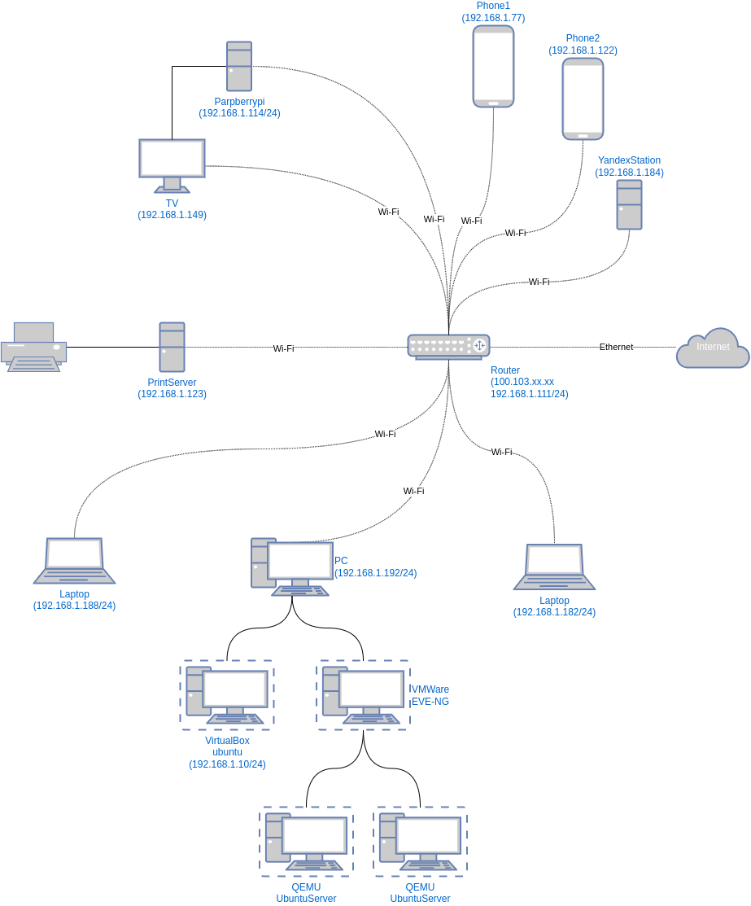

### Решение домашнего задания к занятию "3.8. Компьютерные сети, лекция 3"

1. Подключитесь к публичному маршрутизатору в интернет. Найдите маршрут к вашему публичному IP
```
telnet route-views.routeviews.org
Username: rviews
show ip route x.x.x.x/32
show bgp x.x.x.x/32
```

Мой честный IP:  145.255.11.9 (https://whoer.net подтверждает)

```bash

route-views>show ip route 145.255.11.9
Routing entry for 145.255.10.0/23
  Known via "bgp 6447", distance 20, metric 0
  Tag 3303, type external
  Last update from 217.192.89.50 6d00h ago
  Routing Descriptor Blocks:
  * 217.192.89.50, from 217.192.89.50, 6d00h ago
      Route metric is 0, traffic share count is 1
      AS Hops 2
      Route tag 3303
      MPLS label: none

route-views>show bgp 145.255.11.9         
BGP routing table entry for 145.255.10.0/23, version 307347700
Paths: (5 available, best #4, table default)
  Not advertised to any peer
  Refresh Epoch 1
  1351 6939 47775 24955
    132.198.255.253 from 132.198.255.253 (132.198.255.253)
      Origin IGP, localpref 100, valid, external
      path 7FE149089FB8 RPKI State valid
      rx pathid: 0, tx pathid: 0
  Refresh Epoch 1
  20130 6939 47775 24955
    140.192.8.16 from 140.192.8.16 (140.192.8.16)
      Origin IGP, localpref 100, valid, external
      path 7FE129E2E430 RPKI State valid
      rx pathid: 0, tx pathid: 0
  Refresh Epoch 1
  3333 1103 20562 24955
    193.0.0.56 from 193.0.0.56 (193.0.0.56)
      Origin IGP, localpref 100, valid, external
      Community: 20562:45 20562:3120 20562:4001 20562:65000 20562:65020
      path 7FE0FD45C7A8 RPKI State valid
      rx pathid: 0, tx pathid: 0
  Refresh Epoch 1
  3303 24955
    217.192.89.50 from 217.192.89.50 (138.187.128.158)
      Origin IGP, localpref 100, valid, external, best
      Community: 3303:1004 3303:1006 3303:1030 3303:1031 3303:3081 24955:310 24955:321 24955:3210 24955:3213 24955:3216 24955:40103 31210:24955 65005:10643
      path 7FE0A027F058 RPKI State valid
      rx pathid: 0, tx pathid: 0x0
  Refresh Epoch 1
  6939 47775 24955
    64.71.137.241 from 64.71.137.241 (216.218.252.164)
      Origin IGP, localpref 100, valid, external
      unknown transitive attribute: flag 0xE0 type 0x20 length 0xC
        value 0000 21B7 0000 0777 0000 21B7 
      path 7FE141EE6450 RPKI State valid
      rx pathid: 0, tx pathid: 0
```

2. Создайте dummy0 интерфейс в Ubuntu. Добавьте несколько статических маршрутов. Проверьте таблицу маршрутизации.

Для этого необходим модуль `dummy`.

Проверим:
```bash

vagrant@vagrant:~$ lsmod | grep dummy
vagrant@vagrant:~$ 
```

Нет такой буквы.. Загрузим модуль `dummy`
```bash
vagrant@vagrant:~$ sudo modprobe dummy
```

Создадим dummy0:
```bash

vagrant@vagrant:~$ sudo ip link add dummy0 type dummy
vagrant@vagrant:~$ ip -br a
lo               UNKNOWN        127.0.0.1/8 ::1/128 
eth0             UP             10.0.2.15/24 fe80::a00:27ff:feb1:285d/64 
dummy0           DOWN  


    
vagrant@vagrant:~$ sudo ip addr add 10.0.3.15/24 dev dummy0
vagrant@vagrant:~$ sudo ip link set dev dummy0 up
vagrant@vagrant:~$ ip -br a
lo               UNKNOWN        127.0.0.1/8 ::1/128 
eth0             UP             10.0.2.15/24 fe80::a00:27ff:feb1:285d/64 
dummy0           UNKNOWN        10.0.3.15/24 fe80::c4c7:8ff:fe2a:51db/64 
```

Отлично! Что-то появилось

Добавим маршрут:
```bash

vagrant@vagrant:~$ sudo ip ro add 10.0.3.15 via 10.0.3.1

vagrant@vagrant:~$ ip r show
default via 10.0.2.2 dev eth0 proto dhcp src 10.0.2.15 metric 100 
10.0.2.0/24 dev eth0 proto kernel scope link src 10.0.2.15 
10.0.2.2 dev eth0 proto dhcp scope link src 10.0.2.15 metric 100 
10.0.3.0/24 dev dummy0 proto kernel scope link src 10.0.3.15 
10.0.3.15 via 10.0.2.15 dev eth0 
```

Статических не появилось.. Настроим через `netplan`:
```bash

network:
  version: 2
  ethernets:
    eth0:
      dhcp4: no
      addresses: [192.168.1.10/24]
      gateway4: 192.168.1.111
      nameservers:
        addresses: [8.8.8.8, 8.8.4.4]
      routes:
        - to: 192.168.0.0/24
          via: 192.168.1.1
        - to: 192.168.2.0/24
          via: 192.168.1.1
          on-link: true
```

Результат:
```bash

vagrant@vagrant:~$ ip r show
default via 192.168.1.111 dev eth0 proto static 
192.168.0.0/24 via 192.168.1.1 dev eth0 proto static 
192.168.1.0/24 dev eth0 proto kernel scope link src 192.168.1.10 
192.168.2.0/24 via 192.168.1.1 dev eth0 proto static onlink 
```

3. Проверьте открытые TCP порты в Ubuntu, какие протоколы и приложения используют эти порты? Приведите несколько 
примеров.

```bash

vagrant@vagrant:~$ ss -tnl
State        Recv-Q       Send-Q             Local Address:Port               Peer Address:Port       Process       
LISTEN       0            4096               127.0.0.53%lo:53                      0.0.0.0:*                        
LISTEN       0            128                      0.0.0.0:22                      0.0.0.0:*                        
LISTEN       0            128                         [::]:22                         [::]:*                        
vagrant@vagrant:~$ 
```

Порт 22: SSH, 53: DNS

Посмотрим, какие процессы использую порты:
```bash

vagrant@vagrant:~$ sudo ss -tnlp
State           Recv-Q          Send-Q                   Local Address:Port                   Peer Address:Port         Process                                             
LISTEN          0               4096                     127.0.0.53%lo:53                          0.0.0.0:*             users:(("systemd-resolve",pid=617,fd=13))          
LISTEN          0               128                            0.0.0.0:22                          0.0.0.0:*             users:(("sshd",pid=674,fd=3))                      
LISTEN          0               128                               [::]:22                             [::]:*             users:(("sshd",pid=674,fd=4))    
```

4. Проверьте используемые UDP сокеты в Ubuntu, какие протоколы и приложения используют эти порты?

```bash
vagrant@vagrant:~$ sudo ss -unlp
State               Recv-Q              Send-Q                           Local Address:Port                             Peer Address:Port              Process              
UNCONN              0                   0                                127.0.0.53%lo:53                                    0.0.0.0:*                  users:(("systemd-resolve",pid=617,fd=12))

```

Порт 53: DNS

5. Используя diagrams.net, создайте L3 диаграмму вашей домашней сети или любой другой сети, с которой вы работали. 

