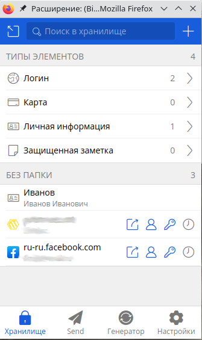
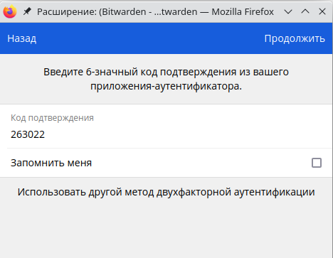
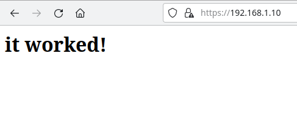
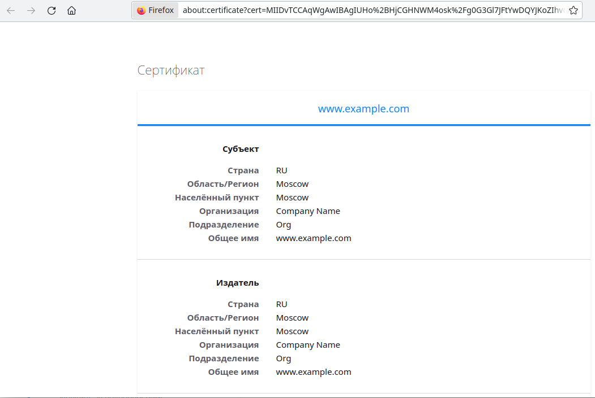
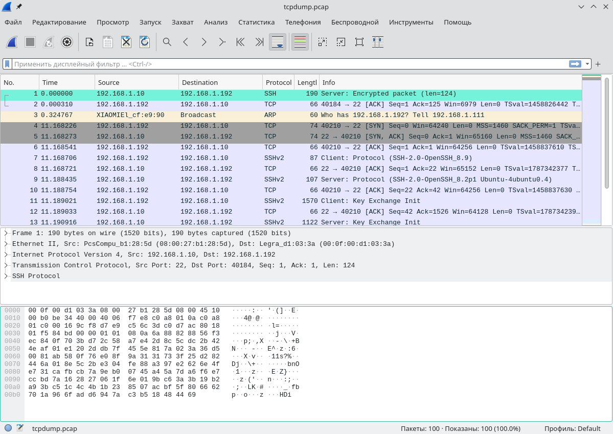

### Решение домашнего задания к занятию "3.9. Элементы безопасности информационных систем"

1. Установите Bitwarden плагин для браузера. Зарегестрируйтесь и сохраните несколько паролей.

Готово!




2. Установите Google authenticator на мобильный телефон. 
Настройте вход в Bitwarden акаунт через Google authenticator OTP.

Сделано!




3. Установите apache2, сгенерируйте самоподписанный сертификат, настройте тестовый сайт для работы по HTTPS

Все сделал по слайду из презентации.

```bash

vagrant@vagrant:~$ sudo openssl x509 -noout -text -in /etc/ssl/certs/apache-selfsigned.crt
Certificate:
    Data:
        Version: 3 (0x2)
        Serial Number:
            1e:8f:87:8c:21:87:35:63:38:a2:c9:3f:83:41:b7:1a:5e:c9:16:d6
        Signature Algorithm: sha256WithRSAEncryption
        Issuer: C = RU, ST = Moscow, L = Moscow, O = Company Name, OU = Org, CN = www.example.com
        Validity
            Not Before: Feb 27 09:18:27 2022 GMT
            Not After : Feb 27 09:18:27 2023 GMT
        Subject: C = RU, ST = Moscow, L = Moscow, O = Company Name, OU = Org, CN = www.example.com
        Subject Public Key Info:
            Public Key Algorithm: rsaEncryption
                RSA Public-Key: (2048 bit)
                Modulus:
                    00:a7:d7:7f:2b:84:40:99:e5:a9:c6:0b:29:86:6a:
                    67:21:84:a5:7a:52:c2:d5:e9:99:5d:b2:1b:22:8f:
                    9b:2d:47:83:10:5f:8d:af:7b:32:35:d4:87:be:06:
                    7c:c7:2f:89:22:e8:c5:79:93:69:d1:c6:63:07:c9:
                    85:31:80:6e:27:16:19:e7:33:66:ff:cf:0e:40:63:
                    e8:fc:de:d9:bd:3d:18:e4:52:67:42:3a:3c:f6:c2:
                    6f:55:bd:6b:09:79:1a:d1:5b:fd:9b:d2:de:6d:f8:
                    3f:b8:1a:6d:14:6d:17:b9:f6:5c:11:83:1c:5f:5e:
                    6b:82:4f:5c:9b:c3:8f:e4:32:9a:67:33:14:87:63:
                    62:dc:f2:54:91:c2:b2:f5:47:a5:46:7b:c1:ee:c2:
                    ce:11:47:c7:15:eb:e7:77:7d:27:d0:cb:3e:7c:22:
                    bb:db:e3:50:0b:88:a9:87:a0:20:7c:3b:0a:69:96:
                    d7:a0:44:37:b4:f3:37:ac:84:87:fb:67:44:e2:34:
                    0d:fc:09:62:86:35:cf:16:8b:75:fa:e9:59:37:aa:
                    a9:1b:91:2a:dc:b8:19:5c:96:98:b1:4c:18:84:67:
                    34:d9:cf:93:54:18:c4:1f:4f:40:38:d0:46:cf:0c:
                    75:91:4d:38:30:13:57:1a:3c:ea:59:5b:8c:83:87:
                    d0:7d
                Exponent: 65537 (0x10001)
        X509v3 extensions:
            X509v3 Subject Key Identifier: 
                B2:86:6F:DE:35:88:CB:AF:DD:6B:8D:CA:C3:26:90:44:D6:69:EB:F7
            X509v3 Authority Key Identifier: 
                keyid:B2:86:6F:DE:35:88:CB:AF:DD:6B:8D:CA:C3:26:90:44:D6:69:EB:F7

            X509v3 Basic Constraints: critical
                CA:TRUE
    Signature Algorithm: sha256WithRSAEncryption
         17:62:3d:22:a1:6e:c9:f5:fb:56:d9:af:bf:5e:56:cb:2d:60:
         ae:6d:aa:c5:49:cc:3b:fb:3a:42:97:68:77:f1:61:07:7e:a9:
         8d:84:0f:db:66:e0:f9:a4:b2:12:e2:de:a0:eb:31:7d:45:33:
         9a:13:08:01:98:48:2b:12:4b:94:21:50:bb:5e:71:87:f6:ea:
         bd:22:48:17:c5:7a:5f:28:50:bd:0e:69:6f:5a:dd:86:01:4d:
         ad:17:76:01:8a:e9:b4:64:5d:99:af:09:47:f9:04:d1:93:e9:
         6c:31:d0:41:01:ab:83:39:b1:c6:fa:34:e7:56:42:96:59:bc:
         9c:ef:d7:5d:11:92:b8:ed:ba:e3:0c:c2:21:fd:3f:38:2c:1e:
         bb:ab:8a:80:2d:6c:b9:17:c9:5d:1c:2c:fe:92:ca:ee:b0:37:
         60:09:ca:d1:98:10:fb:1f:3e:50:36:64:af:c4:31:a3:6d:9d:
         01:da:a3:48:e6:06:49:d8:f4:b4:cc:a7:2c:0d:d7:b8:7b:4d:
         9f:93:a1:2c:68:39:ef:9a:e6:8b:8c:39:25:9a:5a:b9:cd:78:
         20:ee:a5:05:55:9d:d9:0c:8a:54:fb:41:3c:99:52:5c:78:f7:
         f5:ff:9d:8d:2d:67:6e:f3:6b:23:c1:7c:20:b3:e2:7e:a0:1e:
         33:bc:e7:0c

```






4. Проверьте на TLS уязвимости произвольный сайт в интернете (кроме сайтов МВД, ФСБ, МинОбр, НацБанк, РосКосмос, 
РосАтом, РосНАНО и любых госкомпаний, объектов КИИ, ВПК ... и тому подобное).

```bash

vagrant@vagrant:~/testssl.sh$ ./testssl.sh -U --sneaky https://sport-dema.ru/

...
 Testing vulnerabilities 

 Heartbleed (CVE-2014-0160)                not vulnerable (OK), no heartbeat extension
 CCS (CVE-2014-0224)                       not vulnerable (OK)
 Ticketbleed (CVE-2016-9244), experiment.  not vulnerable (OK)
 ROBOT                                     not vulnerable (OK)
 Secure Renegotiation (RFC 5746)           supported (OK)
 Secure Client-Initiated Renegotiation     not vulnerable (OK)
 CRIME, TLS (CVE-2012-4929)                not vulnerable (OK)
 BREACH (CVE-2013-3587)                    potentially NOT ok, "gzip" HTTP compression detected. - only supplied "/" tested
                                           Can be ignored for static pages or if no secrets in the page
 POODLE, SSL (CVE-2014-3566)               not vulnerable (OK)
 TLS_FALLBACK_SCSV (RFC 7507)              No fallback possible (OK), no protocol below TLS 1.2 offered
 SWEET32 (CVE-2016-2183, CVE-2016-6329)    not vulnerable (OK)
 FREAK (CVE-2015-0204)                     not vulnerable (OK)
 DROWN (CVE-2016-0800, CVE-2016-0703)      not vulnerable on this host and port (OK)
                                           make sure you don't use this certificate elsewhere with SSLv2 enabled services
                                           https://censys.io/ipv4?q=F47E036838A9CC22EE8D63F2347CAC2D127809FA74DA978739E4B22B4F726398 could help you to find out
 LOGJAM (CVE-2015-4000), experimental      not vulnerable (OK): no DH EXPORT ciphers, no DH key detected with <= TLS 1.2
 BEAST (CVE-2011-3389)                     not vulnerable (OK), no SSL3 or TLS1
 LUCKY13 (CVE-2013-0169), experimental     potentially VULNERABLE, uses cipher block chaining (CBC) ciphers with TLS. Check patches
 Winshock (CVE-2014-6321), experimental    not vulnerable (OK)
 RC4 (CVE-2013-2566, CVE-2015-2808)        no RC4 ciphers detected (OK)


 Done 2022-02-27 09:49:53 [  44s] -->> 185.114.245.124:443 (sport-dema.ru) <<--
```

5. Установите на Ubuntu ssh сервер, сгенерируйте новый приватный ключ. 
Скопируйте свой публичный ключ на другой сервер. Подключитесь к серверу по SSH-ключу.

Генерируем на хосте:

```bash
[frolls@mainframe ~]$ ssh-keygen 
Generating public/private rsa key pair.
Enter file in which to save the key (/home/frolls/.ssh/id_rsa): iddqd
Enter passphrase (empty for no passphrase): 
Enter same passphrase again: 
Your identification has been saved in iddqd
Your public key has been saved in iddqd.pub
...

```

Копируем в виртуалку `vagrant`:

```bash

[frolls@mainframe ~]$ ssh-copy-id -i .ssh/iddqd vagrant@192.168.1.10
/usr/bin/ssh-copy-id: INFO: Source of key(s) to be installed: ".ssh/iddqd.pub"
/usr/bin/ssh-copy-id: INFO: attempting to log in with the new key(s), to filter out any that are already installed
/usr/bin/ssh-copy-id: INFO: 1 key(s) remain to be installed -- if you are prompted now it is to install the new keys
vagrant@192.168.1.10's password: 

Number of key(s) added: 1

Now try logging into the machine, with:   "ssh 'vagrant@192.168.1.10'"
and check to make sure that only the key(s) you wanted were added.

```

Подключаемся:

```bash

[frolls@mainframe ~]$ ssh -i .ssh/iddqd vagrant@192.168.1.10
Welcome to Ubuntu 20.04.3 LTS (GNU/Linux 5.4.0-99-generic x86_64)

 * Documentation:  https://help.ubuntu.com
 * Management:     https://landscape.canonical.com
 * Support:        https://ubuntu.com/advantage

  System information as of Sun 27 Feb 2022 10:13:12 AM UTC

  System load:  0.19               Processes:             124
  Usage of /:   13.8% of 30.88GB   Users logged in:       1
  Memory usage: 29%                IPv4 address for eth0: 192.168.1.10
  Swap usage:   0%


This system is built by the Bento project by Chef Software
More information can be found at https://github.com/chef/bento
Last login: Sun Feb 27 10:12:56 2022 from 192.168.1.192
```

Работает!

5. Переименуйте файлы ключей из задания 5. Настройте файл конфигурации SSH клиента, так чтобы вход на удаленный 
сервер осуществлялся по имени сервера.

Переименовываем
```bash

[frolls@mainframe ~]$ cd .ssh  
[frolls@mainframe .ssh]$ mv iddqd idkfa
[frolls@mainframe .ssh]$ mv iddqd.pub idkfa.pub
[frolls@mainframe .ssh]$ ls
idkfa  idkfa.pub  id_rsa  id_rsa.pub  known_hosts  known_hosts.old  ssh-key-2022-02-10.key  ssh-key-2022-02-10.key.pub
```

Правим конфиг (файл `~/.ssh/config`):

```bash

# my little server
Host my_little_server
        HostName 192.168.1.10
        IdentityFile ~/.ssh/idkfa
        User vagrant
```

Проверяем:
```bash

[frolls@mainframe .ssh]$ ssh my_little_server
Welcome to Ubuntu 20.04.3 LTS (GNU/Linux 5.4.0-99-generic x86_64)

 * Documentation:  https://help.ubuntu.com
 * Management:     https://landscape.canonical.com
 * Support:        https://ubuntu.com/advantage

  System information as of Sun 27 Feb 2022 10:28:29 AM UTC

  System load:  0.0                Processes:             124
  Usage of /:   13.8% of 30.88GB   Users logged in:       1
  Memory usage: 29%                IPv4 address for eth0: 192.168.1.10
  Swap usage:   0%


This system is built by the Bento project by Chef Software
More information can be found at https://github.com/chef/bento
Last login: Sun Feb 27 10:27:38 2022 from 192.168.1.192
vagrant@vagrant:~$ 
```

Что-то даже работает..

7. Соберите дамп трафика утилитой `tcpdump` в формате `pcap`, 100 пакетов. Откройте файл pcap в Wireshark.

```bash

vagrant@vagrant:~$ sudo tcpdump -c 100 -w tcpdump.pcap
```

Вскрываем:



8*. Просканируйте хост scanme.nmap.org. Какие сервисы запущены?

Установим `nmap` и просканируем: 

```bash

vagrant@vagrant:~$ nmap scanme.nmap.org
Starting Nmap 7.80 ( https://nmap.org ) at 2022-02-27 11:00 UTC
Nmap scan report for scanme.nmap.org (45.33.32.156)
Host is up (0.21s latency).
Other addresses for scanme.nmap.org (not scanned): 2600:3c01::f03c:91ff:fe18:bb2f
Not shown: 996 closed ports
PORT      STATE SERVICE
22/tcp    open  ssh
80/tcp    open  http
9929/tcp  open  nping-echo
31337/tcp open  Elite

Nmap done: 1 IP address (1 host up) scanned in 10.54 seconds
```

Запущены SSH, WEB-сервер на 80 порту, nping-echo и Elite

9*. Установите и настройте фаервол ufw на web-сервер из задания 3. Откройте доступ снаружи только к портам 22,80,443

```bash

vagrant@vagrant:~$ sudo ufw app list
Available applications:
  Apache
  Apache Full
  Apache Secure
  Nginx Full
  Nginx HTTP
  Nginx HTTPS
  OpenSSH

vagrant@vagrant:~$ sudo ufw status verbose
Status: inactive

vagrant@vagrant:~$ sudo ufw allow 22
Rules updated
Rules updated (v6)
vagrant@vagrant:~$ sudo ufw allow 80
Rules updated
Rules updated (v6)
vagrant@vagrant:~$ sudo ufw allow 443
Rules updated
Rules updated (v6)
vagrant@vagrant:~$ 

vagrant@vagrant:~$ sudo ufw enable
Command may disrupt existing ssh connections. Proceed with operation (y|n)? y
Firewall is active and enabled on system startup
vagrant@vagrant:~$ sudo ufw status verbose
Status: active
Logging: on (low)
Default: deny (incoming), allow (outgoing), disabled (routed)
New profiles: skip

To                         Action      From
--                         ------      ----
80,443/tcp (Nginx Full)    ALLOW IN    Anywhere                  
22                         ALLOW IN    Anywhere                  
80                         ALLOW IN    Anywhere                  
443                        ALLOW IN    Anywhere                  
80,443/tcp (Nginx Full (v6)) ALLOW IN    Anywhere (v6)             
22 (v6)                    ALLOW IN    Anywhere (v6)             
80 (v6)                    ALLOW IN    Anywhere (v6)             
443 (v6)                   ALLOW IN    Anywhere (v6)            
```

Изнутри:

```bash

vagrant@vagrant:~$ ss -tnl
State               Recv-Q              Send-Q                           Local Address:Port                             Peer Address:Port              Process              
LISTEN              0                   4096                             127.0.0.53%lo:53                                    0.0.0.0:*                                      
LISTEN              0                   128                                    0.0.0.0:22                                    0.0.0.0:*                                      
LISTEN              0                   511                                          *:443                                         *:*                                      
LISTEN              0                   511                                          *:80                                          *:*                                      
LISTEN              0                   128                                       [::]:22                                       [::]:* 
```

Проверим снаружи:

```bash

[frolls@mainframe ~]$ nmap 192.168.1.10
Starting Nmap 7.92 ( https://nmap.org ) at 2022-02-27 16:23 +05
Nmap scan report for 192.168.1.10
Host is up (0.00052s latency).
Not shown: 997 filtered tcp ports (no-response)
PORT    STATE SERVICE
22/tcp  open  ssh
80/tcp  open  http
443/tcp open  https

Nmap done: 1 IP address (1 host up) scanned in 4.98 seconds
```