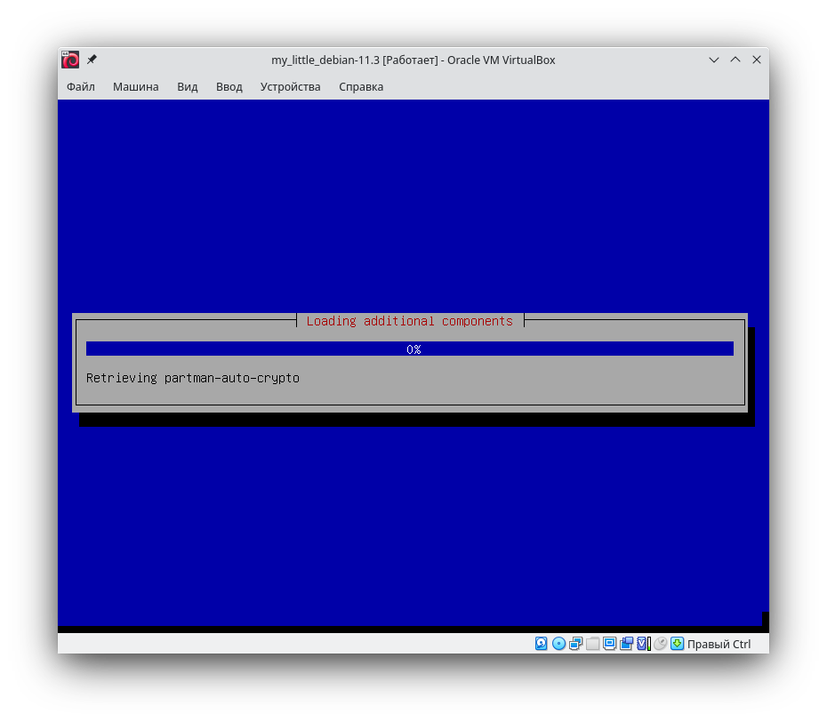
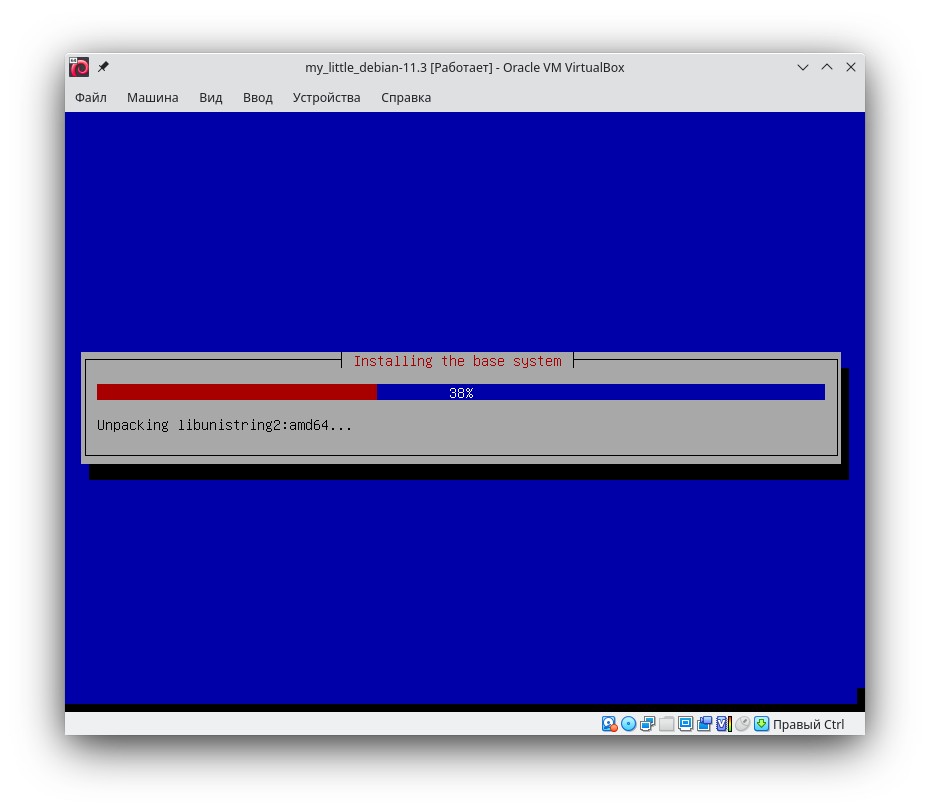
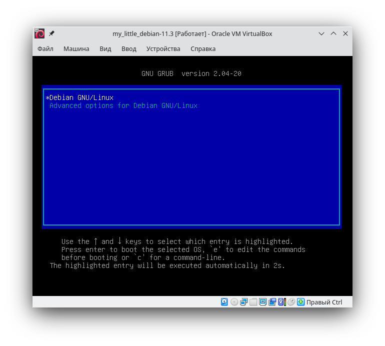
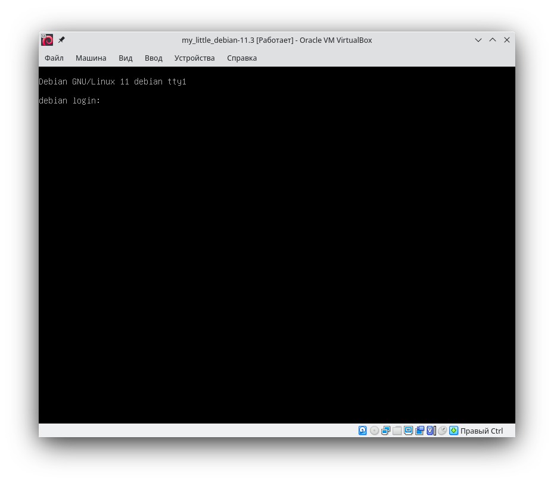
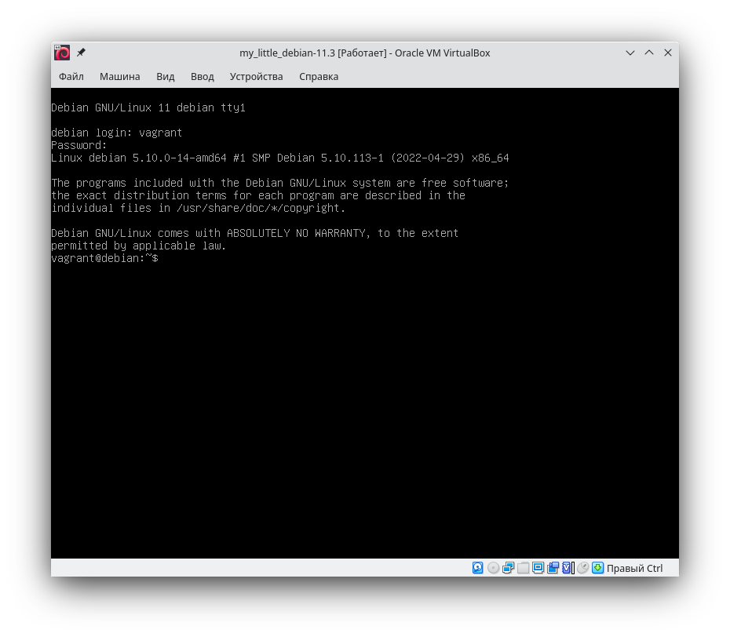
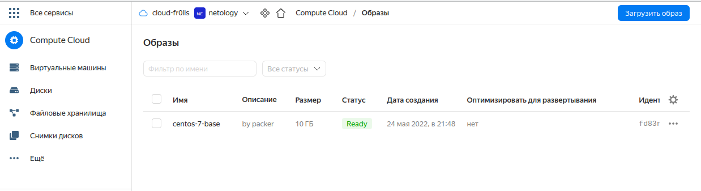
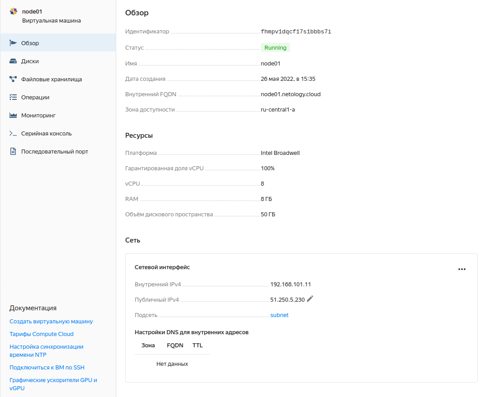
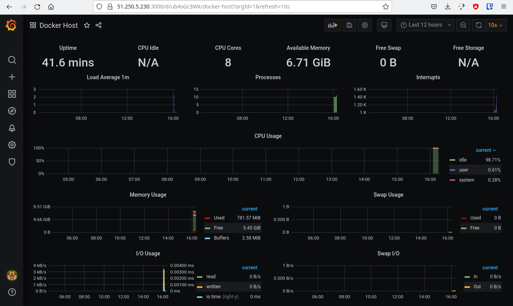

# Решение домашнего задания к занятию "5.4. Оркестрация группой Docker контейнеров на примере Docker Compose"

## Задача 1

Создать собственный образ операционной системы с помощью Packer.

Для получения зачета, вам необходимо предоставить:

- Скриншот страницы, как на слайде из презентации (слайд 37).

На слайде стр. 37 какая-то неведомая штука, но не Packer ) Написано "Деплой ПО и стека микросервисов на виртуальную машину в Yandex.Cloud"

Поэтому создадим что-нибудь сами, например, образ Debian для VirtualBox. Сначала замахнулся на gentoo, но потом понял, что для академических целей это лишняя трата времени.

В итоге получился [json-файлик](src/task1/debian.json)

**Результат**

Один из этапов автоматической установки

Еще скриншот этапа автоматической установки

Меню grub

Приглашение системы

Успешный вход

---

Upd..

Оказывается, нужно было сделать это в Yandex Cloud..

Ну, ок, сейчас все будет)

В итоге нужен скрин, как на слайде стр. 32.

Собственно, скрин:

## Задача 2

Создать вашу первую виртуальную машину в Яндекс.Облаке.

**Решение**

Скриншот ВМ:

## Задача 3

Создать ваш первый готовый к боевой эксплуатации компонент мониторинга, состоящий из стека микросервисов.

**Решение**

Скриншот grafana:

## Задача 4 (*)

Создать вторую ВМ и подключить её к мониторингу развёрнутому на первом сервере.

В работе)