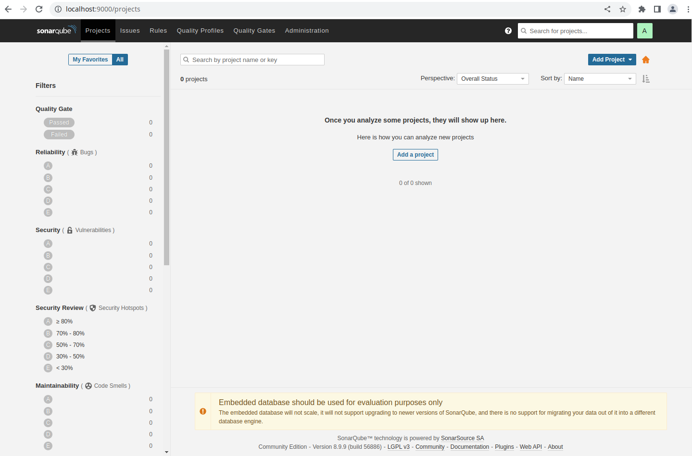
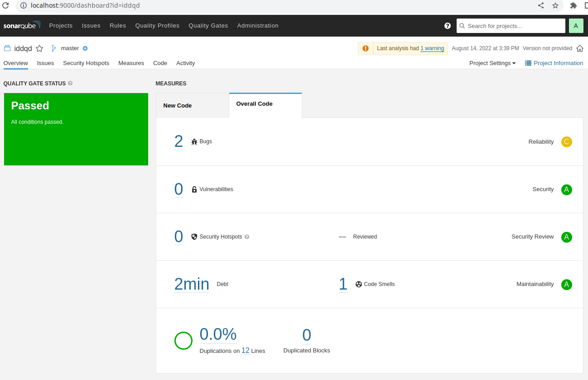
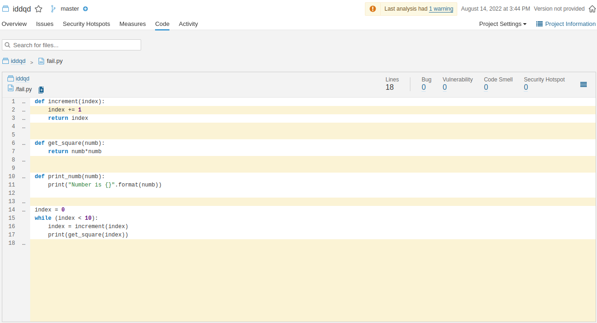
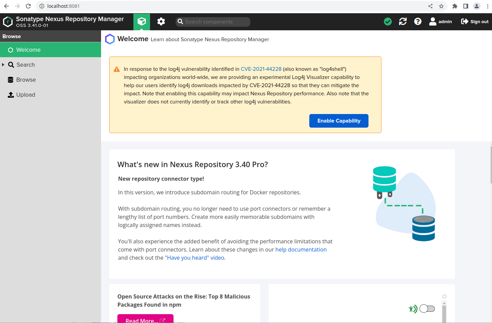
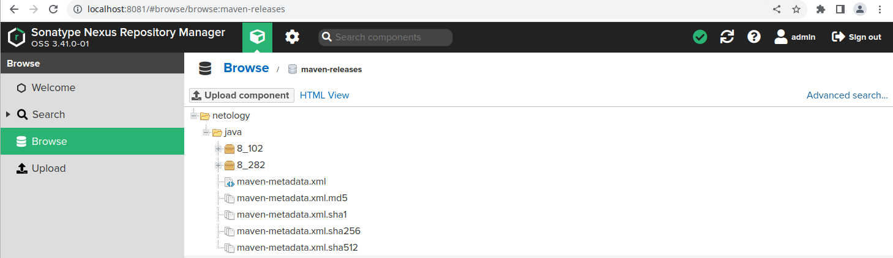

# Решение домашнего задания к занятию "09.02 CI\CD"

## Знакомоство с SonarQube

### Подготовка к выполнению

1. Выполняем `docker pull sonarqube:8.7-community`
2. Выполняем `docker run -d --name sonarqube -e SONAR_ES_BOOTSTRAP_CHECKS_DISABLE=true -p 9000:9000 sonarqube:8.7-community`
3. Ждём запуск, смотрим логи через `docker logs -f sonarqube`
4. Проверяем готовность сервиса через [браузер](http://localhost:9000)
5. Заходим под admin\admin, меняем пароль на свой

В целом, в [этой статье](https://docs.sonarqube.org/latest/setup/install-server/) описаны все варианты установки, включая и docker, но так как нам он нужен разово, то достаточно того набора действий, который я указал выше.

**Решение**

Выполнил `docker pull sonarqube:8.9-community`, в версии 8.7 не было пакета `sonar-scanner`.

После смены пароля:



### Основная часть

1. Создаём новый проект, название произвольное
2. Скачиваем пакет sonar-scanner, который нам предлагает скачать сам sonarqube
3. Делаем так, чтобы binary был доступен через вызов в shell (или меняем переменную PATH или любой другой удобный вам способ)
4. Проверяем `sonar-scanner --version`
5. Запускаем анализатор против кода из директории [example](./example) с дополнительным ключом `-Dsonar.coverage.exclusions=fail.py`
6. Смотрим результат в интерфейсе
7. Исправляем ошибки, которые он выявил(включая warnings)
8. Запускаем анализатор повторно - проверяем, что QG пройдены успешно
9. Делаем скриншот успешного прохождения анализа, прикладываем к решению ДЗ

**Решение**

Результат проверки:



Немного поправил код. Результат:



## Знакомство с Nexus

### Подготовка к выполнению

1. Выполняем `docker pull sonatype/nexus3`
2. Выполняем `docker run -d -p 8081:8081 --name nexus sonatype/nexus3`
3. Ждём запуск, смотрим логи через `docker logs -f nexus`
4. Проверяем готовность сервиса через [бразуер](http://localhost:8081)
5. Узнаём пароль от admin через `docker exec -it nexus /bin/bash`
6. Подключаемся под админом, меняем пароль, сохраняем анонимный доступ

**Решение**

Результат подготовки:



### Основная часть

1. В репозиторий `maven-public` загружаем артефакт с GAV параметрами:
   1. groupId: netology
   2. artifactId: java
   3. version: 8_282
   4. classifier: distrib
   5. type: tar.gz
2. В него же загружаем такой же артефакт, но с version: 8_102
3. Проверяем, что все файлы загрузились успешно
4. В ответе присылаем файл `maven-metadata.xml` для этого артефекта

**Решение**

Репозиторий `maven-public` не позволяет загружать аретфакты. Загрузил в `maven-releases`.



Содержимое файла `maven-metadata.xml`:

```xml
<metadata modelVersion="1.1.0">
    <groupId>netology</groupId>
    <artifactId>java</artifactId>
    <versioning>
        <latest>8_282</latest>
        <release>8_282</release>
        <versions>
            <version>8_102</version>
            <version>8_282</version>
        </versions>
        <lastUpdated>20220814110354</lastUpdated>
    </versioning>
</metadata>
```

Сам файл [тут](nexus3/maven-metadata.xml)

### Знакомство с Maven

### Подготовка к выполнению

1. Скачиваем дистрибутив с [maven](https://maven.apache.org/download.cgi)
2. Разархивируем, делаем так, чтобы binary был доступен через вызов в shell (или меняем переменную PATH или любой другой удобный вам способ)
3. Проверяем `mvn --version`
4. Забираем директорию [mvn](./mvn) с pom

Извращенно, но сделал )

### Основная часть

1. Меняем в `pom.xml` блок с зависимостями под наш артефакт из первого пункта задания для Nexus (java с версией 8_282)
2. Запускаем команду `mvn package` в директории с `pom.xml`, ожидаем успешного окончания
3. Проверяем директорию `~/.m2/repository/`, находим наш артефакт
4. В ответе присылаем исправленный файл `pom.xml`

**Решение**

Чойт даже собралось:

```
[INFO] Building jar: /home/frolls/Загрузки/apache-maven-3.8.6/bin/target/simple-app-1.0-SNAPSHOT.jar
[INFO] ------------------------------------------------------------------------
[INFO] BUILD SUCCESS
[INFO] ------------------------------------------------------------------------
[INFO] Total time:  35.227 s
[INFO] Finished at: 2022-08-14T16:21:38+05:00
[INFO] ------------------------------------------------------------------------
```

Вот что обнаружил по пути `~/.m2/repository/netology/java/8_282/`

```bash
[frolls@mainframe 8_282]$ ls -lah
итого 20K
drwxr-xr-x 2 frolls frolls 4,0K авг 14 16:21 .
drwxr-xr-x 3 frolls frolls 4,0K авг 14 16:21 ..
-rw-r--r-- 1 frolls frolls    0 авг 14 16:21 java-8_282-distrib.tar.gz
-rw-r--r-- 1 frolls frolls   40 авг 14 16:21 java-8_282-distrib.tar.gz.sha1
-rw-r--r-- 1 frolls frolls  383 авг 14 16:21 java-8_282.pom.lastUpdated
-rw-r--r-- 1 frolls frolls  176 авг 14 16:21 _remote.repositories
```

Исправленным `pom.xml` можно полюбоваться [здесь](maven/pom.xml)
