# Курсовая работа по итогам модуля "DevOps и системное администрирование"

## Задание

1. Создайте виртуальную машину Linux.

**Решение**

В одном из первых домашних заданий мы устанавливали VirtualBox и Vagrant, которым воспользуемся:

- используем старый конфиг, [вот он](src/Vagrantfile)
- накатим ubuntu-2004: `vagrant up`
- заглянем внутрь, например, при помощи `vagrant ssh`

**Результат**

Выполнение `vagrant up`:

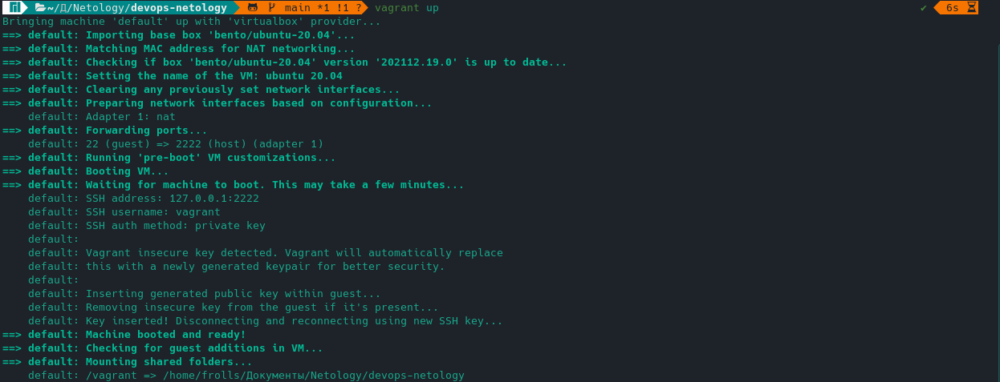

Выполнение `vagrant ssh`:

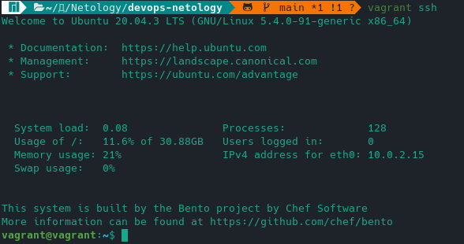

2. Установите ufw и разрешите к этой машине сессии на порты 22 и 443, при этом трафик на интерфейсе localhost (lo) должен ходить свободно на все порты.

**Решение**

Обновим виртуальную машину и установим ufw:

```bash
vagrant@vagrant:~$ sudo apt update && sudo apt upgrade && sudo apt install ufw
```

Оказывается, ufw был установлен. Что ж..

Посмотрим статус ufw:

```bash
vagrant@vagrant:~$ sudo ufw status
Status: inactive
```

Включим, предварительно открыв порт 22)):

```bash
vagrant@vagrant:~$ sudo ufw allow 22
Rules updated
Rules updated (v6)
vagrant@vagrant:~$ sudo ufw enable
Command may disrupt existing ssh connections. Proceed with operation (y|n)? y
Firewall is active and enabled on system startup
```

Откроем 443 порт и посмотрим статус ufw:

```bash
vagrant@vagrant:~$ sudo ufw allow 443
Rule added
Rule added (v6)
vagrant@vagrant:~$ sudo ufw status verbose
Status: active
Logging: on (low)
Default: deny (incoming), allow (outgoing), disabled (routed)
New profiles: skip

To                         Action      From
--                         ------      ----
22                         ALLOW IN    Anywhere
443                        ALLOW IN    Anywhere
22 (v6)                    ALLOW IN    Anywhere (v6)
443 (v6)                   ALLOW IN    Anywhere (v6)
```

Разрешим свободный трафик через lacalhost (lo):

```bash
vagrant@vagrant:~$ sudo ufw allow in on lo to any
Rule added
Rule added (v6)
vagrant@vagrant:~$ sudo ufw status verbose
Status: active
Logging: on (low)
Default: deny (incoming), allow (outgoing), disabled (routed)
New profiles: skip

To                         Action      From
--                         ------      ----
22                         ALLOW IN    Anywhere
443                        ALLOW IN    Anywhere
Anywhere on lo             ALLOW IN    Anywhere
22 (v6)                    ALLOW IN    Anywhere (v6)
443 (v6)                   ALLOW IN    Anywhere (v6)
Anywhere (v6) on lo        ALLOW IN    Anywhere (v6)
```

**Результат**

Обновление системы и установка ufw:

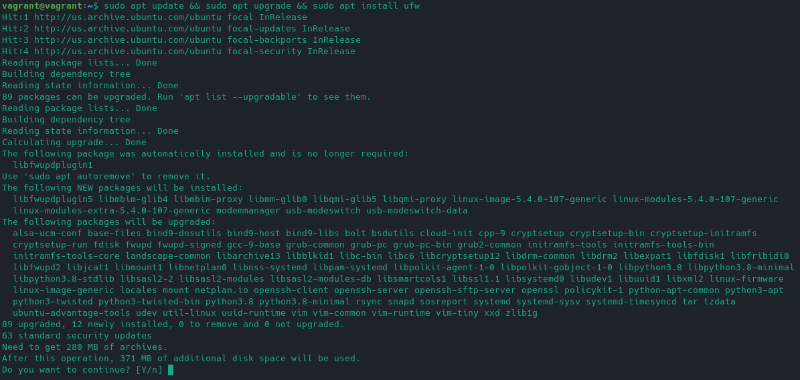

Результат настройки ufw:

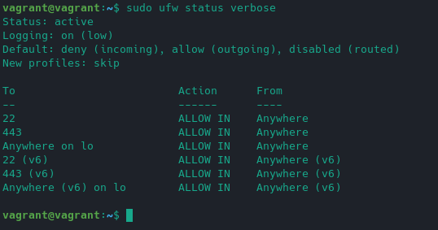

Глянем дополнительно изнутри:

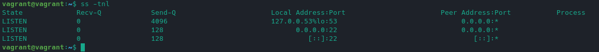

Настроил сетевой мост в VirtualBox, чтобы было нормально видно виртуальную машину.
Теперь можно глянуть снаружи, какие порты открыты:

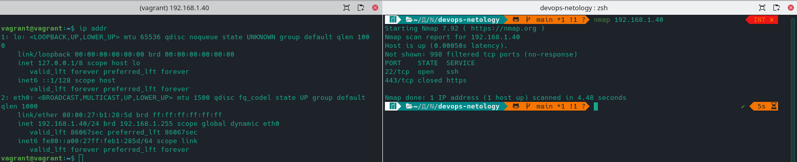

Порт 443 в состоянии `closed`, потомучто его покачто никто не прослушивает )

3. Установите hashicorp vault ([инструкция по ссылке](https://learn.hashicorp.com/tutorials/vault/getting-started-install?in=vault/getting-started#install-vault)).

**Решение**

Добавим репозиторий:

```bash
vagrant@vagrant:~$ curl -fsSL https://apt.releases.hashicorp.com/gpg | sudo apt-key add -
curl: (22) The requested URL returned error: 405
gpg: no valid OpenPGP data found.
```

Ах, да.. Нас же теперь туда не пускают.. Можо было клонировать репозиторий и установить оттуда, но хотелось принципиально поставить по официальному мануалу.
Пришлось потратить пару минут на обход блокировок))

В итоге:

```bash
vagrant@vagrant:~$ curl -fsSL https://apt.releases.hashicorp.com/gpg | sudo apt-key add -
OK
vagrant@vagrant:~$ sudo apt-add-repository "deb [arch=amd64] https://apt.releases.hashicorp.com $(lsb_release -cs) main"
vagrant@vagrant:~$ sudo apt-get update && sudo apt-get install vault
```

Проверим после установки, введя клманду `vault`:

```bash
vagrant@vagrant:~$ vault
Usage: vault <command> [args]

Common commands:
    read        Read data and retrieves secrets
    write       Write data, configuration, and secrets
    delete      Delete secrets and configuration
    list        List data or secrets
    login       Authenticate locally
    agent       Start a Vault agent
    server      Start a Vault server
    status      Print seal and HA status
    unwrap      Unwrap a wrapped secret

Other commands:
    audit                Interact with audit devices
    auth                 Interact with auth methods
    debug                Runs the debug command
    kv                   Interact with Vault's Key-Value storage
    lease                Interact with leases
    monitor              Stream log messages from a Vault server
    namespace            Interact with namespaces
    operator             Perform operator-specific tasks
    path-help            Retrieve API help for paths
    plugin               Interact with Vault plugins and catalog
    policy               Interact with policies
    print                Prints runtime configurations
    secrets              Interact with secrets engines
    ssh                  Initiate an SSH session
    token                Interact with tokens
    version-history      Prints the version history of the target Vault server

```

**Результат**

Установка vault:

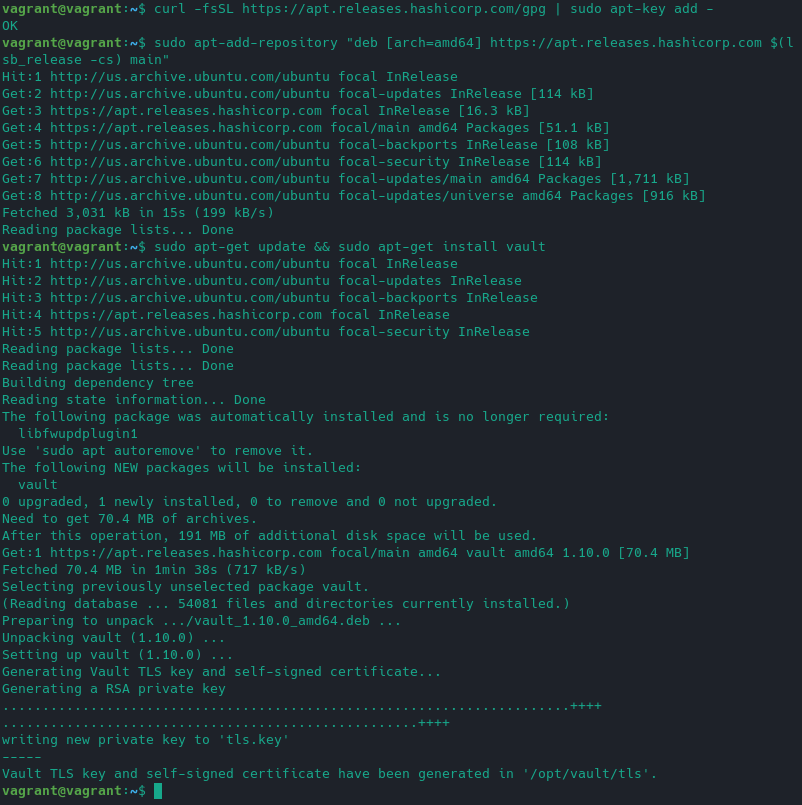

Убедимся, что vault установлен:

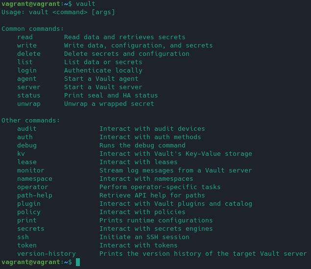

4. Cоздайте центр сертификации по инструкции ([ссылка](https://learn.hashicorp.com/tutorials/vault/pki-engine?in=vault/secrets-management)) и выпустите сертификат для использования его в настройке веб-сервера nginx (срок жизни сертификата - месяц).

**Решение**

Предварительно установим jq командой `sudo apt-get install jq`.

Воспользуемся утилитой screen, чтобы не создавать 100500 окон, а спокойно переключаться между терминалами. Просто так захотелось.. Upd: в итоге не очень удобно

В первом окне запустим

```bash
vagrant@vagrant:~$ vault server -dev -dev-root-token-id root
```

Во втором окне выполним:

```bash
vagrant@vagrant:~$ export VAULT_ADDR=http://127.0.0.1:8200
vagrant@vagrant:~$ export VAULT_TOKEN=root
```

Сервер Vault готов.

Запилим корневой ЦС

Включаем механизм pki:

```bash
vagrant@vagrant:~$ vault secrets enable pki
Success! Enabled the pki secrets engine at: pki/
```

Выкрутим TTL на максималки:

```bash
vagrant@vagrant:~$ vault secrets tune -max-lease-ttl=87600h pki
Success! Tuned the secrets engine at: pki/
```

Создадим корневой сертификат и сохраним его в CA_cert.crt:

```bash
vagrant@vagrant:~$ vault write -field=certificate pki/root/generate/internal common_name="mylittleserver.com" ttl=87600h > CA_cert.crt
```

Настроим URL`ы:

```bash
vault write pki/config/urls issuing_certificates="$VAULT_ADDR/v1/pki/ca" crl_distribution_points="$VAULT_ADDR/v1/pki/crl"
Success! Data written to: pki/config/urls
```

Пришло время создать промежуточный ЦС..

```bash
vagrant@vagrant:~$ vault secrets enable -path=pki_int pki
Success! Enabled the pki secrets engine at: pki_int/
```

В среднем количество часов в месяце невисокосного года:  часов.

Используя математику и копипаст, выпустим сертификат с максимальным сроком жизни 730 часов:

```bash
vagrant@vagrant:~$ vault secrets tune -max-lease-ttl=730h pki_int
Success! Tuned the secrets engine at: pki_int/
vagrant@vagrant:~$ vault write -format=json pki_int/intermediate/generate/internal common_name="mylittleserver.com Intermediate Authority" | jq -r '.data.csr' > pki_intermediate.csr
```

Подпишем закрытым ключом корневого ЦС и сохраним:

```bash
vagrant@vagrant:~$ vault write -format=json pki/root/sign-intermediate csr=@pki_intermediate.csr format=pem_bundle ttl="43800h" | jq -r '.data.certificate' > intermediate.cert.pem
```

Импортируем:

```bash
vagrant@vagrant:~$ vault write pki_int/intermediate/set-signed certificate=@intermediate.cert.pem
Success! Data written to: pki_int/intermediate/set-signed
```

Создадим роль:

```bash
vagrant@vagrant:~$ vault write pki_int/roles/my-little-role allowed_domains="mylittleserver.com" allow_subdomains=true max_ttl="730h"
Success! Data written to: pki_int/roles/my-little-role
```

Запросим новый сертификат для `test.mylittleserver.com` домена на основе `my-little-role` роли:

```bash
vagrant@vagrant:~$ vault write -format=json pki_int/issue/my-little-role common_name="test.mylittleserver.com" ttl="730h" > full.crt
```

Расчехлим jq и разделим ключи и сертификаты (пожалуй, это самая сложная часть в курсовой работе):

```bash
vagrant@vagrant:~$ cat full.crt | jq -r .data.certificate > test.mylittleserver.com.crt
vagrant@vagrant:~$ cat full.crt | jq -r .data.issuing_ca >> test.mylittleserver.com.crt
vagrant@vagrant:~$ cat full.crt | jq -r .data.private_key > test.mylittleserver.com.key
```

Исходник и выхлоп приложены [тут](src/vault/).

**Результат**

Запуск vault:

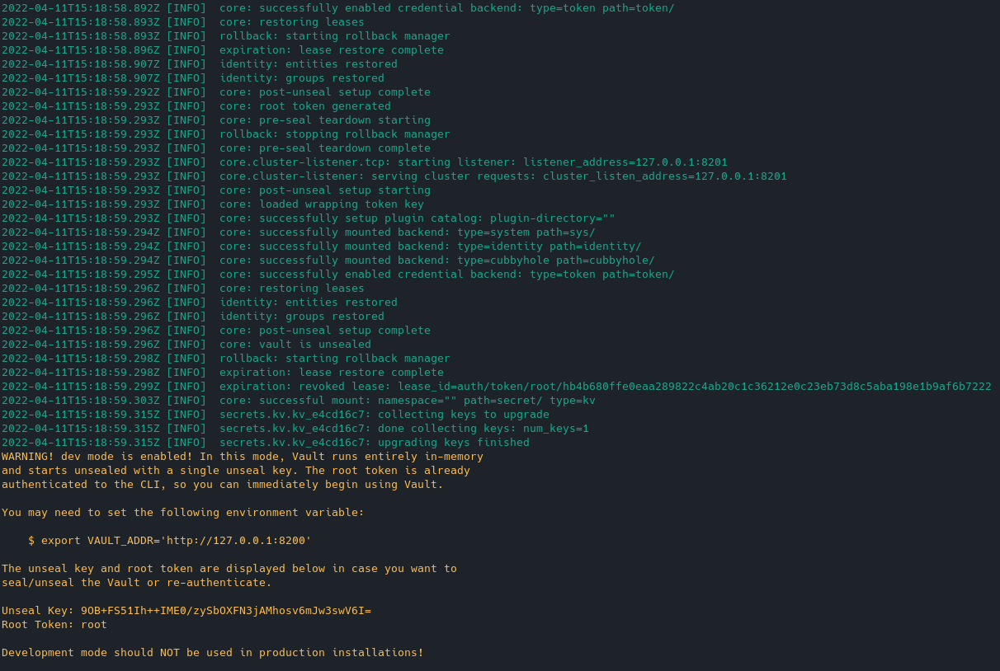

Экспорт переменных окружения:

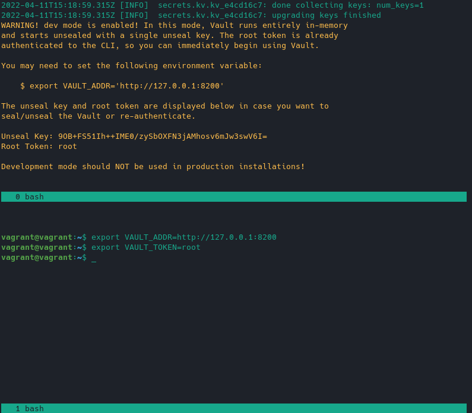

Создание сертификатов:

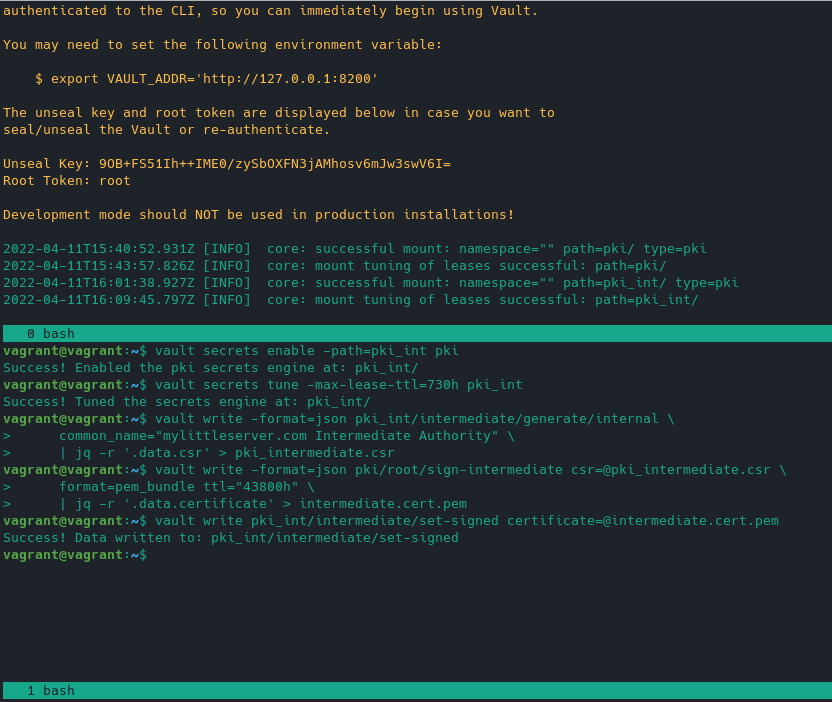

Пример сертификатов:

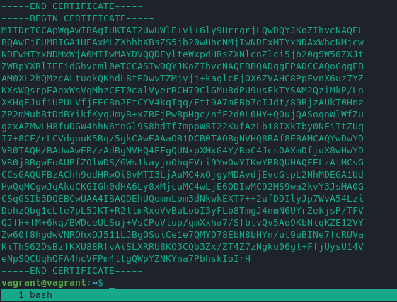

5. Установите корневой сертификат созданного центра сертификации в доверенные в хостовой системе.

**Решение**

В моем дистрибутиве для обучения devops добавление сертификата выполняется командой:

```bash
sudo cp course_work/src/vault/test.mylittleserver.com.crt /etc/ca-certificates/trust-source/anchors/
```

Далее `sudo trust extract-compat`.

**Результат**

Добавление сертификата:

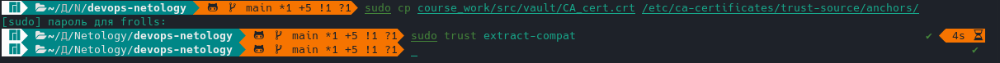

6. Установите nginx.

**Решение**

Тут все просто:

```bash
vagrant@vagrant:~$ sudo apt install nginx
```

**Результат**

Проверка, что nginx установлен:

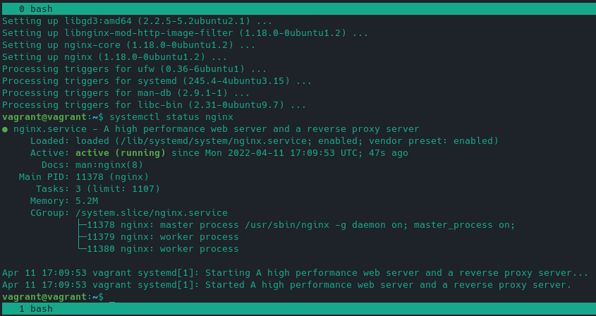

7. По инструкции ([ссылка](https://nginx.org/en/docs/http/configuring_https_servers.html)) настройте nginx на https, используя ранее подготовленный сертификат:

- можно использовать стандартную стартовую страницу nginx для демонстрации работы сервера;
- можно использовать и другой html файл, сделанный вами;

**Решение**

Настраиваем по инструкции, не забывая про права и обязанности:

- `sudo chmod 755` для директорий
- `sudo chmod 644` для файлов
- `sudo chown -R $USER:$USER` для нашего нового сайта )

Создаем конфиг `sudo nano /etc/nginx/sites-available/test.mylittleserver.com` такого содержания:

```
server {
    listen              443 ssl;
    ssl on;
    server_name         test.mylittleserver.com www.test.mylittleserver.com;
    ssl_certificate     /home/vagrant/test.mylittleserver.com.crt;
    ssl_certificate_key /home/vagrant/test.mylittleserver.com.key;
    ssl_protocols       TLSv1 TLSv1.1 TLSv1.2;
    ssl_ciphers         HIGH:!aNULL:!MD5;

    root /var/www/test.mylittleserver.com/html;

    location / {
        index index.html index.htm;
        }
}
```

Делаем на него ссылку `sudo ln -s /etc/nginx/sites-available/test.mylittleserver.com /etc/nginx/sites-enabled/` и перезапускаем nginx
командой `sudo systemctl restart nginx`.

**Результат**

Просто скриншот конфига:

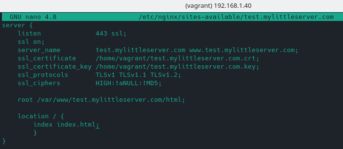

8. Откройте в браузере на хосте https адрес страницы, которую обслуживает сервер nginx.

**Решение**

Запустил браузер по адресу `https://test.mylittleserver.com/`

Да, предваритеьлно этот адрес прописал в /etc/hosts как `192.168.1.40 test.mylittleserver.com`

**Результат**

Проверка https:

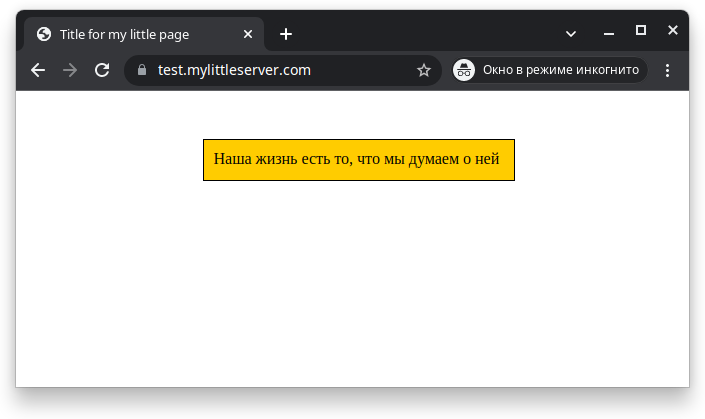

Просмотр сертификата:

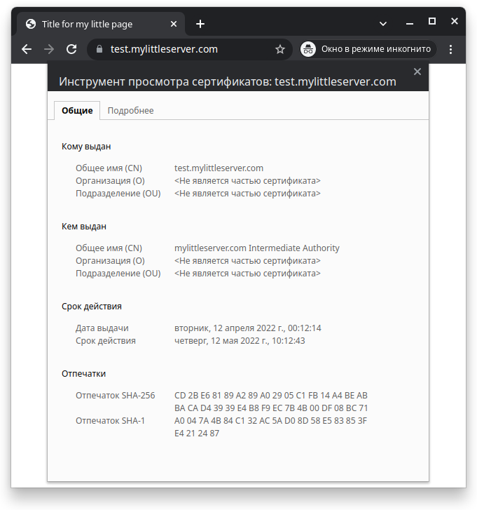

Страница сервера nginx в браузере хоста с предупреждениями:

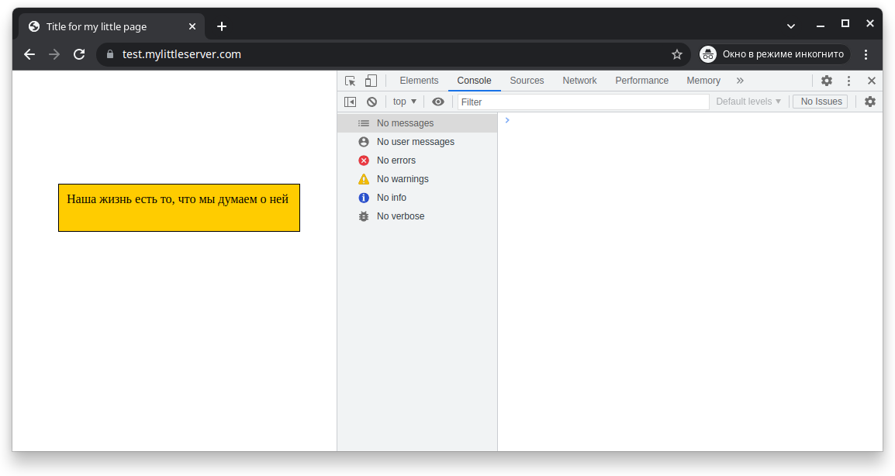

И еще одна:

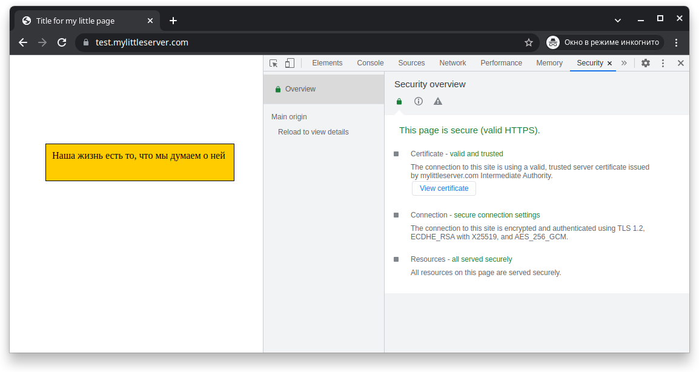

9. Создайте скрипт, который будет генерировать новый сертификат в vault:

- генерируем новый сертификат так, чтобы не переписывать конфиг nginx;
- перезапускаем nginx для применения нового сертификата.

**Решение**

Создаем файл `vault_genetare_cert.sh` и далее просто копипаст того, что уже сделали, только путь доуточним (не дефайнил, ибо для примера не нужно):

```bash
#!/bin/bash

export VAULT_ADDR=http://127.0.0.1:8200
export VAULT_TOKEN=root

vault write -format=json pki_int/issue/my-little-role common_name="test.mylittleserver.com" ttl="730h" > /home/vagrant/full.crt

cat /home/vagrant/full.crt | jq -r .data.certificate > /home/vagrant/test.mylittleserver.com.crt
cat /home/vagrant/full.crt | jq -r .data.issuing_ca >> /home/vagrant/test.mylittleserver.com.crt
cat /home/vagrant/full.crt | jq -r .data.private_key > /home/vagrant/test.mylittleserver.com.key

```

Чмокаем `vagrant@vagrant:~$ chmod u+x vault_genetare_cert.sh`. В принципе, готово, только nginx придется перезапускать отдельно от рута или еще кого посерьезней ).

Запилим скрипт `nginx_restart.sh`:

```bash
#!/bin/bash

systemctl restart nginx.service
```

**Результат**

Скрипты расположены [тут](src/script/).

10. Поместите скрипт в crontab, чтобы сертификат обновлялся какого-то числа каждого месяца в удобное для вас время.

**Решение**

Сначала посмотрим, вдруг у меня уже все сделано:

```bash
vagrant@vagrant:~$ crontab -l
no crontab for vagrant
```

Нет(( Ок, сейчас все будет!

Генерация сертификатов пусть происходит каждое 3 число в 22:55, т.к. почти во всех месяцах эти дата и время присутствуют:

```bash
vagrant@vagrant:~$ crontab -e
crontab: installing new crontab
vagrant@vagrant:~$ crontab -l
55 22 3 * * /home/vagrant/vault_genetare_cert.sh
```

Можно было применить `@monthly`, что аналогично `0 0 1 * *` (т.е раз в месяц, первый день).

А в 23:00 ребутнем nginx (не забываем про рута):

```bash
vagrant@vagrant:~$ sudo crontab -l
no crontab for root
vagrant@vagrant:~$ sudo crontab -e
no crontab for root - using an empty one
crontab: installing new crontab
vagrant@vagrant:~$ sudo crontab -l
00 23 3 * * /home/vagrant/nginx_restart.sh
```

**Результат**

Пример crontab:

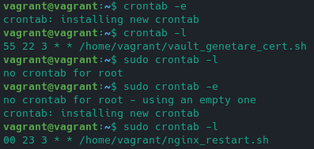

Да, работает, проверял при запуске каждую минуту (`*/1 * * * * /home/vagrant/vault_genetare_cert.sh`).
